# 🚀 SuperBlazorComponents

[](https://www.nuget.org/packages/SuperBlazorComponents)
[](LICENSE)
[](https://dotnet.microsoft.com)

**High-performance, open-source Blazor component library** for admin and line-of-business applications — built with Bootstrap 5.3 and zero third-party JS dependencies (except Google Charts).

---

## 🖼️ Demo

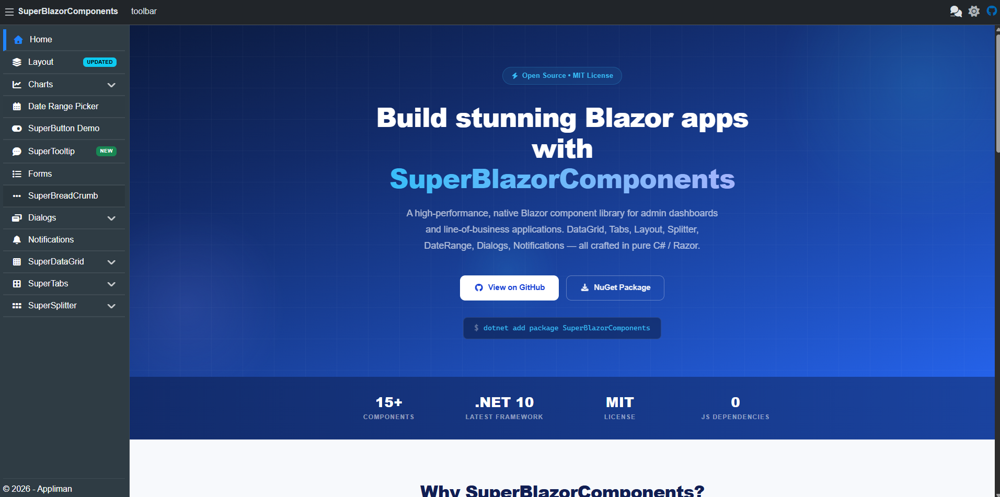

---

## ✨ Components

| Preview | Component | Description | Docs |
|---|---|---|---|
| 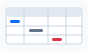 | **SuperDataGrid** | Virtualized data grid — frozen columns/rows, hierarchical lazy-loading rows, reordering, resizing, filtering, sorting, inline editing, row selection, settings persistence | [📖 SUPERDATAGRID.md](SUPERDATAGRID.md) |
| 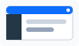 | **SuperLayout** | Responsive app layout — header, sidebar, body, footer, chat panel with collapsible sidebar | [📖 SUPERLAYOUT.md](SUPERLAYOUT.md) |
|  | **SuperTabs** | Dynamic tabbed interface — badges, closable tabs, lazy loading, persistence (URL + localStorage), keyboard navigation, service-driven management | [📖 SUPERTABS.md](SUPERTABS.md) |
| 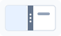 | **SuperSplitter** | Resizable split panels — horizontal/vertical, collapsible, state persistence | [📖 SuperSplitter.md](src/SuperBlazorComponents/Components/SuperSplitter/SuperSplitter.md) |
|  | **SuperDateRangePicker** | Calendar-based date range picker with presets | [📖 SUPERDATERANGEPICKER.md](SUPERDATERANGEPICKER.md) |
|  | **SuperColorPicker** | Inline HSV color picker — hue/saturation/value canvas, alpha slider, HEX & RGB input modes | [📖 SUPERCOLORPICKER.md](SUPERCOLORPICKER.md) |
| 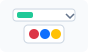 | **SuperDropDownColorPicker** | Compact dropdown variant of SuperColorPicker — colored swatch trigger button with floating popup | [📖 SUPERCOLORPICKER.md](SUPERCOLORPICKER.md) |
| 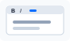 | **SuperHtmlEditor** | WYSIWYG HTML editor — toolbar (font, size, bold/italic/underline, colors, alignment, lists), lazy-loaded Monaco Editor for HTML source view | [📖 SUPERHTMLEDITOR.md](SUPERHTMLEDITOR.md) |
|  | **SuperMarkdownEditor** | Markdown editor — rendered view by default, source mode toggle, integrated Markdown help dialog | [📖 SUPERMARKDOWNEDITOR.md](SUPERMARKDOWNEDITOR.md) |
| 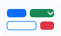 | **SuperButtons** | Buttons, split buttons, toggle buttons, link buttons, confirmation buttons | [📖 SUPERBUTTONS.md](SUPERBUTTONS.md) |
| 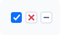 | **SuperTriStateCheckbox** | Bootstrap-friendly checkbox for nullable boolean values (`true`, `false`, `null`) | [📖 SuperTriStateCheckbox.md](src/SuperBlazorComponents/Components/SuperTriStateCheckbox/SuperTriStateCheckbox.md) |
|  | **SuperTooltip** | Tooltips for Blazor or HTML elements — text, HTML, Markdown, positions, delay, duration, click closing and manual control | [📖 SuperTooltip.md](src/SuperBlazorComponents/Components/Tooltips/SuperTooltip.md) |
|  | **SuperDialog** | Modal dialog system with dynamic component rendering | [📖 SUPERDIALOGS.md](SUPERDIALOGS.md) |
| 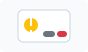 | **SuperConfirmDialog** | Confirmation dialog with customizable buttons | [📖 SUPERDIALOGS.md](SUPERDIALOGS.md) |
|  | **SuperNotifications** | Toast notifications with auto-dismiss and severity levels | [📖 SUPERNOTIFICATIONS.md](SUPERNOTIFICATIONS.md) |
| 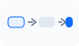 | **SuperBreadCrumb** | Breadcrumb navigation with back-navigation support | [📖 SUPERBREADCRUMB.md](SUPERBREADCRUMB.md) |
|  | **SuperMenuItem** | Sidebar menu items with icons, badges, and nested submenus | [📖 SUPERMENUITEM.md](SUPERMENUITEM.md) |
| 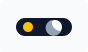 | **ThemeToggle** | Dark/light theme toggle with system preference detection and localStorage persistence | [📖 THEMETOGGLE.md](THEMETOGGLE.md) |
| 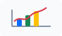 | **Google Charts** | Combo charts, pie charts, and pure SVG time series charts | [📖 GOOGLECHARTS.md](GOOGLECHARTS.md) |

---

## 📦 Installation

```bash
dotnet add package SuperBlazorComponents
```

## 🔧 Setup

Register the services in your `Program.cs`:

```csharp
builder.Services.AddSuperComponents();
```

---

## 🚀 Quick Start

```razor
@using SuperBlazorComponents.Components.SuperDataGrid

<SuperDataGrid TItem="Product"
               ItemsProvider="LoadProducts"
               Height="500px"
               AllowSorting="true"
               AllowFiltering="true"
               FreezeHeader="true"
               SelectionMode="SuperDataGridSelectionMode.Multiple"
               GridId="products-grid">
    <DataGridColumn Title="Name" For="@(c => c.Name)" />
    <DataGridColumn Title="Price" For="@(c => c.Price)" Width="120" />
    <DataGridColumn Title="Category" For="@(c => c.Category)" Width="150" />
</SuperDataGrid>
```

For tree-like datasets, enable `Hierarchical="true"` and branch inside `ItemsProvider` when `request.IsHierarchyRequest` is true. Parent and child rows use the same `TItem` type.

---

## 🤝 Contributing

Contributions are welcome! Feel free to open issues, suggest features, or submit pull requests.

1. Fork the repository
2. Create your feature branch (`git checkout -b feature/amazing-feature`)
3. Commit your changes (`git commit -m 'Add amazing feature'`)
4. Push to the branch (`git push origin feature/amazing-feature`)
5. Open a Pull Request

---

## 📄 License

This project is licensed under the [MIT License](LICENSE).

---

## 🌐 Live Demo

A live demo site is available at **[blazor.appliman.com](https://blazor.appliman.com/)**

---

## 🤖 MCP Server

The demo site also exposes a public **Model Context Protocol (MCP)** server for AI-assisted development.

Use it when you want an MCP-compatible assistant to discover how to install and implement SuperBlazorComponents in another Blazor application.

- **MCP endpoint:** `https://blazor.appliman.com/mcp`
- **Health check:** `https://blazor.appliman.com/mcp/health`
- **Transport:** Streamable HTTP
- **Authentication:** none

The server exposes tools such as:

- `list_super_components`
- `get_super_component_guide`
- `get_super_data_grid_guide`
- `get_super_datagrid_guide`
- `get_super_buttons_guide`
- `get_super_tabs_guide`
- `get_super_layout_guide`
- `get_super_dialogs_guide`

Example prompts:

- `Use the SuperBlazorComponents MCP server and show me how to add SuperDataGrid to this Blazor app.`
- `Get the SuperButtons guide and implement a confirmation delete button.`
- `List the available SuperBlazorComponents guides.`

### VS Code

In VS Code, open **Command Palette** → **MCP: Add Server**, choose **HTTP**, and enter:

```text
https://blazor.appliman.com/mcp
```

Or create `.vscode/mcp.json` in your workspace:

```json
{
  "servers": {
    "superblazorcomponents": {
      "type": "http",
      "url": "https://blazor.appliman.com/mcp"
    }
  }
}
```

Then open Copilot Chat in **Agent** mode and ask for a component guide.

### Visual Studio

Visual Studio can discover MCP server configuration from several locations, including:

- `%USERPROFILE%\.mcp.json`
- `<SOLUTIONDIR>\.mcp.json`
- `<SOLUTIONDIR>\.vs\mcp.json`
- `<SOLUTIONDIR>\.vscode\mcp.json`

Example `.mcp.json`:

```json
{
  "servers": [
    {
      "name": "superblazorcomponents",
      "transport": "http",
      "url": "https://blazor.appliman.com/mcp"
    }
  ]
}
```

After saving the file, restart or reload GitHub Copilot Agent mode in Visual Studio so the MCP tools are discovered.

### Docker Desktop MCP Toolkit

Docker Desktop MCP Toolkit can be used as a gateway between MCP clients and a profile of MCP servers.

1. Enable **Docker Desktop → Settings → Beta features → MCP Toolkit**.
2. Open **Docker Desktop → MCP Toolkit → Profiles**.
3. Create a profile, for example `superblazor-docs`.
4. Add a remote HTTP MCP server with this URL:

```text
https://blazor.appliman.com/mcp
```

5. Connect your client from the **Clients** tab, or configure the gateway manually.

Manual VS Code-style gateway configuration:

```json
{
  "servers": {
    "MCP_DOCKER": {
      "type": "stdio",
      "command": "docker",
      "args": ["mcp", "gateway", "run", "--profile", "superblazor-docs"]
    }
  }
}
```

You can also run the gateway directly:

```bash
docker mcp gateway run --profile superblazor-docs
```

### References

- [MCP C# SDK](https://csharp.sdk.modelcontextprotocol.io/)
- [VS Code MCP configuration](https://code.visualstudio.com/docs/copilot/reference/mcp-configuration)
- [Visual Studio MCP servers](https://learn.microsoft.com/visualstudio/ide/mcp-servers)
- [Docker Desktop MCP Toolkit](https://docs.docker.com/ai/mcp-catalog-and-toolkit/)

---

## 🔗 Links

- **Live Demo:** [blazor.appliman.com](https://blazor.appliman.com/)
- **GitHub:** [github.com/appliman/superblazorcomponents](https://github.com/appliman/superblazorcomponents)
- **NuGet:** [nuget.org/packages/SuperBlazorComponents](https://www.nuget.org/packages/SuperBlazorComponents)
- **Changelog:** [CHANGELOG.md](CHANGELOG.md)
