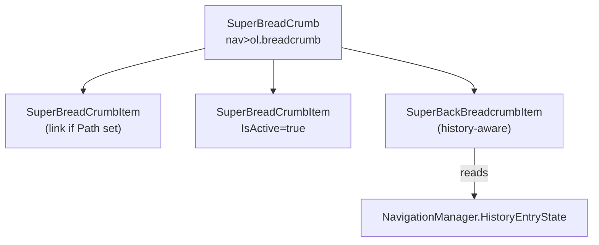

# 🗂️ SuperBreadCrumb

> Lightweight Bootstrap-styled breadcrumb navigation with Font Awesome icon support and a built-in **back** breadcrumb that uses the navigation history.

[← Back to README](README.md)

---

## 📑 Table of Contents

- [Overview](#overview)
- [Getting Started](#getting-started)
- [Architecture](#architecture)
- [API Reference](#api-reference)
- [Usage Examples](#usage-examples)
- [Tips & Best Practices](#tips--good-practices)
- [Troubleshooting](#troubleshooting)

---

## Overview

`SuperBreadCrumb` renders a Bootstrap 5 `<nav><ol class="breadcrumb">…</ol></nav>` and exposes two children:

- **`SuperBreadCrumbItem`** — a single segment, optionally a hyperlink (when `Path` is set and not active), with optional icon and text.
- **`SuperBackBreadcrumbItem`** — picks up the previous URL from `NavigationManager.HistoryEntryState` and renders it as a "back" item.

**Key features**

- 🎨 Bootstrap 5 markup with custom **separator** (text or SVG data URI)
- 🖼️ Optional Font Awesome icons per item
- 🎯 `IsActive` adds `aria-current="page"` and disables the link
- 🔁 Back-navigation item using `NavigationManager` history
- 🧩 Free-form `Content` render fragment for advanced cases

---

## Getting Started

### Imports

```razor
@using SuperBlazorComponents.Components
```

### Minimal example

```razor
<SuperBreadCrumb>
    <SuperBreadCrumbItem Path="/" Text="Home" Icon="fa-solid fa-house" />
    <SuperBreadCrumbItem Path="/customers" Text="Customers" />
    <SuperBreadCrumbItem Text="Acme Corp" IsActive="true" />
</SuperBreadCrumb>
```

---

## Architecture



---

## API Reference

### `SuperBreadCrumb`

| Parameter | Type | Default | Description |
|---|---|---|---|
| `ChildContent` | `RenderFragment?` | `null` | Breadcrumb items |
| `Separator` | `string` | SVG chevron | CSS value for `--bs-breadcrumb-divider` (text like `">"` or a `url(...)` value) |
| `AriaLabel` | `string` | `"breadcrumb"` | Nav `aria-label` |
| `CapturedAttributes` | `Dictionary<string,object>` | — | Forwarded to `<nav>` (including `class` and `style`) |

### `SuperBreadCrumbItem`

| Parameter | Type | Default | Description |
|---|---|---|---|
| `Path` | `string?` | `null` | When set and `IsActive=false`, renders as `<a href="Path">` |
| `Text` | `string?` | `null` | Item label |
| `Icon` | `string?` | `null` | Full icon CSS class (e.g. `fa-solid fa-house`) |
| `IsActive` | `bool` | `false` | Marks as current page (no link, `aria-current="page"`) |
| `Content` | `RenderFragment?` | `null` | Used when `Text` is empty — for fully custom content |
| `CapturedAttributes` | `Dictionary<string,object>` | — | Forwarded to `<li>` |

### `SuperBackBreadcrumbItem`

| Parameter | Type | Default | Description |
|---|---|---|---|
| `Path` | `string` | `""` | Fallback path when no history entry exists |
| `Text` | `string` | `""` | Label of the back link |

On initialization it tries to read the previous URL from `NavigationManager.HistoryEntryState` and uses that as the link target.

---

## Usage Examples

### 1. Basic chain

```razor
<SuperBreadCrumb>
    <SuperBreadCrumbItem Path="/" Text="Home" />
    <SuperBreadCrumbItem Path="/products" Text="Products" />
    <SuperBreadCrumbItem Text="Editing #42" IsActive="true" />
</SuperBreadCrumb>
```

### 2. With icons

```razor
<SuperBreadCrumb>
    <SuperBreadCrumbItem Path="/" Icon="fa-solid fa-house" Text="Home" />
    <SuperBreadCrumbItem Path="/orders" Icon="fa-solid fa-receipt" Text="Orders" />
    <SuperBreadCrumbItem Text="#1024" IsActive="true" />
</SuperBreadCrumb>
```

### 3. Text separator

```razor
<SuperBreadCrumb Separator="/">
    <SuperBreadCrumbItem Path="/" Text="Home" />
    <SuperBreadCrumbItem Path="/blog" Text="Blog" />
    <SuperBreadCrumbItem Text="Article" IsActive="true" />
</SuperBreadCrumb>
```

### 4. Custom SVG separator

```razor
<SuperBreadCrumb Separator="url(&quot;data:image/svg+xml,%3Csvg xmlns='http://www.w3.org/2000/svg' width='8' height='8'%3E%3Cpath d='M0 0h8v8H0z' fill='%23dee2e6'/%3E%3C/svg%3E&quot;)">
    <SuperBreadCrumbItem Path="/" Text="Home" />
    <SuperBreadCrumbItem Text="Section" IsActive="true" />
</SuperBreadCrumb>
```

### 5. Back navigation breadcrumb

```razor
<SuperBreadCrumb>
    <SuperBackBreadcrumbItem Path="/" Text="Back" />
    <SuperBreadCrumbItem Text="Customer details" IsActive="true" />
</SuperBreadCrumb>
```

When the user navigated to this page from `/customers`, the back item will link there automatically.

### 6. Custom item content

```razor
<SuperBreadCrumb>
    <SuperBreadCrumbItem Path="/">
        <Content>
            <strong>🏠 Home</strong>
        </Content>
    </SuperBreadCrumbItem>
    <SuperBreadCrumbItem Text="Settings" IsActive="true" />
</SuperBreadCrumb>
```

### 7. Custom CSS class on the nav

```razor
<SuperBreadCrumb class="bg-body-tertiary p-2 rounded">
    <SuperBreadCrumbItem Path="/" Text="Home" />
    <SuperBreadCrumbItem Text="Account" IsActive="true" />
</SuperBreadCrumb>
```

### 8. Dynamic breadcrumb from a list

```razor
<SuperBreadCrumb>
    @foreach (var crumb in _crumbs)
    {
        <SuperBreadCrumbItem Path="@crumb.Path"
                             Text="@crumb.Text"
                             IsActive="@(crumb == _crumbs[^1])" />
    }
</SuperBreadCrumb>

@code {
    private record Crumb(string Path, string Text);
    private List<Crumb> _crumbs = new()
    {
        new("/",          "Home"),
        new("/customers", "Customers"),
        new("/customers/42", "Acme Corp")
    };
}
```

### 9. Inside a page header

```razor
<header class="d-flex flex-column gap-2 mb-3">
    <SuperBreadCrumb class="mb-0">
        <SuperBreadCrumbItem Path="/" Text="Home" />
        <SuperBreadCrumbItem Text="Reports" IsActive="true" />
    </SuperBreadCrumb>

    <h1 class="h3 m-0">Monthly report</h1>
</header>
```

---

## Tips & Best Practices

- ✅ Always mark the **last item** with `IsActive="true"` for accessibility.
- ✅ Combine **icon + text** for the home item — improves scannability.
- ✅ Use `SuperBackBreadcrumbItem` for detail pages where the user came from a list/search; provide a **fallback `Path`** in case there's no history.
- ✅ Use `Separator="/"` for a minimal text style; the default chevron SVG fits a polished UI.
- ⚠️ The `Separator` uses Bootstrap's `--bs-breadcrumb-divider`; using single quotes inside the URI requires HTML encoding for the inline `style`.

---

## Troubleshooting

| Symptom | Cause | Fix |
|---|---|---|
| Custom separator not visible | Quotes not escaped in CSS value | Use the raw `url(...)` form (already wrapped) — or escape `"` in markup |
| Back item links to root | No previous history entry | Provide a sensible fallback `Path="/customers"` |
| Last item still clickable | `IsActive` not set | Add `IsActive="true"` |
| Icon not aligned | Missing Font Awesome stylesheet | Include FA in `App.razor` / `_Host.cshtml` |

---

[← Back to README](README.md)
