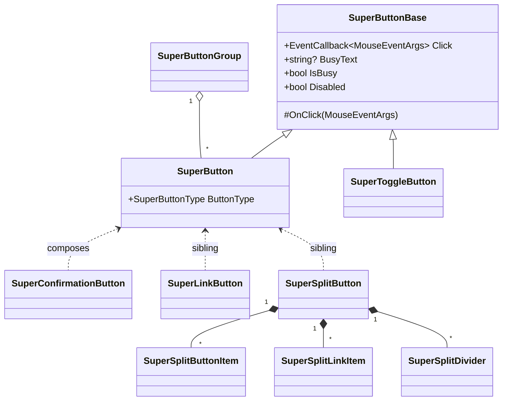
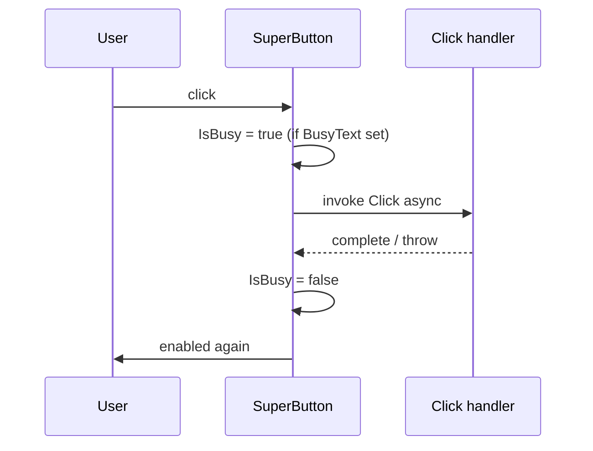

# 🔘 SuperButtons

> A complete family of Bootstrap-powered buttons for Blazor: standard buttons, link buttons, toggle buttons, split buttons (dropdown), confirmation buttons, and button groups.

[← Back to README](README.md)

---

## 📑 Table of Contents

- [Overview](#overview)
- [Getting Started](#getting-started)
- [Architecture](#architecture)
- [Component Family](#component-family)
- [API Reference](#api-reference)
  - [SuperButton](#superbutton)
  - [SuperLinkButton](#superlinkbutton)
  - [SuperToggleButton](#supertogglebutton)
  - [SuperSplitButton](#supersplitbutton)
  - [SuperConfirmationButton](#superconfirmationbutton)
  - [SuperButtonGroup](#superbuttongroup)
- [Enums](#enums)
- [Usage Examples](#usage-examples)
- [Tips & Best Practices](#tips--best-practices)
- [Troubleshooting](#troubleshooting)

---

## Overview

`SuperButtons` is a coordinated set of button components designed for line-of-business apps. They share a common base (`SuperButtonBase`) that handles the `Click` callback, busy state, and disabled state, and they all integrate with the optional `SuperLayout` cascading parameter so they automatically collapse to icon-only mode when the sidebar is collapsed.

**Key features**

- 🎨 9 Bootstrap variants (`Primary`, `Secondary`, `Success`, `Danger`, `Warning`, `Info`, `Light`, `Dark`, `Link`)
- 📏 4 sizes (`Default`, `SuperSmall`, `Small`, `Large`)
- 🧾 Native `button` / `submit` rendering via `ButtonType`
- ⏳ Built-in **busy state** with spinner and `BusyText`
- 🖼️ Icons (Font Awesome) or images (URL)
- 🏷️ Optional **badges** with custom CSS class
- 💬 Optional **Bootstrap popover** (title + content + placement)
- 🔄 Auto **icon-only collapse** when used inside `SuperLayout`'s collapsed sidebar
- ✅ Confirmation flow via `SuperConfirmationButton` (uses `SuperDialogService`)
- ⬇️ Dropdowns with `SuperSplitButton` + `SuperSplitButtonItem` / `SuperSplitLinkItem` / `SuperSplitDivider`
- 🔘 Toggle (pressed/unpressed) state via `SuperToggleButton`

---

## Getting Started

### Service registration

Buttons rely on standard `SuperBlazorComponents` services. In `Program.cs`:

```csharp
builder.Services.AddSuperComponents();
```

For `SuperConfirmationButton` you also need a `<SuperDialog />` and `<SuperConfirmDialog />` host placed somewhere in your layout (see [SUPERDIALOGS.md](SUPERDIALOGS.md)).

### Imports

```razor
@using SuperBlazorComponents.Components.Buttons
```

### Minimal example

```razor
<SuperButton Text="Save"
             Icon="fa-floppy-disk"
             Style="SuperButtonStyle.Primary"
             Click="OnSaveAsync" />
```

---

## Architecture



**Click pipeline (with busy state)**



---

## Component Family

| Component | Purpose |
|---|---|
| `SuperButton` | Standard button (`<button>`), supports busy state, popover, badge, icon/image |
| `SuperLinkButton` | Anchor (`<a href>`) styled as a button — supports `OpenInNewTab` |
| `SuperToggleButton` | Two-state pressed/unpressed button with `Active` + `ActiveChanged` |
| `SuperSplitButton` | Primary action + dropdown with items |
| `SuperSplitButtonItem` | `<button>`-based item inside a split-button menu |
| `SuperSplitLinkItem` | `<a href>` item inside a split-button menu |
| `SuperSplitDivider` | Visual divider inside a split-button menu |
| `SuperConfirmationButton` | Wraps `SuperButton` with a confirmation dialog before executing the click |
| `SuperButtonGroup` | Bootstrap `btn-group` / `btn-group-vertical` container |

---

## API Reference

### SuperButton

| Parameter | Type | Default | Description |
|---|---|---|---|
| `Text` | `string` | — | Button label (required) |
| `ChildContent` | `RenderFragment?` | `null` | Custom inner content (overrides `Text` rendering) |
| `Icon` | `string?` | `null` | Font Awesome icon class (e.g. `fa-floppy-disk`) |
| `Image` | `string?` | `null` | Image URL — replaces `Icon` when set |
| `IconStyle` | `SuperIconStyle` | `Configuration` | Solid / Regular / Brands / Duotone |
| `BadgeText` | `string?` | `null` | Optional badge text |
| `BadgeCssClass` | `string` | `badge text-bg-secondary` | CSS classes applied to the badge |
| `Outline` | `bool` | `false` | Use `btn-outline-*` variant |
| `Size` | `SuperButtonSize` | `Default` | Button size |
| `Style` | `SuperButtonStyle` | `Primary` | Bootstrap variant |
| `ButtonType` | `SuperButtonType` | `Button` | Native button type. `Button` renders `type="button"`; `Submit` renders `type="submit"` for forms |
| `Disabled` | `bool` | `false` | Disables the button |
| `IsBusy` | `bool` | `false` | Force the busy state externally |
| `BusyText` | `string?` | `null` | Text shown next to the spinner while the component `Click` callback is running |
| `PopoverTitle` | `string?` | `null` | Bootstrap popover title |
| `PopoverContent` | `string?` | `null` | Bootstrap popover content |
| `PopoverPlacement` | `string?` | `null` | `top`, `bottom`, `start`, `end` |
| `AllowCollapse` | `bool` | `true` | Auto icon-only mode when sidebar collapses |
| `Click` | `EventCallback<MouseEventArgs>` | — | Invoked on click |

### SuperLinkButton

Same visuals as `SuperButton`, but renders an `<a>` element.

| Parameter | Type | Default | Description |
|---|---|---|---|
| `Href` | `string?` | `null` | Target URL |
| `OpenInNewTab` | `bool` | `false` | Adds `target="_blank"` + `rel="noopener noreferrer"` |
| `Text`, `Icon`, `Image`, `IconStyle`, `BadgeText`, `BadgeCssClass`, `Outline`, `Size`, `Style`, `Disabled`, `AllowCollapse` | — | — | Same semantics as `SuperButton` |

### SuperToggleButton

| Parameter | Type | Default | Description |
|---|---|---|---|
| `Text` | `string` | — | Label |
| `Icon` | `string?` | `null` | Optional CSS icon class |
| `Outline` | `bool` | `false` | Outline variant |
| `Size` / `Style` | enums | — | Same as `SuperButton` |
| `Active` | `bool` | `false` | Pressed/unpressed state |
| `ActiveChanged` | `EventCallback<bool>` | — | Two-way binding partner |
| `Click` | `EventCallback<MouseEventArgs>` | — | Fired after toggling |
| `AllowCollapse` | `bool` | `true` | Icon-only when sidebar collapsed |

### SuperSplitButton

| Parameter | Type | Default | Description |
|---|---|---|---|
| `Text` | `string` | `""` | Main button label |
| `ButtonContent` | `RenderFragment?` | `null` | Custom main button content |
| `Menu` | `RenderFragment?` | `null` | Dropdown items |
| `Icon` / `IconStyle` | — | — | Main button icon |
| `Outline` / `Size` / `Style` | — | — | Same as `SuperButton` |
| `MenuAlignment` | `SuperDropdownMenuAlignment` | `Start` | `Start` or `End` |
| `Click` | `EventCallback<MouseEventArgs>` | — | Main button click |
| `ActionSelected` | `EventCallback<SuperSplitButtonActionEventArgs>` | — | Fired when an item with `ActionName` is clicked |
| `AllowCollapse` | `bool` | `true` | Icon-only when sidebar collapsed |

`SuperSplitButtonItem` parameters: `ActionName`, `Text`, `Icon`, `IconStyle`, `Disabled`, `Size`, `ChildContent`.

`SuperSplitLinkItem` parameters: `Path`, `Text`, `Icon`, `IconStyle`, `Disabled`, `Size`, `Match`.

### SuperConfirmationButton

| Parameter | Type | Default | Description |
|---|---|---|---|
| `ConfirmationTitle` | `string?` | `"Demande de confirmation"` | Dialog title |
| `ConfirmationContent` | `string` | `""` | Dialog message |
| `ApplyCondition` | `Func<bool>?` | `null` | When set and returns `false`, skips both confirmation and click |
| All `SuperButton` parameters except popover | — | — | Forwarded |

### SuperButtonGroup

| Parameter | Type | Default | Description |
|---|---|---|---|
| `Buttons` | `RenderFragment?` | `null` | Child buttons |
| `Vertical` | `bool` | `false` | Vertical layout (`btn-group-vertical`) |
| `AriaLabel` | `string` | `"Button group"` | Accessibility label |

---

## Enums

```csharp
public enum SuperButtonStyle
{
    Primary, Secondary, Success, Danger, Warning, Info, Light, Dark, Link
}

public enum SuperButtonSize
{
    Default, SuperSmall, Small, Large
}

public enum SuperButtonType
{
    Button, Submit
}

public enum SuperDropdownMenuAlignment
{
    Start, End
}
```

---

## Usage Examples

### 1. Basic primary button

```razor
<SuperButton Text="Save" Icon="fa-floppy-disk" Click="OnSaveAsync" />
```

### 2. Submit button

```razor
<EditForm Model="@model" OnValidSubmit="OnSubmitAsync">
    <SuperButton Text="Save"
                 Icon="fa-floppy-disk"
                 ButtonType="SuperButtonType.Submit" />
</EditForm>
```

`SuperButton` renders `type="button"` by default, so it does not submit a form accidentally. Use `ButtonType="SuperButtonType.Submit"` only for the button that should trigger form submission.

### 3. Submit button with form-controlled loader

```razor
<EditForm Model="@model" OnValidSubmit="SaveAsync">
    <SuperButton Text="Save"
                 Icon="fa-floppy-disk"
                 ButtonType="SuperButtonType.Submit"
                 IsBusy="@_isSaving"
                 BusyText="Saving..." />
</EditForm>

@code {
    private bool _isSaving;

    private async Task SaveAsync()
    {
        _isSaving = true;

        try
        {
            await Api.SaveAsync(model);
        }
        finally
        {
            _isSaving = false;
        }
    }
}
```

`BusyText` is automatic when the async work is executed by the `Click` callback on `SuperButton`. For `EditForm.OnValidSubmit`, bind `IsBusy` to the form handler state as shown above.

### 4. Outline + size + style

```razor
<SuperButton Text="Delete"
             Icon="fa-trash"
             Style="SuperButtonStyle.Danger"
             Outline="true"
             Size="SuperButtonSize.Small"
             Click="OnDeleteAsync" />
```

### 5. Async button with busy state

```razor
<SuperButton Text="Send invoice"
             BusyText="Sending..."
             Click="SendAsync" />

@code {
    private async Task SendAsync()
    {
        await Http.PostAsync("/invoices/send", null);
    }
}
```

### 6. Image instead of icon

```razor
<SuperButton Text="Sign in with Google"
             Image="/img/google.svg"
             Style="SuperButtonStyle.Light" />
```

### 7. Button with badge

```razor
<SuperButton Text="Inbox"
             Icon="fa-inbox"
             BadgeText="@unreadCount.ToString()"
             BadgeCssClass="badge text-bg-danger" />
```

### 8. Bootstrap popover

```razor
<SuperButton Text="Help"
             Icon="fa-circle-question"
             Style="SuperButtonStyle.Info"
             Outline="true"
             PopoverTitle="Why is this disabled?"
             PopoverContent="You need at least one selected row before exporting."
             PopoverPlacement="top" />
```

### 9. Link button opening in a new tab

```razor
<SuperLinkButton Text="Documentation"
                 Icon="fa-book"
                 Href="https://example.com/docs"
                 OpenInNewTab="true"
                 Style="SuperButtonStyle.Link" />
```

### 10. Toggle button (pressed state)

```razor
<SuperToggleButton Text="Show archived"
                   Icon="fa-box-archive"
                   @bind-Active="_showArchived"
                   Click="OnFilterChanged" />
```

### 11. Split button with multiple actions

```razor
<SuperSplitButton Text="Export"
                  Icon="fa-download"
                  Style="SuperButtonStyle.Primary"
                  ActionSelected="OnExport">
    <Menu>
        <SuperSplitButtonItem ActionName="csv"  Text="Export as CSV"  Icon="fa-file-csv" />
        <SuperSplitButtonItem ActionName="xlsx" Text="Export as Excel" Icon="fa-file-excel" />
        <SuperSplitDivider />
        <SuperSplitButtonItem ActionName="pdf"  Text="Export as PDF"  Icon="fa-file-pdf" />
    </Menu>
</SuperSplitButton>

@code {
    private async Task OnExport(SuperSplitButtonActionEventArgs e)
    {
        switch (e.ActionName)
        {
            case "csv":  await ExportCsvAsync();  break;
            case "xlsx": await ExportXlsxAsync(); break;
            case "pdf":  await ExportPdfAsync();  break;
        }
    }
}
```

### 12. Split button with link items

```razor
<SuperSplitButton Text="New" Icon="fa-plus" Style="SuperButtonStyle.Success">
    <Menu>
        <SuperSplitLinkItem Path="/customers/new" Text="Customer"  Icon="fa-user" />
        <SuperSplitLinkItem Path="/orders/new"    Text="Order"     Icon="fa-receipt" />
    </Menu>
</SuperSplitButton>
```

### 13. Confirmation button (deletion)

```razor
<SuperConfirmationButton Text="Delete"
                         Icon="fa-trash"
                         Style="SuperButtonStyle.Danger"
                         ConfirmationTitle="Delete this customer?"
                         ConfirmationContent="This action cannot be undone."
                         Click="DeleteCustomerAsync" />
```

### 14. Confirmation button with `ApplyCondition`

```razor
<SuperConfirmationButton Text="Apply"
                         ConfirmationTitle="Apply changes?"
                         ConfirmationContent="Continue?"
                         ApplyCondition="@(() => _form.IsValid)"
                         Click="OnApplyAsync" />
```

### 15. Button group (toolbar)

```razor
<SuperButtonGroup AriaLabel="Text alignment">
    <Buttons>
        <SuperToggleButton Text="Left"   Icon="fa-align-left"   @bind-Active="_left" />
        <SuperToggleButton Text="Center" Icon="fa-align-center" @bind-Active="_center" />
        <SuperToggleButton Text="Right"  Icon="fa-align-right"  @bind-Active="_right" />
    </Buttons>
</SuperButtonGroup>
```

### 16. Vertical button group

```razor
<SuperButtonGroup Vertical="true">
    <Buttons>
        <SuperButton Text="One"   Click="@(() => Pick(1))" />
        <SuperButton Text="Two"   Click="@(() => Pick(2))" />
        <SuperButton Text="Three" Click="@(() => Pick(3))" />
    </Buttons>
</SuperButtonGroup>
```

### 17. Auto icon-only inside collapsed sidebar

```razor
<SuperLayout>
    <SidebarContent>
        <SuperButton Text="Refresh" Icon="fa-rotate" Click="RefreshAsync" />
        <!-- When sidebar collapses, the button auto-shrinks to icon-only with title="Refresh" -->
    </SidebarContent>
</SuperLayout>
```

Set `AllowCollapse="false"` to disable that behavior.

### 18. All variants overview

```razor
@foreach (var style in Enum.GetValues<SuperButtonStyle>())
{
    <SuperButton Text="@style.ToString()" Style="@style" />
    <SuperButton Text="@style.ToString()" Style="@style" Outline="true" />
}
```

---

## Tips & Best Practices

- ✅ Prefer **`BusyText`** over manually toggling `Disabled` for async clicks — it gives free spinner + click protection.
- ✅ Keep the default `ButtonType="SuperButtonType.Button"` for normal actions inside forms, and opt in to `Submit` only when the button must submit the form.
- ✅ Use **`SuperConfirmationButton`** for any destructive operation; do not roll your own modal.
- ✅ For toolbars, wrap related buttons in **`SuperButtonGroup`** to get correct Bootstrap spacing/borders.
- ✅ Provide **`Icon` + `Text`** so the button degrades gracefully when the sidebar collapses to icon-only.
- ✅ For dropdown menus that should align to the right edge of the button, set `MenuAlignment="SuperDropdownMenuAlignment.End"`.
- ⚠️ `SuperButton.PopoverTitle` + `PopoverContent` requires Bootstrap's JS popover bundle to be loaded.

---

## Troubleshooting

| Symptom | Cause | Fix |
|---|---|---|
| Click handler runs twice | `Click` callback also calls `StateHasChanged` while `BusyText` already triggers it | Remove the manual `StateHasChanged` |
| Button inside a form does not submit | `SuperButton` defaults to `type="button"` | Set `ButtonType="SuperButtonType.Submit"` |
| Loader does not show during `OnValidSubmit` | `BusyText` follows the `SuperButton.Click` callback, not the form event | Bind `IsBusy` to a field that is toggled in the form submit handler |
| Confirmation dialog never shows | `<SuperDialog />` or `<SuperConfirmDialog />` host not placed in layout | Add both to `MainLayout.razor` |
| Split button menu cut off | Parent has `overflow: hidden` | Add `overflow-visible` or move the dropdown to a higher container |
| Icon-only mode never triggers | Component is not inside a `SuperLayout` | Either add it, or set `AllowCollapse="false"` to silence the feature |
| Popover does not appear | Bootstrap JS not loaded, or no `data-bs-trigger` set | Ensure `bootstrap.bundle.min.js` is included; component sets `focus` trigger by default |

---

[← Back to README](README.md)
