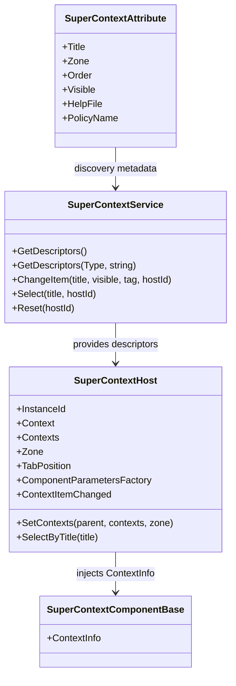

# SuperContext

> Contextual rendering for Blazor workspaces: discover context-aware components by runtime type and zone, then host them as tabbed panels around the selected entity.

[<- Back to README](README.md)

---

## Table of Contents

- [Overview](#overview)
- [Getting Started](#getting-started)
- [Architecture](#architecture)
- [Core Concepts](#core-concepts)
- [API Reference](#api-reference)
- [Usage Examples](#usage-examples)
- [Tips & Best Practices](#tips--best-practices)
- [Troubleshooting](#troubleshooting)

---

## Overview

`SuperContext` is the contextualization subsystem for SuperBlazorComponents. It discovers components tagged with `SuperContextAttribute`, matches them against the current runtime context type, and renders the resulting panels inside `SuperContextHost`.

It is designed for screens where the selected entity drives a set of contextual tools, details, actions, or related information. The host can manage one context or multiple heterogeneous contexts, and it keeps the selected tab isolated per host instance through `InstanceId`.

**What it gives you**

- Discover context components from configured assemblies
- Match components by runtime type and zone
- Render one or many context objects in the same host
- Keep tab selection and visibility state isolated per host
- Support custom component parameters when the default `ContextInfo` injection is not enough
- Expose service-driven actions such as select, reset, and change item visibility

---

## Getting Started

### Service registration

Register Super components as usual, then add the assembly that contains your contextual components:

```csharp
builder.Services.AddSuperComponents(options =>
{
	options.Contextualization.AddAssembly<AppAssemblyMarker>();
});
```

If your contextual components live in the entry assembly, `AddSuperComponents()` alone is enough. If they live in another project, explicitly add that assembly so the service can discover them.

### Imports

```razor
@using SuperBlazorComponents.Components.Contextualization
```

### Minimal host example

```razor
<SuperContextHost InstanceId="customer-host"
				  Context="SelectedCustomer"
				  Parent="this"
				  Zone="@SuperContextZones.Bottom" />
```

---

## Architecture



---

## Core Concepts

### Zones

Zones let you split contextual components by layout location.

| Zone | Purpose |
|---|---|
| `SuperContextZones.Default` | Default contextual area |
| `SuperContextZones.Bottom` | Bottom tab strip or lower panel |
| `SuperContextZones.Right` | Right-hand side panel |

### Discovery

A component becomes available to `SuperContextHost` when it is decorated with `SuperContextAttribute` or `SuperContextAttribute<TContext>`.

The service matches:

- the requested context type against the attribute's `ContextType`
- the requested `Zone` against the attribute's `Zone`
- the current route against `ExcludeRoutes`, when configured

### Rendering

Each discovered descriptor is converted to a `SuperContextItem`, then projected into a `SuperTabItem`. The default parameter name passed to the rendered component is `ContextInfo`, which is defined by `SuperContextComponentBase`.

---

## API Reference

### SuperContextHost

| Parameter | Type | Default | Description |
|---|---|---|---|
| `InstanceId` | `string` | generated GUID-based id | Isolates tab state and service actions per host |
| `Parent` | `object?` | `null` | Parent object passed into each context item |
| `Context` | `object?` | `null` | Single runtime context object |
| `Contexts` | `IEnumerable<object>?` | `null` | Multiple runtime context objects |
| `Zone` | `string` | `SuperContextZones.Default` | Context zone to resolve |
| `TabPosition` | `SuperTabPosition` | `Bottom` | Tab strip placement |
| `Height` | `string` | `100%` | Height of the host area |
| `ContextParameterName` | `string` | `ContextInfo` | Name of the parameter used for rendered components |
| `ComponentParametersFactory` | `Func<SuperContextItem, IReadOnlyDictionary<string, object>>?` | `null` | Custom parameters for the rendered component |
| `ContextItemChanged` | `Action<SuperContextItem>?` | `null` | Callback when item visibility or tag changes |

### SuperContextAttribute

| Property | Type | Default | Description |
|---|---|---|---|
| `Title` | `string` | required | Tab title |
| `Zone` | `string` | `SuperContextZones.Default` | Target zone |
| `Order` | `int` | `int.MaxValue` | Sort order |
| `Visible` | `bool` | `true` | Initial visibility |
| `Icon` | `string?` | `null` | Optional icon |
| `IconColor` | `string?` | `null` | Optional icon color |
| `ExcludeRoutes` | `string?` | `null` | Comma-separated route prefixes to skip |
| `HelpFile` | `string?` | `null` | Help document path; defaults to `<ComponentType.Name>.md` |
| `PolicyName` | `string?` | `null` | Optional policy name |

### SuperContextComponentBase

Base class for contextual components.

| Parameter | Type | Description |
|---|---|---|
| `ContextInfo` | `SuperContextItem` | Context metadata and the runtime context object |

### SuperContextItem

Useful runtime properties:

| Property | Type | Description |
|---|---|---|
| `Context` | `object` | Runtime context object |
| `Parent` | `object?` | Parent object passed by the host |
| `Tag` | `object?` | Mutable host state |
| `Visible` | `bool` | Current visibility state |
| `ReloadHost` | `EventCallback<object>` | Refresh callback when the parent implements `ISuperContextRefreshable` |
| `Title` | `string` | Descriptor title |
| `Zone` | `string` | Descriptor zone |
| `HelpFile` | `string?` | Associated help file |

### SuperContextService

| Method | Description |
|---|---|
| `GetDescriptors()` | Returns all discovered descriptors |
| `GetDescriptors(Type contextType, string zone)` | Returns descriptors compatible with a runtime context type and zone |
| `GetByTitle(string? title)` | Looks up a descriptor by title |
| `ChangeItem(title, visible, tag, hostId)` | Requests a visibility/tag change for a context item |
| `Select(title, hostId)` | Requests a tab selection |
| `Reset(hostId)` | Resets the selected tab for a host |

### ISuperContextRefreshable

```csharp
public interface ISuperContextRefreshable
{
	Task RefreshFromContextAsync(object context);
}
```

If the `Parent` object implements this interface, each `SuperContextItem` receives a `ReloadHost` callback wired to `RefreshFromContextAsync`.

---

## Usage Examples

### 1. Context component

```razor
@inherits SuperContextComponentBase

<div class="card border-0">
	<div class="card-body">
		<h5 class="card-title">@((Customer)ContextInfo.Context).Name</h5>
		<p class="card-text mb-0">@((Customer)ContextInfo.Context).Email</p>
	</div>
</div>
```

```csharp
[SuperContextAttribute<Customer>(Title = "Details", Zone = SuperContextZones.Bottom)]
public sealed class CustomerDetailsContext : SuperContextComponentBase
{
}
```

### 2. Host with a single context

```razor
<SuperContextHost InstanceId="demo-bottom"
				  Context="SelectedCustomer"
				  Parent="this"
				  Zone="@SuperContextZones.Bottom" />
```

### 3. Host with multiple contexts

```razor
<SuperContextHost InstanceId="demo-multiple"
				  Contexts="SelectedContexts"
				  Parent="this"
				  Zone="@SuperContextZones.Bottom" />

@code {
	private IReadOnlyList<object> SelectedContexts => [SelectedCustomer, SelectedInvoice];
}
```

### 4. Right-hand contextual panel

```razor
<SuperContextHost InstanceId="demo-right"
				  Context="SelectedCustomer"
				  Parent="this"
				  Zone="@SuperContextZones.Right"
				  TabPosition="SuperTabPosition.Top" />
```

### 5. Custom parameter mapping

```razor
<SuperContextHost InstanceId="demo-custom"
				  Context="SelectedCustomer"
				  Parent="this"
				  ComponentParametersFactory="BuildParameters" />

@code {
	private IReadOnlyDictionary<string, object> BuildParameters(SuperContextItem item) =>
		new Dictionary<string, object>
		{
			["Model"] = item.Context,
			["ContextInfo"] = item
		};
}
```

### 6. Service-driven visibility changes

```csharp
ContextService.ChangeItem("Details", visible: false, hostId: "demo-bottom");
ContextService.Select("History", hostId: "demo-bottom");
ContextService.Reset("demo-bottom");
```

---

## Tips & Best Practices

- Register the assembly that contains your contextual components, or discovery will return nothing.
- Use a dedicated `InstanceId` for each host when the page renders more than one `SuperContextHost`.
- Keep the rendered components focused: one context component should represent one task, one detail surface, or one action group.
- Use `Zone` to separate right-side and bottom-side experiences instead of overloading one host.
- Prefer `SuperContextComponentBase` for strongly typed context panels so your components stay simple.
- Use `ExcludeRoutes` when a contextual component should not appear on create, edit, or read-only routes.

---

## Troubleshooting

| Symptom | Cause | Fix |
|---|---|---|
| No tabs appear | Assembly not registered for discovery | Add `options.Contextualization.AddAssembly<T>()` |
| Tabs appear in the wrong place | `Zone` does not match the component attribute | Align the host `Zone` with the attribute `Zone` |
| Component gets no context | Custom parameter name does not match the component parameter | Keep `ContextParameterName` aligned with the target component |
| State leaks between hosts | Hosts share the same `InstanceId` | Give each host a unique `InstanceId` |
| Refresh callback is null | Parent does not implement `ISuperContextRefreshable` | Implement the interface or invoke refresh manually |

---

[<- Back to README](README.md)
