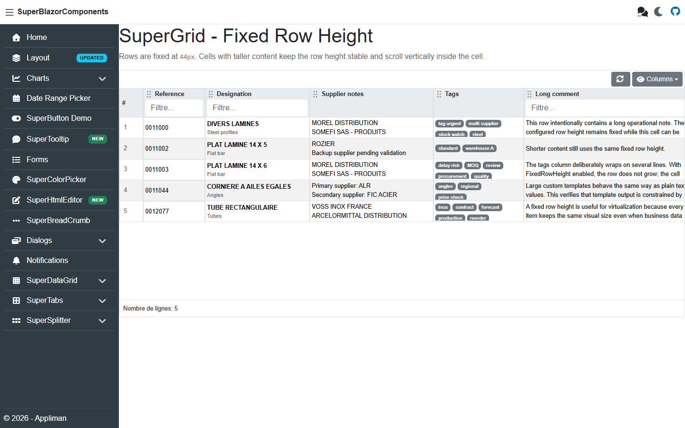
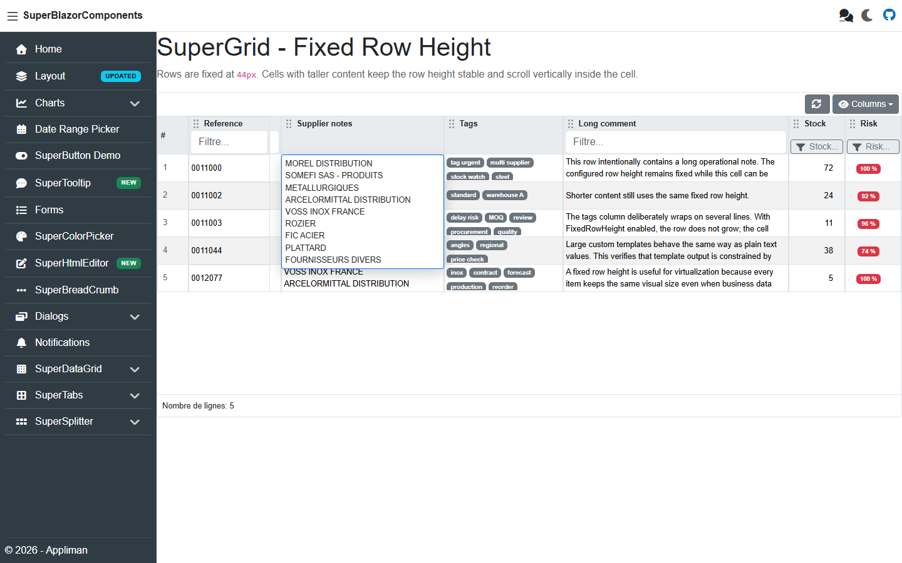

# 📊 SuperDataGrid — Complete Documentation

> A high-performance, virtualized data grid component for Blazor with frozen columns/rows, hierarchical lazy-loading rows, column reordering & resizing, filtering, sorting, inline editing, row selection, and settings persistence.

**[← Back to main README](README.md)**

---

## Table of Contents

- [Getting Started](#getting-started)
  - [Installation](#installation)
  - [Service Registration](#service-registration)
  - [Minimal Example](#minimal-example)
- [Data Provider](#data-provider)
  - [GridItemsProvider Delegate](#griditemsprovider-delegate)
  - [GridItemsProviderRequest](#griditemsproviderrequest)
  - [Hierarchical Requests](#hierarchical-requests)
  - [GridItemsProviderResult](#griditemsproviderresult)
  - [IDataItem Interface](#idataitem-interface)
- [SuperDataGrid Parameters](#superdatagrid-parameters)
  - [Data & Layout](#data--layout)
  - [Frozen Columns & Rows](#frozen-columns--rows)
  - [Features Toggle](#features-toggle)
  - [Editing](#editing)
  - [Selection](#selection)
  - [Appearance](#appearance)
  - [Templates](#templates)
  - [Events](#events)
- [DataGridColumn Parameters](#datagridcolumn-parameters)
  - [Column Templates](#column-templates)
- [Public API (Methods & Properties)](#public-api-methods--properties)
- [Usage Examples](#usage-examples)
  - [1 — Basic Grid with Sorting](#1--basic-grid-with-sorting)
  - [2 — Custom Cell Templates](#2--custom-cell-templates)
  - [3 — Frozen Columns (Left & Right)](#3--frozen-columns-left--right)
  - [4 — Row Selection (Single)](#4--row-selection-single)
  - [5 — Row Selection (Multiple) with Actions](#5--row-selection-multiple-with-actions)
  - [6 — Inline Row Editing (Double-Click)](#6--inline-row-editing-double-click)
  - [7 — Custom Column Filters](#7--custom-column-filters)
  - [8 — Enum Filter Dialog](#8--enum-filter-dialog)
  - [9 — Number Filter Dialog](#9--number-filter-dialog)
  - [10 — Header & Footer Templates](#10--header--footer-templates)
  - [11 — Column Visibility Toggle](#11--column-visibility-toggle)
  - [12 — Settings Persistence (LocalStorage)](#12--settings-persistence-localstorage)
  - [13 — Custom Settings Storage (Database)](#13--custom-settings-storage-database)
  - [14 — Vertical Orientation (Property Grid)](#14--vertical-orientation-property-grid)
  - [15 — Preset Grid Settings (DefaultSettingsName)](#15--preset-grid-settings-defaultsettingsname)
  - [16 — Large Dataset with Simulated Latency](#16--large-dataset-with-simulated-latency)
  - [17 — Cell Click Events](#17--cell-click-events)
  - [18 — Programmatic Grid Control](#18--programmatic-grid-control)
  - [19 — Custom Filter Component Registration](#19--custom-filter-component-registration)
  - [20 — Selector Menu Items (Bulk Actions)](#20--selector-menu-items-bulk-actions)
  - [21 — Hierarchical Lazy Loading](#21--hierarchical-lazy-loading)
- [Filter System](#filter-system)
  - [Built-in Filter Components](#built-in-filter-components)
  - [SuperDataGridFilterInfo](#superdatagridfilterinfo)
  - [Registering Custom Filters](#registering-custom-filters)
- [Settings Persistence](#settings-persistence)
  - [Storage Modes](#storage-modes)
  - [ISuperDataGridSettingsStorage Interface](#isuperdatagridsettigsstorage-interface)
- [Enums Reference](#enums-reference)
- [Tips & Best Practices](#tips--best-practices)

---

## Getting Started

### Installation

```bash
dotnet add package SuperBlazorComponents
```

### Service Registration

In your `Program.cs`, register the SuperBlazorComponents services:

```csharp
builder.Services.AddSuperComponents(options =>
{
    // Choose where grid settings are persisted
    options.DataGridSettingsStorageMode = DataGridSettingsStorageMode.LocalStorage;

    // Default icon style for all components
    options.DefaultSuperIconeStyle = SuperIconStyle.Solid;
});
```

### Minimal Example

```razor
@using SuperBlazorComponents.Components.SuperDataGrid

<SuperDataGrid TItem="Product" ItemsProvider="LoadProducts">
    <DataGridColumn For="@(p => p.Name)"  Title="Name"  Width="200px" />
    <DataGridColumn For="@(p => p.Price)" Title="Price" Width="120px" FormatString="{0:C}" />
</SuperDataGrid>

@code {
    private readonly List<Product> _products =
    [
        new("Keyboard", 89.99m),
        new("Mouse", 49.99m),
        new("Monitor", 449.00m),
    ];

    private ValueTask<GridItemsProviderResult<Product>> LoadProducts(
        GridItemsProviderRequest<Product> request)
    {
        var items = _products
            .Skip(request.StartIndex)
            .Take(request.Count ?? _products.Count)
            .ToList();

        return ValueTask.FromResult(
            GridItemsProviderResult<Product>.From(items, _products.Count));
    }

    private record Product(string Name, decimal Price);
}
```

---

## Data Provider

### GridItemsProvider Delegate

The grid uses a **delegate-based data provider** pattern similar to QuickGrid's `ItemsProvider`. This enables server-side paging, sorting, and filtering.

```csharp
public delegate ValueTask<GridItemsProviderResult<TItem>> GridItemsProvider<TItem>(
    GridItemsProviderRequest<TItem> request);
```

### GridItemsProviderRequest

The request object sent to your data provider:

| Property | Type | Description |
|---|---|---|
| `StartIndex` | `int` | Zero-based index of the first requested item |
| `Count` | `int?` | Number of items requested (null = all) |
| `SortColumn` | `string?` | Property name of the sorted column |
| `SortDirection` | `SortDirection` | `None`, `Ascending`, or `Descending` |
| `Filters` | `IEnumerable<SuperDataGridFilterInfo>` | Active filters from the UI |
| `CancellationToken` | `CancellationToken` | Token cancelled when a new request supersedes this one |
| `ParentItem` | `TItem?` | Parent row when the request loads hierarchical child rows |
| `ParentKey` | `object?` | Parent key when the request loads hierarchical child rows |
| `HierarchyLevel` | `int` | Zero-based hierarchy level for root requests; child requests use parent level + 1 |
| `IsHierarchyRequest` | `bool` | `true` when `ParentKey` is set |

### Hierarchical Requests

When `Hierarchical="true"`, SuperDataGrid reuses the same `ItemsProvider` for root rows and child rows:

- In hierarchical mode, root rows are loaded without `Virtualize` because expanded rows create variable item heights.
- Child requests are sent when a row is expanded.
- Child requests use `StartIndex = 0`, `Count = null`, the current sort/filter state, and parent context through `ParentItem`, `ParentKey`, and `HierarchyLevel`.
- Parent and child rows must be the same `TItem` type.
- Child rows are not cached by the grid. Collapsing removes loaded descendants, and expanding again calls `ItemsProvider` again.
- If a child request returns no rows, the expander is hidden for that row until the next grid reload/filter/sort refresh.

Example provider branching:

```csharp
private async ValueTask<GridItemsProviderResult<CategoryRow>> LoadRows(
    GridItemsProviderRequest<CategoryRow> request)
{
    if (request.IsHierarchyRequest && request.ParentItem is not null)
    {
        var children = await _service.GetChildrenAsync(
            request.ParentKey,
            request.Filters,
            request.SortColumn,
            request.SortDirection,
            request.CancellationToken);

        return GridItemsProviderResult<CategoryRow>.From(children, children.Count);
    }

    var page = await _service.GetRootPageAsync(
        request.StartIndex,
        request.Count ?? 50,
        request.Filters,
        request.SortColumn,
        request.SortDirection,
        request.CancellationToken);

    return GridItemsProviderResult<CategoryRow>.From(page.Items, page.TotalCount);
}
```

### GridItemsProviderResult

The result you return from your data provider:

| Property | Type | Description |
|---|---|---|
| `Items` | `IEnumerable<TItem>` | The items for the requested page |
| `TotalItemCount` | `int` | Total number of items matching the current filters |

Helper methods:

```csharp
// Create from items + count
GridItemsProviderResult<Product>.From(items, totalCount);

// Empty result
GridItemsProviderResult<Product>.Empty();
```

### IDataItem Interface

Implement `IDataItem` on your model for enhanced selection support and row numbering:

```csharp
public class Product : IDataItem
{
    public int Id { get; set; }
    public string Name { get; set; } = "";
    public decimal Price { get; set; }

    // IDataItem implementation
    public object KeyValue => Id;
    public bool IsSelected { get; set; }
    public int RowNumber { get; set; }
}
```

When your model implements `IDataItem`:
- The `KeyValue` property is used for tracking selected rows across virtualization pages
- `IsSelected` is automatically set/unset when rows are selected/deselected
- `RowNumber` is automatically populated by the grid

---

## SuperDataGrid Parameters

### Data & Layout

| Parameter | Type | Default | Description |
|---|---|---|---|
| `ItemsProvider` | `GridItemsProvider<TItem>` | **required** | Delegate providing data to the grid |
| `GridId` | `string?` | `null` | Unique identifier for settings persistence |
| `Height` | `string` | `"400px"` | CSS height of the grid container (e.g. `"400px"`, `"100%"`) |
| `RowHeight` | `float` | `40f` | Estimated row height in pixels for virtualization |
| `FixedRowHeight` | `bool` | `true` | Keep body rows at `RowHeight`; overflowing cell content scrolls vertically inside the cell and can expand into a hover preview |
| `OverscanCount` | `int` | `5` | Number of extra items rendered outside the visible area |
| `GridOrientation` | `SuperDataGridOrientation` | `Horizontal` | `Horizontal` (table) or `Vertical` (property grid) |
| `DefaultSettingsName` | `string?` | `null` | Name of a preset from `SuperComponentsConfiguration.SuperDataGridSettingsList` |
| `Hierarchical` | `bool` | `false` | Enable hierarchical lazy-loading rows in horizontal orientation |
| `HierarchyKeySelector` | `Func<TItem, object?>?` | `null` | Optional key selector for hierarchy state; falls back to `IDataItem.KeyValue` or the item instance |

### Frozen Columns & Rows

| Parameter | Type | Default | Description |
|---|---|---|---|
| `FreezeHeader` | `bool` | `true` | Freeze the header row (sticky top) |
| `FreezeFooter` | `bool` | `true` | Freeze the footer row (sticky bottom) |
| `FreezeLeftColumns` | `int` | `0` | Number of columns to freeze on the left |
| `FreezeRightColumns` | `int` | `0` | Number of columns to freeze on the right |

### Features Toggle

| Parameter | Type | Default | Description |
|---|---|---|---|
| `AllowColumnReorder` | `bool` | `true` | Allow drag-and-drop column reordering |
| `AllowColumnResize` | `bool` | `true` | Allow column resize via drag handles |
| `AllowSorting` | `bool` | `true` | Enable column sorting on header click |
| `AllowFiltering` | `bool` | `true` | Display filter controls in the header row |
| `DisplayRowNumberColumn` | `bool` | `true` | Show the row number column |
| `DisplayRefreshButton` | `bool` | `false` | Show a refresh button in the toolbar |
| `DisplayColumnVisibilityToggle` | `bool` | `true` | Show the column visibility toggle button |
| `DisplayDefaultFooterTemplate` | `bool` | `true` | Show the default footer with row count |

### Editing

| Parameter | Type | Default | Description |
|---|---|---|---|
| `EditionMode` | `SuperDataGridEditionMode` | `None` | `None` or `Edit` — controls whether cells render in edit mode |
| `EditOnDoubleClick` | `bool` | `false` | Toggle individual row editing on double-click |
| `RowEditStarted` | `EventCallback<TItem>` | — | Fired when a row enters edit mode |
| `RowEditEnded` | `EventCallback<TItem>` | — | Fired when a row leaves edit mode |
| `ActionsTemplate` | `RenderFragment<TItem>?` | `null` | Template for per-row action buttons (edit, delete, etc.) |
| `ActionsWidth` | `int` | `50` | Width of the actions column in pixels |

### Selection

| Parameter | Type | Default | Description |
|---|---|---|---|
| `SelectionMode` | `SuperDataGridSelectionMode` | `Multiple` | `None`, `Single`, or `Multiple` |
| `DisplaySelectionColumn` | `bool` | `true` | Show the checkbox selection column |
| `CurrentItem` | `TItem?` | `null` | The currently focused item (two-way bindable) |
| `CurrentItemChanged` | `EventCallback<TItem?>` | — | Two-way binding callback for `CurrentItem` |
| `SelectionChanged` | `EventCallback<IEnumerable<TItem>>` | — | Fires when the selected items collection changes |
| `SelectionStateChanged` | `EventCallback<SelectionChangedEventArgs<TItem>>` | — | Fires with detailed selection info |
| `SelectorMenuItems` | `IEnumerable<SuperDataGridRowSelectorItem>?` | `null` | Static selector dropdown items |
| `SelectorMenuItemsContent` | `RenderFragment?` | `null` | Declarative selector menu items |
| `SelectorMenuItemSelected` | `EventCallback<SelectedActionInfo<TItem>>` | — | Fires when a selector menu action is picked |

### Appearance

| Parameter | Type | Default | Description |
|---|---|---|---|
| `CurrentRowBackground` | `string` | `"#3b95c6"` | CSS background color for the active row |
| `ContainerCssClass` | `string?` | `null` | Additional CSS class on the outer container |
| `TableCssClass` | `string` | `"table-striped table-hover table-bordered"` | CSS classes on the `<table>` element |
| `HeaderCssClass` | `string` | `""` | CSS class for the header section |
| `DisplayRowDeleted` | `Func<TItem, bool>?` | `null` | Marks matching rows with `table-danger row-deleted`; deleted rows are read-only and excluded from selection |
| `RowClass` | `Func<TItem, string?>?` | `null` | Function returning a CSS class per row |

### Templates

| Parameter | Type | Description |
|---|---|---|
| `ChildContent` | `RenderFragment?` | The column definitions (`DataGridColumn` components) |
| `HeaderTemplate` | `RenderFragment?` | Custom content in the toolbar above the grid |
| `FooterTemplate` | `RenderFragment?` | Custom content in the footer below the grid |
| `LoadingTemplate` | `RenderFragment?` | Content shown while data is loading |
| `EmptyTemplate` | `RenderFragment?` | Content shown when no data is available |
| `ActionsTemplate` | `RenderFragment<TItem>?` | Per-row action buttons |

### Events

| Event | Type | Description |
|---|---|---|
| `DataLoaded` | `EventCallback<SuperDataGridDataLoadedEventArgs<TItem>>` | Fires after items are loaded |
| `RowClicked` | `EventCallback<TItem>` | Fires when a row is clicked |
| `RowDoubleClicked` | `EventCallback<TItem>` | Fires when a row is double-clicked |
| `CellClicked` | `EventCallback<CellClickedEventArgs<TItem>>` | Fires when a specific cell is clicked |
| `ColumnSettingsChanged` | `EventCallback<IEnumerable<SuperDataGridColumnSettings>>` | Fires when column settings change |
| `ColumnStateChanged` | `event EventHandler` | C# event when column state changes |
| `DataReloaded` | `event Action` | C# event after a data reload completes |
| `SelectedRowsChanged` | `event EventHandler<SelectionChangedEventArgs<TItem>>` | C# event when selection changes |
| `SelectorMenuItemClicked` | `event Action<SelectedActionInfo<TItem>>` | C# event for selector menu clicks |

---

## DataGridColumn Parameters

Define columns inside `<ChildContent>` of `SuperDataGrid`:

| Parameter | Type | Default | Description |
|---|---|---|---|
| `Property` | `string` | `""` | Property name to bind (set automatically when `For` is used) |
| `For` | `Expression<Func<TItem, object?>>?` | `null` | Lambda to the property (e.g. `p => p.Name`). Auto-infers `Property` |
| `Title` | `string?` | Property name | Display title in the header |
| `Width` | `string?` | `null` | Column width (e.g. `"150px"`, `"10%"`) |
| `MinWidth` | `string?` | `null` | Minimum column width |
| `MaxWidth` | `string?` | `null` | Maximum column width |
| `Visible` | `bool` | `true` | Whether the column is visible |
| `AlwaysVisible` | `bool` | `false` | Prevents the column from being hidden |
| `Sortable` | `bool` | `true` | Whether clicking the header sorts this column |
| `Filterable` | `bool` | `true` | Whether a filter control is shown |
| `FilterProperty` | `string?` | `null` | Override property name used by the filter (defaults to `Property`) |
| `Resizable` | `bool` | `true` | Whether the column can be resized |
| `Reorderable` | `bool` | `true` | Whether the column can be drag-reordered |
| `FormatString` | `string?` | `null` | Format string (e.g. `"{0:C}"`, `"{0:d}"`, `"{0:F2}"`) |
| `TextAlign` | `SuperTextAlignment` | `Left` | Text alignment: `Left`, `Center`, `Right` |
| `HeaderCssClass` | `string?` | `null` | CSS class for header cells |
| `CssClass` | `string?` | `null` | CSS class for data cells |
| `CellClass` | `Func<TItem, string?>?` | `null` | Function returning per-cell CSS class |
| `DeferredRegistration` | `bool` | `false` | Skips auto-registration so a parent component can insert the column later with `grid.AddColumn(...)` |

### Column Templates

Each column supports four templates:

```razor
<DataGridColumn TItem="Product" For="@(p => p.Price)" Title="Price" Width="120px">
    <!-- Custom header rendering -->
    <HeaderTemplate>
        <b>Unit<br/>Price</b>
    </HeaderTemplate>

    <!-- Custom display cell rendering (context = TItem) -->
    <Template>
        <span class="text-success">@context.Price.ToString("C")</span>
    </Template>

    <!-- Custom edit cell rendering (context = TItem) -->
    <EditTemplate>
        <input type="number" class="form-control form-control-sm"
               value="@context.Price"
               @onchange="@(e => context.Price = decimal.Parse(e.Value?.ToString() ?? "0"))" />
    </EditTemplate>

    <!-- Custom footer cell rendering -->
    <FooterTemplate>
        <strong>@totalPrice.ToString("C")</strong>
    </FooterTemplate>

    <!-- Custom filter rendering -->
    <FilterTemplate>
        <input type="number" placeholder="Min price..." />
    </FilterTemplate>
</DataGridColumn>
```

---

## Public API (Methods & Properties)

### Methods

| Method | Returns | Description |
|---|---|---|
| `ReloadAsync()` | `Task` | Refreshes the grid data from the `ItemsProvider` |
| `ExpandAllAsync(CancellationToken)` | `Task` | Expands all loaded root rows and recursively loads descendants |
| `CollapseAllAsync()` | `Task` | Collapses all expanded hierarchy rows and removes loaded descendants |
| `ResetColumnSettingsAsync()` | `Task` | Resets all columns to their default width, visibility, and order |
| `GetColumnSettings()` | `IEnumerable<SuperDataGridColumnSettings>` | Returns the current column settings |
| `GetColumnVisibilityInfo()` | `IReadOnlyList<SuperDataGridColumnVisibilityInfo>` | Returns visibility metadata for all columns |
| `SetColumnVisibilityAsync(int, bool)` | `Task` | Sets visibility of a column by its index |
| `AddColumn(int, DataGridColumn<TItem>)` | `void` | Inserts or repositions a column at a specific logical index |
| `BeginEditAsync(TItem)` | `Task` | Puts a row into edit mode |
| `EndEditAsync(TItem)` | `Task` | Confirms and exits edit mode for a row |
| `CancelEditAsync(TItem)` | `Task` | Cancels edit mode for a row (no `RowEditEnded` event) |
| `IsRowInEditMode(TItem)` | `bool` | Returns whether a row is in edit mode |
| `SelectItemAsync(TItem)` | `Task` | Adds an item to the selection |
| `SelectRow(TItem, bool)` | `Task` | Selects a row (optionally clearing others) |
| `SelectAllAsync()` | `Task` | Selects all rows (multiple mode only) |
| `SelectAllRenderedAsync()` | `Task` | Selects all currently rendered rows |
| `ClearSelectionAsync()` | `Task` | Clears the selection |
| `TrySelectFirstRow()` | `Task<bool>` | Selects the first rendered row |
| `SetCurrentRowAsync(TItem)` | `Task` | Sets the current row highlight without changing checkbox state |
| `GetSelectionInfo()` | `SelectionInfo<TItem>` | Returns the current selection summary |
| `AddSelectorMenuItemAsync(...)` | `Task` | Adds a runtime selector menu item |
| `AddSelectorMenuItemsAsync(...)` | `Task` | Adds multiple runtime selector menu items |
| `ClearSelectorMenuItemsAsync()` | `Task` | Clears runtime selector menu items |

### Properties

| Property | Type | Description |
|---|---|---|
| `Items` | `IEnumerable<TItem>?` | Currently rendered items (null if no data loaded) |
| `TotalRowCount` | `int` | Total item count from the last provider result |
| `RowCount` | `int` | Number of registered columns |
| `ColumnsCollection` | `IReadOnlyList<DataGridColumn<TItem>>` | Current column collection |
| `SelectedItems` | `IReadOnlyCollection<TItem>` | Currently selected items |
| `SelectedCountTotal` | `int` | Total selected count (including "select all") |
| `FooterText` | `string` | Default footer text with row/selection count |

---

## Usage Examples

### 1 — Basic Grid with Sorting

A simple grid with automatic sorting and formatting:

```razor
@using SuperBlazorComponents.Components.SuperDataGrid

<div style="height: 400px;">
    <SuperDataGrid TItem="Employee"
                   ItemsProvider="LoadEmployees"
                   Height="100%"
                   AllowSorting="true">
        <ChildContent>
            <DataGridColumn For="@(e => e.Name)"       Title="Name"       Width="200px" />
            <DataGridColumn For="@(e => e.Department)"  Title="Department" Width="150px" />
            <DataGridColumn For="@(e => e.Salary)"      Title="Salary"     Width="120px"
                            FormatString="{0:C}" TextAlign="SuperTextAlignment.Right" />
            <DataGridColumn For="@(e => e.HireDate)"    Title="Hire Date"  Width="130px"
                            FormatString="{0:d}" />
        </ChildContent>
    </SuperDataGrid>
</div>

@code {
    private List<Employee> _employees = [ /* ... */ ];

    private ValueTask<GridItemsProviderResult<Employee>> LoadEmployees(
        GridItemsProviderRequest<Employee> request)
    {
        var query = _employees.AsEnumerable();

        // Apply sorting
        query = (request.SortColumn, request.SortDirection) switch
        {
            (nameof(Employee.Name), SortDirection.Ascending)       => query.OrderBy(e => e.Name),
            (nameof(Employee.Name), SortDirection.Descending)      => query.OrderByDescending(e => e.Name),
            (nameof(Employee.Salary), SortDirection.Ascending)     => query.OrderBy(e => e.Salary),
            (nameof(Employee.Salary), SortDirection.Descending)    => query.OrderByDescending(e => e.Salary),
            (nameof(Employee.Department), SortDirection.Ascending)  => query.OrderBy(e => e.Department),
            (nameof(Employee.Department), SortDirection.Descending) => query.OrderByDescending(e => e.Department),
            (nameof(Employee.HireDate), SortDirection.Ascending)   => query.OrderBy(e => e.HireDate),
            (nameof(Employee.HireDate), SortDirection.Descending)  => query.OrderByDescending(e => e.HireDate),
            _ => query
        };

        var total = query.Count();
        var items = query.Skip(request.StartIndex)
                         .Take(request.Count ?? total)
                         .ToList();

        return ValueTask.FromResult(
            GridItemsProviderResult<Employee>.From(items, total));
    }

    private record Employee(string Name, string Department, decimal Salary, DateTime HireDate);
}
```

---

### 2 — Custom Cell Templates

Use `<Template>` to fully customize how each cell is rendered:

```razor
<SuperDataGrid TItem="Product" ItemsProvider="LoadProducts" Height="400px">
    <ChildContent>
        <DataGridColumn For="@(p => p.Name)" Title="Product" Width="200px">
            <Template>
                <strong>@context.Name</strong>
            </Template>
        </DataGridColumn>

        <DataGridColumn For="@(p => p.Stock)" Title="Stock" Width="120px"
                        TextAlign="SuperTextAlignment.Center">
            <Template>
                @if (context.Stock == 0)
                {
                    <span class="badge text-bg-danger">Out of stock</span>
                }
                else if (context.Stock < 10)
                {
                    <span class="badge text-bg-warning text-dark">@context.Stock left</span>
                }
                else
                {
                    <span class="badge text-bg-success">@context.Stock</span>
                }
            </Template>
        </DataGridColumn>

        <DataGridColumn For="@(p => p.IsActive)" Title="Active" Width="100px"
                        TextAlign="SuperTextAlignment.Center">
            <Template>
                @if (context.IsActive)
                {
                    <span class="badge text-bg-success">Yes</span>
                }
                else
                {
                    <span class="badge text-bg-secondary">No</span>
                }
            </Template>
        </DataGridColumn>

        <DataGridColumn For="@(p => p.Price)" Title="Price" Width="120px"
                        TextAlign="SuperTextAlignment.Right" FormatString="{0:C}" />
    </ChildContent>
</SuperDataGrid>
```

---

### 3 — Frozen Columns (Left & Right)

Keep important columns visible while scrolling horizontally:

```razor
<SuperDataGrid TItem="Invoice"
               ItemsProvider="LoadInvoices"
               Height="500px"
               FreezeHeader="true"
               FreezeFooter="true"
               FreezeLeftColumns="2"
               FreezeRightColumns="1">
    <ChildContent>
        <!-- These 2 columns are frozen on the left -->
        <DataGridColumn For="@(i => i.InvoiceNumber)" Title="#" Width="100px" AlwaysVisible="true" />
        <DataGridColumn For="@(i => i.CustomerName)"   Title="Customer" Width="180px" />

        <!-- These scroll normally -->
        <DataGridColumn For="@(i => i.Date)"    Title="Date"    Width="120px" FormatString="{0:d}" />
        <DataGridColumn For="@(i => i.DueDate)" Title="Due"     Width="120px" FormatString="{0:d}" />
        <DataGridColumn For="@(i => i.Items)"   Title="Items"   Width="80px"  TextAlign="SuperTextAlignment.Center" />
        <DataGridColumn For="@(i => i.Tax)"     Title="Tax"     Width="100px" FormatString="{0:C}" />
        <DataGridColumn For="@(i => i.Notes)"   Title="Notes"   Width="250px" />

        <!-- This column is frozen on the right -->
        <DataGridColumn For="@(i => i.Total)"   Title="Total"   Width="120px"
                        FormatString="{0:C}" TextAlign="SuperTextAlignment.Right"
                        AlwaysVisible="true" />
    </ChildContent>
</SuperDataGrid>
```

---

### 4 — Row Selection (Single)

Single selection with two-way binding on `CurrentItem`:

```razor
<SuperDataGrid TItem="Customer"
               ItemsProvider="LoadCustomers"
               Height="400px"
               SelectionMode="SuperDataGridSelectionMode.Single"
               @bind-CurrentItem="_selectedCustomer"
               RowClicked="OnRowClicked">
    <ChildContent>
        <DataGridColumn For="@(c => c.Name)"  Title="Name"  Width="200px" />
        <DataGridColumn For="@(c => c.Email)" Title="Email" Width="250px" />
        <DataGridColumn For="@(c => c.City)"  Title="City"  Width="150px" />
    </ChildContent>
</SuperDataGrid>

@if (_selectedCustomer is not null)
{
    <div class="alert alert-info mt-2">
        Selected: <strong>@_selectedCustomer.Name</strong> — @_selectedCustomer.Email
    </div>
}

@code {
    private Customer? _selectedCustomer;

    private void OnRowClicked(Customer customer)
    {
        _selectedCustomer = customer;
    }
}
```

---

### 5 — Row Selection (Multiple) with Actions

Multiple selection with a selector dropdown for bulk actions:

```razor
<SuperDataGrid @ref="_grid"
               TItem="Order"
               ItemsProvider="LoadOrders"
               Height="500px"
               SelectionMode="SuperDataGridSelectionMode.Multiple"
               DisplaySelectionColumn="true"
               SelectorMenuItemSelected="OnBulkAction">

    <SelectorMenuItemsContent>
        <SuperSplitButtonItem ActionName="export"   Text="Export selected" />
        <SuperSplitButtonItem ActionName="archive"  Text="Archive selected" />
        <SuperSplitDivider />
        <SuperSplitButtonItem ActionName="delete"   Text="Delete selected" />
    </SelectorMenuItemsContent>

    <ChildContent>
        <DataGridColumn For="@(o => o.Id)"       Title="ID"       Width="80px" />
        <DataGridColumn For="@(o => o.Customer)" Title="Customer" Width="200px" />
        <DataGridColumn For="@(o => o.Total)"    Title="Total"    Width="120px" FormatString="{0:C}" />
    </ChildContent>
</SuperDataGrid>

@code {
    private SuperDataGrid<Order>? _grid;

    private async Task OnBulkAction(SelectedActionInfo<Order> action)
    {
        var selectionInfo = action.DataGridSelectionInfo;
        var selectedCount = selectionInfo.SelectedCountTotal;

        switch (action.ActionName)
        {
            case "export":
                // Export the selected items...
                break;
            case "archive":
                // Archive the selected items...
                break;
            case "delete":
                // Delete the selected items...
                await _grid!.ClearSelectionAsync();
                await _grid.ReloadAsync();
                break;
        }
    }
}
```

---

### 6 — Inline Row Editing (Double-Click)

Double-click a row to edit, with per-row action buttons:

```razor
<SuperDataGrid @ref="_grid"
               TItem="TodoItem"
               ItemsProvider="LoadTodos"
               Height="500px"
               EditOnDoubleClick="true"
               DisplaySelectionColumn="false"
               AllowFiltering="false"
               ActionsWidth="70">

    <ActionsTemplate Context="item">
        @if (_grid is not null && _grid.IsRowInEditMode(item))
        {
            <button class="btn btn-sm btn-success"
                    @onclick="@(async () => await _grid.EndEditAsync(item))">
                <i class="fa-solid fa-check"></i>
            </button>
            <button class="btn btn-sm btn-secondary"
                    @onclick="@(async () => await _grid.CancelEditAsync(item))">
                <i class="fa-solid fa-xmark"></i>
            </button>
        }
        else
        {
            <button class="btn btn-sm btn-primary"
                    @onclick="@(async () => await _grid.BeginEditAsync(item))">
                <i class="fa-solid fa-pencil"></i>
            </button>
        }
    </ActionsTemplate>

    <ChildContent>
        <DataGridColumn For="@(t => t.Title)" Title="Title" Width="400px">
            <EditTemplate>
                <input type="text" class="form-control form-control-sm"
                       value="@context.Title"
                       @onchange="@(e => context.Title = e.Value?.ToString() ?? "")" />
            </EditTemplate>
        </DataGridColumn>

        <DataGridColumn For="@(t => t.Priority)" Title="Priority" Width="140px"
                        TextAlign="SuperTextAlignment.Center">
            <EditTemplate>
                <select class="form-select form-select-sm"
                        value="@context.Priority"
                        @onchange="@(e => context.Priority = e.Value?.ToString() ?? "Normal")">
                    <option value="Low">Low</option>
                    <option value="Normal">Normal</option>
                    <option value="High">High</option>
                </select>
            </EditTemplate>
            <Template>
                @switch (context.Priority)
                {
                    case "High":
                        <span class="badge text-bg-danger">High</span>
                        break;
                    case "Low":
                        <span class="badge text-bg-success">Low</span>
                        break;
                    default:
                        <span class="badge text-bg-warning text-dark">Normal</span>
                        break;
                }
            </Template>
        </DataGridColumn>

        <DataGridColumn For="@(t => t.IsCompleted)" Title="Done" Width="100px"
                        TextAlign="SuperTextAlignment.Center">
            <EditTemplate>
                <input type="checkbox" class="form-check-input"
                       checked="@context.IsCompleted"
                       @onchange="@(e => context.IsCompleted = e.Value is true)" />
            </EditTemplate>
            <Template>
                @if (context.IsCompleted)
                {
                    <span class="badge text-bg-success">Done</span>
                }
                else
                {
                    <span class="badge text-bg-secondary">Pending</span>
                }
            </Template>
        </DataGridColumn>
    </ChildContent>
</SuperDataGrid>

@code {
    private SuperDataGrid<TodoItem>? _grid;

    private class TodoItem
    {
        public int Id { get; set; }
        public string Title { get; set; } = "";
        public string Priority { get; set; } = "Normal";
        public bool IsCompleted { get; set; }
    }
}
```

---

### 7 — Custom Column Filters

Use `<FilterTemplate>` to create your own filter UI per column:

```razor
<SuperDataGrid @ref="_grid"
               TItem="Product"
               ItemsProvider="LoadProducts"
               Height="500px"
               AllowFiltering="true">
    <ChildContent>
        <DataGridColumn For="@(p => p.Name)" Title="Name" Width="200px">
            <FilterTemplate>
                <SuperDataGridStringFilter PropertyName="Name" />
            </FilterTemplate>
        </DataGridColumn>

        <DataGridColumn For="@(p => p.Category)" Title="Category" Width="150px">
            <FilterTemplate>
                <select @bind="_filterCategory" @bind:after="ReloadGrid">
                    <option value="">All</option>
                    @foreach (var cat in _categories)
                    {
                        <option value="@cat">@cat</option>
                    }
                </select>
            </FilterTemplate>
        </DataGridColumn>

        <DataGridColumn For="@(p => p.Price)" Title="Price" Width="120px">
            <FilterTemplate>
                <input type="number" placeholder="Min price"
                       @bind="_minPrice" @bind:event="oninput"
                       @bind:after="ReloadGrid" style="width:100%;" />
            </FilterTemplate>
        </DataGridColumn>
    </ChildContent>
</SuperDataGrid>

@code {
    private SuperDataGrid<Product>? _grid;
    private string _filterCategory = "";
    private decimal? _minPrice;

    private async Task ReloadGrid()
    {
        if (_grid is not null)
        {
            await _grid.ReloadAsync();
        }
    }

    private ValueTask<GridItemsProviderResult<Product>> LoadProducts(
        GridItemsProviderRequest<Product> request)
    {
        var query = _products.AsEnumerable();

        // Process built-in grid filters (from FilterTemplate components)
        foreach (var filter in request.Filters)
        {
            if (filter.PropertyName == "Name" && !string.IsNullOrWhiteSpace(filter.PropertyValue))
            {
                query = query.Where(p =>
                    p.Name.Contains(filter.PropertyValue, StringComparison.OrdinalIgnoreCase));
            }
        }

        // Process external filters
        if (!string.IsNullOrWhiteSpace(_filterCategory))
            query = query.Where(p => p.Category == _filterCategory);

        if (_minPrice.HasValue)
            query = query.Where(p => p.Price >= _minPrice.Value);

        var total = query.Count();
        var items = query.Skip(request.StartIndex)
                         .Take(request.Count ?? total)
                         .ToList();

        return ValueTask.FromResult(
            GridItemsProviderResult<Product>.From(items, total));
    }
}
```

---

### 8 — Enum Filter Dialog

Use the built-in `SuperDataGridEnumFilterDialog` for multi-select enum filtering:

```razor
@using System.ComponentModel.DataAnnotations

<DataGridColumn For="@(e => e.Status)" Title="Status" Width="150px">
    <Template>
        <span class="badge text-bg-light border">@GetDisplayName(context.Status)</span>
    </Template>
</DataGridColumn>

@code {
    private enum OrderStatus
    {
        [Display(Name = "Pending")]
        Pending,

        [Display(Name = "Processing")]
        Processing,

        [Display(Name = "Shipped")]
        Shipped,

        [Display(Name = "Delivered")]
        Delivered,

        [Display(Name = "Cancelled")]
        Cancelled
    }
}
```

Register the enum filter in `Program.cs`:

```csharp
builder.Services.AddSuperComponents(options =>
{
    options.SuperDataGridFilterComponentList.Add(new SuperDataGridFilterComponent
    {
        Name = "OrderStatusFilter",
        PropertyType = typeof(OrderStatus),
        ComponentType = typeof(SuperDataGridEnumFilterDialog)
    });
});
```

Then process the filter in your `ItemsProvider`:

```csharp
foreach (var filter in request.Filters)
{
    if (filter.PropertyName == nameof(Order.Status) && filter.SelectedValues.Count > 0)
    {
        var statuses = filter.SelectedValues
            .Select(v => Enum.TryParse<OrderStatus>(v, out var s) ? s : (OrderStatus?)null)
            .Where(s => s.HasValue)
            .Select(s => s!.Value)
            .ToHashSet();

        query = query.Where(o => statuses.Contains(o.Status));
    }
}
```

---

### 9 — Number Filter Dialog

Use the built-in `SuperDataGridNumberFilterDialog` for numeric filtering with operators:

Register the filter in `Program.cs`:

```csharp
options.SuperDataGridFilterComponentList.Add(new SuperDataGridFilterComponent
{
    Name = "QuantityFilter",
    PropertyType = typeof(int),
    ComponentType = typeof(SuperDataGridNumberFilterDialog)
});
```

Process the filter:

```csharp
foreach (var filter in request.Filters)
{
    if (filter.PropertyName == nameof(Product.Quantity))
    {
        if (filter.FromNumericValue.HasValue)
            query = query.Where(p => p.Quantity >= filter.FromNumericValue.Value);
        if (filter.ToNumericValue.HasValue)
            query = query.Where(p => p.Quantity <= filter.ToNumericValue.Value);
    }
}
```

Supported operators: `Equals`, `NotEquals`, `GreaterThan`, `LessThan`, `GreaterThanOrEqual`, `LessThanOrEqual`, `Between`, `NotBetween`.

---

### 10 — Header & Footer Templates

Add custom header toolbar and footer aggregates:

```razor
<SuperDataGrid TItem="SalesRecord"
               ItemsProvider="LoadSales"
               Height="500px"
               DisplayDefaultFooterTemplate="false">

    <HeaderTemplate>
        <span class="badge bg-primary me-2">Total: @_totalCount</span>
        <span class="badge bg-info">Revenue: @_totalRevenue.ToString("C")</span>
    </HeaderTemplate>

    <ChildContent>
        <DataGridColumn For="@(s => s.Product)" Title="Product" Width="200px" />
        <DataGridColumn For="@(s => s.Quantity)" Title="Qty" Width="80px"
                        TextAlign="SuperTextAlignment.Center">
            <FooterTemplate>
                <strong>@_totalQuantity</strong>
            </FooterTemplate>
        </DataGridColumn>
        <DataGridColumn For="@(s => s.Revenue)" Title="Revenue" Width="120px"
                        FormatString="{0:C}" TextAlign="SuperTextAlignment.Right">
            <FooterTemplate>
                <strong>@_totalRevenue.ToString("C")</strong>
            </FooterTemplate>
        </DataGridColumn>
    </ChildContent>

    <FooterTemplate>
        <span>@_totalCount record(s) — @_totalQuantity units sold</span>
    </FooterTemplate>
</SuperDataGrid>
```

---

### 11 — Column Visibility Toggle

Enable users to show/hide columns. The toggle button is displayed by default:

```razor
<SuperDataGrid TItem="Product"
               ItemsProvider="LoadProducts"
               Height="400px"
               DisplayColumnVisibilityToggle="true">
    <ChildContent>
        <DataGridColumn For="@(p => p.Name)"  Title="Name" Width="200px" AlwaysVisible="true" />
        <DataGridColumn For="@(p => p.SKU)"   Title="SKU"  Width="120px" Visible="false" />
        <DataGridColumn For="@(p => p.Price)" Title="Price" Width="100px" />
        <DataGridColumn For="@(p => p.Stock)" Title="Stock" Width="80px" />
    </ChildContent>
</SuperDataGrid>
```

- `AlwaysVisible="true"` — column cannot be hidden by the user
- `Visible="false"` — column is hidden by default but can be shown via the toggle

You can also programmatically control column visibility:

```csharp
// Get visibility metadata
var columns = _grid.GetColumnVisibilityInfo();

// Toggle visibility by index
await _grid.SetColumnVisibilityAsync(columnIndex: 2, isVisible: false);
```

---

### 12 — Settings Persistence (LocalStorage)

Enable automatic persistence of column widths, order, and visibility:

```csharp
// Program.cs
builder.Services.AddSuperComponents(options =>
{
    options.DataGridSettingsStorageMode = DataGridSettingsStorageMode.LocalStorage;
});
```

```razor
<SuperDataGrid TItem="Product"
               ItemsProvider="LoadProducts"
               Height="400px"
               GridId="my-products-grid"
               AllowColumnReorder="true"
               AllowColumnResize="true">
    <ChildContent>
        <DataGridColumn For="@(p => p.Name)"  Title="Name"  Width="200px" />
        <DataGridColumn For="@(p => p.Price)" Title="Price" Width="120px" />
    </ChildContent>
</SuperDataGrid>
```

When `GridId` is set, column widths, order, and visibility are automatically saved and restored from the browser's local storage.

Use the **reset button** (shown when `AllowColumnResize="true"` and `GridId` is set) to clear saved settings.

---

### 13 — Custom Settings Storage (Database)

Implement `ISuperDataGridSettingsStorage` to store settings in a database or API:

```csharp
public class DatabaseSettingsStorage : ISuperDataGridSettingsStorage
{
    private readonly IDbConnection _db;

    public DatabaseSettingsStorage(IDbConnection db)
    {
        _db = db;
    }

    public async Task<IEnumerable<SuperDataGridColumnSettings>?> GetSettingsAsync(
        string gridId, CancellationToken ct = default)
    {
        // Fetch from database...
        return await _db.QueryAsync<SuperDataGridColumnSettings>(
            "SELECT * FROM GridSettings WHERE GridId = @GridId ORDER BY [Order]",
            new { GridId = gridId });
    }

    public async Task SaveSettingsAsync(
        string gridId,
        IEnumerable<SuperDataGridColumnSettings> settings,
        CancellationToken ct = default)
    {
        // Save to database...
    }

    public async Task ClearSettingsAsync(string gridId, CancellationToken ct = default)
    {
        // Delete from database...
    }
}
```

Register it instead of the default:

```csharp
builder.Services.AddScoped<ISuperDataGridSettingsStorage, DatabaseSettingsStorage>();
```

---

### 14 — Vertical Orientation (Property Grid)

Display each record as a property grid (3 columns: #, Property, Value):

```razor
<SuperDataGrid TItem="Product"
               ItemsProvider="LoadProducts"
               GridOrientation="SuperDataGridOrientation.Vertical"
               Height="500px"
               RowHeight="50"
               EditOnDoubleClick="true"
               AllowSorting="false"
               AllowFiltering="false"
               AllowColumnReorder="false"
               AllowColumnResize="false"
               DisplaySelectionColumn="false"
               DisplayColumnVisibilityToggle="false"
               TableCssClass="table-bordered">

    <ActionsTemplate Context="item">
        @if (_grid is not null && _grid.IsRowInEditMode(item))
        {
            <button class="btn btn-sm btn-success"
                    @onclick="@(async () => await _grid.EndEditAsync(item))">✓</button>
            <button class="btn btn-sm btn-secondary"
                    @onclick="@(async () => await _grid.CancelEditAsync(item))">✕</button>
        }
        else
        {
            <button class="btn btn-sm btn-primary"
                    @onclick="@(async () => await _grid.BeginEditAsync(item))">✎</button>
        }
    </ActionsTemplate>

    <ChildContent>
        <DataGridColumn For="@(p => p.Name)" Title="Name">
            <EditTemplate>
                <input type="text" class="form-control form-control-sm"
                       value="@context.Name"
                       @onchange="@(e => context.Name = e.Value?.ToString() ?? "")" />
            </EditTemplate>
        </DataGridColumn>
        <DataGridColumn For="@(p => p.Category)" Title="Category" />
        <DataGridColumn For="@(p => p.Price)" Title="Price" FormatString="{0:C}">
            <EditTemplate>
                <input type="number" class="form-control form-control-sm"
                       value="@context.Price"
                       @onchange="@(e => context.Price = decimal.Parse(e.Value?.ToString() ?? "0"))" />
            </EditTemplate>
        </DataGridColumn>
    </ChildContent>
</SuperDataGrid>
```

---

### 15 — Preset Grid Settings (DefaultSettingsName)

Define reusable grid presets in configuration:

```csharp
builder.Services.AddSuperComponents(options =>
{
    options.SuperDataGridSettingsList.Add(new SuperDataGridSettings
    {
        Name = "SimpleGrid",
        DisplaySelectionColumn = false,
        AllowFiltering = false,
        AllowColumnReorder = false,
        AllowColumnResize = false,
        DisplayColumnVisibilityToggle = false,
        DisplayDefaultFooterTemplate = false,
        DisplayRefreshButton = false,
        DisplayRowNumberColumn = true,
    });

    options.SuperDataGridSettingsList.Add(new SuperDataGridSettings
    {
        Name = "FullGrid",
        DisplaySelectionColumn = true,
        AllowFiltering = true,
        AllowColumnReorder = true,
        AllowColumnResize = true,
        DisplayColumnVisibilityToggle = true,
        DisplayDefaultFooterTemplate = true,
        DisplayRefreshButton = true,
        SelectionMode = SuperDataGridSelectionMode.Multiple,
    });
});
```

Use a preset:

```razor
<SuperDataGrid TItem="Product"
               ItemsProvider="LoadProducts"
               DefaultSettingsName="SimpleGrid">
    <ChildContent>
        <DataGridColumn For="@(p => p.Name)"  Title="Name"  Width="200px" />
        <DataGridColumn For="@(p => p.Price)" Title="Price" Width="120px" FormatString="{0:C}" />
    </ChildContent>
</SuperDataGrid>
```

> **Note:** Parameters explicitly set on the `SuperDataGrid` tag always override the preset values.

---

### 16 — Large Dataset with Simulated Latency

The grid uses virtualization to handle large datasets efficiently:

```razor
<SuperDataGrid TItem="LogEntry"
               ItemsProvider="LoadLogs"
               Height="600px"
               RowHeight="40"
               OverscanCount="10"
               FreezeHeader="true"
               FreezeLeftColumns="1"
               GridId="log-viewer"
               DisplayRefreshButton="true">
    <ChildContent>
        <DataGridColumn For="@(l => l.Id)"        Title="#"         Width="80px"  AlwaysVisible="true" />
        <DataGridColumn For="@(l => l.Timestamp)"  Title="Time"     Width="180px" FormatString="{0:yyyy-MM-dd HH:mm:ss}" />
        <DataGridColumn For="@(l => l.Level)"      Title="Level"    Width="100px" />
        <DataGridColumn For="@(l => l.Message)"    Title="Message"  Width="500px" />
        <DataGridColumn For="@(l => l.Source)"     Title="Source"   Width="200px" />
    </ChildContent>
</SuperDataGrid>

@code {
    private async ValueTask<GridItemsProviderResult<LogEntry>> LoadLogs(
        GridItemsProviderRequest<LogEntry> request)
    {
        // Simulate API call with latency
        await Task.Delay(50, request.CancellationToken);

        // Server-side paging — only load what's needed
        var page = await _logService.GetPageAsync(
            request.StartIndex,
            request.Count ?? 50,
            request.SortColumn,
            request.SortDirection,
            request.CancellationToken);

        return GridItemsProviderResult<LogEntry>.From(page.Items, page.TotalCount);
    }
}
```

With `FixedRowHeight="true"` (the default), body rows remain at the configured `RowHeight`.
When a cell contains taller content, the content scrolls vertically inside the cell instead of increasing the row height.
If the user hovers an overflowing cell, the grid shows a floating preview over the cell with the full content; the preview opens downward when there is enough viewport space and upward when the row is near the bottom of the screen.





---

### 17 — Cell Click Events

React to clicks on specific cells:

```razor
<SuperDataGrid TItem="Product"
               ItemsProvider="LoadProducts"
               Height="400px"
               CellClicked="OnCellClicked">
    <ChildContent>
        <DataGridColumn For="@(p => p.Name)"  Title="Name"  Width="200px" />
        <DataGridColumn For="@(p => p.Price)" Title="Price" Width="120px" FormatString="{0:C}" />
    </ChildContent>
</SuperDataGrid>

@if (_lastCell is not null)
{
    <div class="alert alert-info mt-2">
        Cell clicked: <code>@_lastCell.PropertyName</code> =
        <code>@_lastCell.Value</code> on row @_lastCell.Item.Name
    </div>
}

@code {
    private CellClickedEventArgs<Product>? _lastCell;

    private void OnCellClicked(CellClickedEventArgs<Product> args)
    {
        _lastCell = args;
    }
}
```

---

### 18 — Programmatic Grid Control

Use `@ref` to interact with the grid from code:

```razor
<SuperDataGrid @ref="_grid"
               TItem="Product"
               ItemsProvider="LoadProducts"
               Height="400px"
               GridId="products">
    <ChildContent>
        <DataGridColumn For="@(p => p.Name)"  Title="Name"  Width="200px" />
        <DataGridColumn For="@(p => p.Price)" Title="Price" Width="120px" />
    </ChildContent>
</SuperDataGrid>

<div class="mt-2">
    <button class="btn btn-primary" @onclick="ReloadData">Reload</button>
    <button class="btn btn-secondary" @onclick="ResetColumns">Reset Columns</button>
    <button class="btn btn-info" @onclick="SelectFirst">Select First Row</button>
    <button class="btn btn-warning" @onclick="ClearSelection">Clear Selection</button>
    <button class="btn btn-success" @onclick="SelectAll">Select All</button>
</div>

@code {
    private SuperDataGrid<Product>? _grid;

    private async Task ReloadData() => await _grid!.ReloadAsync();
    private async Task ResetColumns() => await _grid!.ResetColumnSettingsAsync();
    private async Task SelectFirst() => await _grid!.TrySelectFirstRow();
    private async Task ClearSelection() => await _grid!.ClearSelectionAsync();
    private async Task SelectAll() => await _grid!.SelectAllAsync();
}
```

---

### 18.1 — Injecting Columns From ChildContent

When a child component lives inside the grid `ChildContent`, it can receive the grid through `[CascadingParameter]`, keep a `DataGridColumn<TItem>` reference, and inject it at a specific position after the first render.

Use `DeferredRegistration="true"` to prevent the column from auto-registering at the end before you place it.

```razor
<SuperDataGrid TItem="Product"
               ItemsProvider="LoadProducts"
               GridId="products-grid">
    <ChildContent>
        <DataGridColumn For="@(p => p.Name)" Title="Name" Width="220px" />
        <PluginInjectedPriceColumn />
        <DataGridColumn For="@(p => p.Category)" Title="Category" Width="180px" />
    </ChildContent>
</SuperDataGrid>
```

```razor
@using SuperBlazorComponents.Components.SuperDataGrid

<DataGridColumn @ref="_priceColumn"
                TItem="Product"
                For="@(p => p.Price)"
                Title="Price"
                Width="120px"
                DeferredRegistration="true">
    <Template>
        <strong>@context.Price.ToString("C")</strong>
    </Template>
</DataGridColumn>

@code {
    [CascadingParameter]
    private SuperDataGrid<Product>? Grid { get; set; }

    private DataGridColumn<Product>? _priceColumn;
    private bool _injected;

    protected override void OnAfterRender(bool firstRender)
    {
        if (_injected || Grid is null || _priceColumn is null)
        {
            return;
        }

        Grid.AddColumn(1, _priceColumn);
        _injected = true;
    }
}
```

If the same column is already attached to the grid, `AddColumn(...)` repositions it instead of duplicating it.

---

### 19 — Custom Filter Component Registration

Register custom filter components that appear automatically based on property type:

```csharp
builder.Services.AddSuperComponents(options =>
{
    // Enum filters — registered once, used for any column of this type
    options.SuperDataGridFilterComponentList.Add(new SuperDataGridFilterComponent
    {
        Name = "OrderStatusFilter",
        PropertyType = typeof(OrderStatus),
        ComponentType = typeof(SuperDataGridEnumFilterDialog)
    });

    // Number filters
    options.SuperDataGridFilterComponentList.Add(new SuperDataGridFilterComponent
    {
        Name = "QuantityFilter",
        PropertyType = typeof(int),
        ComponentType = typeof(SuperDataGridNumberFilterDialog)
    });
});
```

You can also create your own filter component by implementing a Razor component and registering it the same way.

---

### 20 — Selector Menu Items (Bulk Actions)

Add bulk action items to the row selector dropdown. You can do this declaratively or programmatically:

**Declarative (in markup):**

```razor
<SuperDataGrid TItem="Order"
               ItemsProvider="LoadOrders"
               SelectionMode="SuperDataGridSelectionMode.Multiple"
               SelectorMenuItemSelected="OnAction">

    <SelectorMenuItemsContent>
        <SuperSplitButtonItem ActionName="export" Text="Export to CSV" />
        <SuperSplitButtonItem ActionName="print"  Text="Print selected" />
        <SuperSplitDivider />
        <SuperSplitButtonItem ActionName="delete" Text="Delete selected" />
    </SelectorMenuItemsContent>

    <!-- ... columns ... -->
</SuperDataGrid>
```

**Programmatic (at runtime):**

```csharp
protected override async Task OnAfterRenderAsync(bool firstRender)
{
    if (firstRender && _grid is not null)
    {
        await _grid.AddSelectorMenuItemsAsync([
            new SuperDataGridRowSelectorItem
            {
                ActionName = "approve",
                Text = "Approve",
                Icon = "fa-check"
            },
            new SuperDataGridRowSelectorItem
            {
                ActionName = "reject",
                Text = "Reject",
                Icon = "fa-xmark",
                Disabled = false
            }
        ]);
    }
}
```

---

### 21 — Hierarchical Lazy Loading

Enable hierarchical mode when parent and child rows share the same `TItem` type and child rows should be loaded only when a parent row is expanded.

```razor
<SuperDataGrid @ref="_grid"
               TItem="CategoryRow"
               ItemsProvider="LoadRows"
               Height="500px"
               Hierarchical="true"
               HierarchyKeySelector="@(row => row.Id)">
    <ChildContent>
        <DataGridColumn For="@(r => r.Name)" Title="Name" Width="220px" />
        <DataGridColumn For="@(r => r.Status)" Title="Status" Width="120px" />
        <DataGridColumn For="@(r => r.Amount)" Title="Amount" Width="120px" FormatString="{0:C}" />
    </ChildContent>
</SuperDataGrid>

<div class="mt-2">
    <button class="btn btn-sm btn-outline-primary" @onclick="ExpandAll">Expand all visible roots</button>
    <button class="btn btn-sm btn-outline-secondary" @onclick="CollapseAll">Collapse all</button>
</div>

@code {
    private SuperDataGrid<CategoryRow>? _grid;

    private async Task ExpandAll() => await _grid!.ExpandAllAsync();
    private async Task CollapseAll() => await _grid!.CollapseAllAsync();

    private async ValueTask<GridItemsProviderResult<CategoryRow>> LoadRows(
        GridItemsProviderRequest<CategoryRow> request)
    {
        if (request.IsHierarchyRequest && request.ParentItem is not null)
        {
            var children = await _service.GetChildrenAsync(
                request.ParentKey,
                request.Filters,
                request.SortColumn,
                request.SortDirection,
                request.CancellationToken);

            return GridItemsProviderResult<CategoryRow>.From(children, children.Count);
        }

        var roots = await _service.GetRootPageAsync(
            request.StartIndex,
            request.Count ?? 50,
            request.Filters,
            request.SortColumn,
            request.SortDirection,
            request.CancellationToken);

        return GridItemsProviderResult<CategoryRow>.From(roots.Items, roots.TotalCount);
    }
}
```

Notes:

- The row-number column becomes the hierarchy column and displays `+`, `-`, or an empty placeholder.
- Hierarchical mode disables root `Virtualize` and loads root rows with `Count = null` to avoid variable-height virtualization issues.
- Child rows are requested with `Count = null` and are expected to be returned without paging.
- Collapsing a row or calling `CollapseAllAsync` discards loaded descendants, so the next expansion performs a fresh provider call.

---

## Filter System

### Built-in Filter Components

| Component | Use Case | Data Type |
|---|---|---|
| `SuperDataGridStringFilter` | Text search (contains, starts with, etc.) | `string` |
| `SuperDataGridNumberFilterDialog` | Numeric filtering with operators | `int`, `long`, numeric types |
| `SuperDataGridEnumFilterDialog` | Multi-select enum filtering | Any `enum` |

### SuperDataGridFilterInfo

The filter info model passed to your `ItemsProvider`:

| Property | Type | Description |
|---|---|---|
| `PropertyName` | `string` | The filtered column's property name |
| `PropertyValue` | `string?` | Text filter value |
| `SelectedValues` | `IReadOnlyList<string>` | Selected enum values |
| `StartDate` | `DateTime?` | Date range start |
| `EndDate` | `DateTime?` | Date range end |
| `FromNumericValue` | `long?` | Numeric range start |
| `ToNumericValue` | `long?` | Numeric range end |
| `Operator` | `SuperDataGridFilterOperator` | Filter operator |
| `PropertyType` | `Type` | The type of the filtered property |
| `PeriodPreset` | `SuperDateRangePreset?` | Date range preset if applicable |

### SuperDataGridFilterOperator

| Operator | Description |
|---|---|
| `Equals` | Exact match |
| `NotEquals` | Not equal |
| `Contains` | Contains substring (default for text) |
| `StartsWith` | Starts with |
| `EndsWith` | Ends with |
| `GreaterThan` | Greater than |
| `LessThan` | Less than |
| `GreaterThanOrEqual` | Greater than or equal |
| `LessThanOrEqual` | Less than or equal |
| `Between` | Between two values |
| `NotBetween` | Outside two values |

### Registering Custom Filters

```csharp
options.SuperDataGridFilterComponentList.Add(new SuperDataGridFilterComponent
{
    Name = "MyCustomFilter",
    PropertyType = typeof(MyEnum),
    ComponentType = typeof(SuperDataGridEnumFilterDialog)
});
```

---

## Settings Persistence

### Storage Modes

| Mode | Description |
|---|---|
| `LocalStorage` | Saves settings in browser local storage (default) |
| `InMemory` | Keeps settings in memory (lost on page refresh) |

### ISuperDataGridSettingsStorage Interface

Implement this interface for custom storage:

```csharp
public interface ISuperDataGridSettingsStorage
{
    Task<IEnumerable<SuperDataGridColumnSettings>?> GetSettingsAsync(
        string gridId, CancellationToken ct = default);

    Task SaveSettingsAsync(
        string gridId,
        IEnumerable<SuperDataGridColumnSettings> settings,
        CancellationToken ct = default);

    Task ClearSettingsAsync(
        string gridId, CancellationToken ct = default);
}
```

`SuperDataGridColumnSettings` fields:

| Property | Type | Description |
|---|---|---|
| `PropertyName` | `string` | Column property identifier |
| `Width` | `string?` | Persisted width (e.g. `"150px"`) |
| `Order` | `int` | Column position |
| `IsVisible` | `bool` | Whether the column is visible |

---

## Enums Reference

### SuperDataGridSelectionMode

| Value | Description |
|---|---|
| `None` | No selection |
| `Single` | Only one row can be selected at a time |
| `Multiple` | Multiple rows can be selected via checkboxes |

### SuperDataGridEditionMode

| Value | Description |
|---|---|
| `None` | Display mode — cells are read-only |
| `Edit` | All cells render using `EditTemplate` |

### SuperDataGridOrientation

| Value | Description |
|---|---|
| `Horizontal` | Traditional table layout (default) |
| `Vertical` | Property grid layout — one block per record |

### SortDirection

| Value | Description |
|---|---|
| `None` | No sorting |
| `Ascending` | A → Z, 0 → 9 |
| `Descending` | Z → A, 9 → 0 |

### SuperTextAlignment

| Value | Description |
|---|---|
| `Left` | Left-aligned text (default) |
| `Center` | Centered text |
| `Right` | Right-aligned text |

### DataGridSettingsStorageMode

| Value | Description |
|---|---|
| `LocalStorage` | Browser local storage |
| `InMemory` | In-memory (non-persistent) |

---

## Tips & Best Practices

### Performance

- **Always set `Height`** — The grid needs a fixed or relative height for virtualization to work efficiently.
- **Use server-side paging** — For large datasets (1000+ rows), implement paging in your `ItemsProvider` instead of loading all data in memory.
- **Set `RowHeight` accurately** — The closer this matches your actual row height, the smoother virtualization scrolling will be.
- **Keep `FixedRowHeight` enabled for virtualized grids** — Overflowing cells scroll internally and show a hover preview, while virtualization keeps stable row measurements.
- **Use `OverscanCount`** wisely — Default is 5. Increase for smoother scrolling, decrease for better memory usage.
- **Respect `CancellationToken`** — The grid cancels superseded requests when the user scrolls fast. Always pass the token to your data operations.

### Settings Persistence

- **Always set `GridId`** when using `AllowColumnResize` or `AllowColumnReorder` — Without it, user customizations are lost on navigation.
- Use `AlwaysVisible="true"` on key columns (like ID) to prevent users from accidentally hiding them.

### Editing

- When using `EditOnDoubleClick`, provide `<EditTemplate>` for each editable column.
- Always provide both `<Template>` and `<EditTemplate>` so display and edit modes render differently.
- Use `IsRowInEditMode(item)` in `ActionsTemplate` to show appropriate action buttons (edit vs. save/cancel).

### Filtering

- Use `<FilterTemplate>` for simple inline filters (dropdowns, text inputs).
- Register `SuperDataGridEnumFilterDialog` or `SuperDataGridNumberFilterDialog` for rich filter dialogs.
- Always handle `request.Filters` in your `ItemsProvider` — unprocessed filters are silently ignored.

### Selection

- For simple use cases, use `@bind-CurrentItem` for two-way binding.
- For bulk operations, use `SelectionMode="Multiple"` combined with `SelectorMenuItemsContent`.
- Access `GetSelectionInfo()` for detailed selection state (total count, excluded count when "select all" is active).

---

**[← Back to main README](README.md)**
