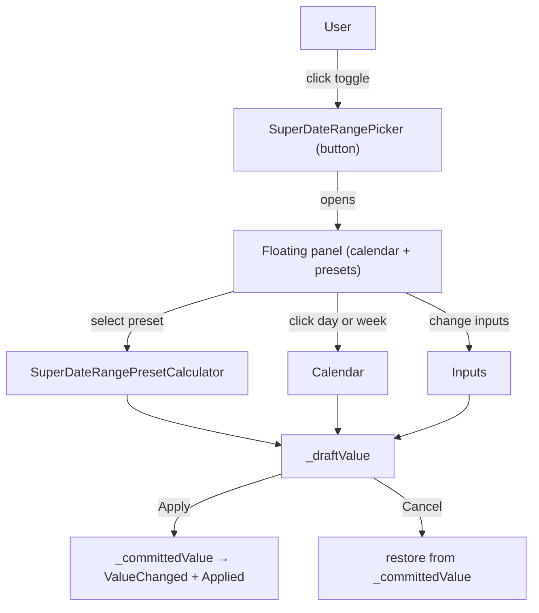
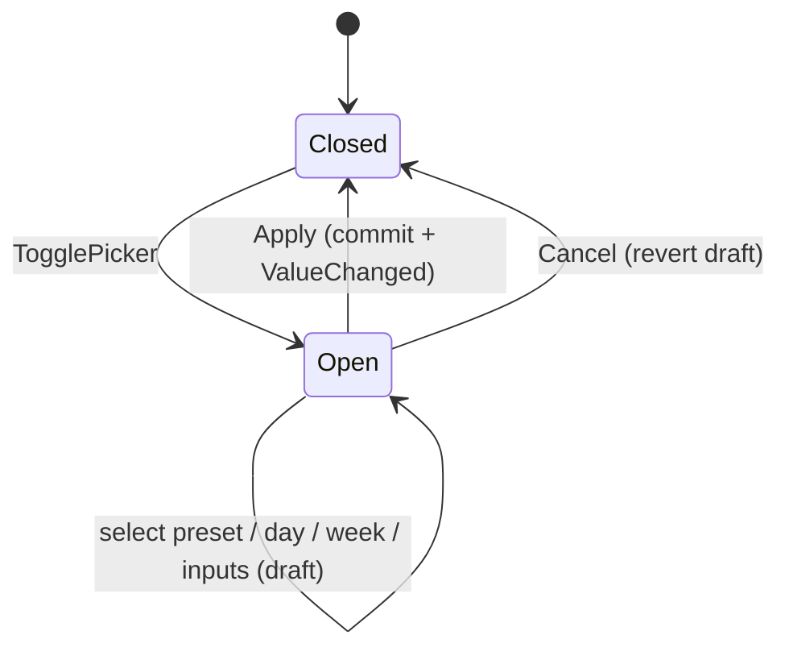

# 📅 SuperDateRangePicker

> Calendar-based date range picker for Blazor — preset shortcuts, two-month calendar, week selection, manual inputs, and a floating panel.

[← Back to README](README.md)

---

## 📑 Table of Contents

- [Overview](#overview)
- [Getting Started](#getting-started)
- [Architecture](#architecture)
- [API Reference](#api-reference)
- [Models & Enums](#models--enums)
- [Usage Examples](#usage-examples)
- [CSS Custom Properties](#css-custom-properties)
- [Tips & Best Practices](#tips--best-practices)
- [Troubleshooting](#troubleshooting)

---

## Overview

`SuperDateRangePicker` lets users pick a date range either through **preset shortcuts** (Today, This Week, Last 30 Days, This Year, …) or by selecting **start/end dates** manually on a multi-month calendar. Selection can also be made **week-by-week** when week numbers are displayed.

**Key features**

- 🗓️ Two-month calendar with optional ISO week numbers
- ⏩ 18 built-in presets (Today, Yesterday, Last 7/14/30/90 Days, This/Last Week/Month/Quarter/Year, Last 12/13/24 Months, All Time, Custom)
- 🚫 Optional **disable future dates**
- 🧮 Manual date inputs with `Clear` buttons
- 📅 Click-to-pick week ranges
- 🪟 Floating panel positioned via JS (Floating UI–style attach/detach)
- 🌐 Localized day headers and labels (uses `IStringLocalizer`)
- ✨ Returns a strongly-typed `SuperDateRangeSelection` record
- 🪞 Optional dialog mode via `SuperDialogService.OpenDateRangeDialogAsync(...)`

---

## Getting Started

### Service registration

```csharp
builder.Services.AddSuperComponents();
```

### Imports

```razor
@using SuperBlazorComponents.Components.SuperDateRange
```

### Minimal example

```razor
<SuperDateRangePicker @bind-Value="_period" />

@code {
    private SuperDateRangeSelection _period =
        new(null, null, SuperDateRangePreset.AllTime);
}
```

---

## Architecture





---

## API Reference

### Parameters

| Parameter | Type | Default | Description |
|---|---|---|---|
| `Value` | `SuperDateRangeSelection` | `(null, null, AllTime)` | Current value |
| `ValueChanged` | `EventCallback<SuperDateRangeSelection>` | — | Two-way binding partner |
| `Applied` | `EventCallback<SuperDateRangeSelection>` | — | Fired when the user clicks **Apply** (always, even if value unchanged) |
| `Disabled` | `bool` | `false` | Disables the toggle button |
| `ButtonCssClass` | `string` | `btn btn-outline-secondary d-inline-flex align-items-center justify-content-between gap-2` | CSS class for the toggle button |
| `EmptyText` | `string?` | `null` | Text shown when no range is selected (defaults to "All period") |
| `MinWidth` | `string` | `"18rem"` | Minimum width of the toggle button — exposed as `--sdrp-min-width` |
| `DisplayWeekNumbers` | `bool` | `true` | Shows ISO week numbers + click-to-pick week |
| `DisableFutureDates` | `bool` | `true` | Disables future dates in calendar and inputs |

### Methods (private — invoked via UI)

`Apply`, `Cancel`, `SelectPreset`, `SelectDay`, `SelectWeek`, `ShowPreviousMonth`, `ShowNextMonth`.

---

## Models & Enums

### `SuperDateRangeSelection`

```csharp
public sealed record SuperDateRangeSelection(
    DateTimeOffset? StartDate,
    DateTimeOffset? EndDate,
    SuperDateRangePreset Preset = SuperDateRangePreset.Custom,
    string? PeriodName = null);
```

### `SuperDateRangePreset`

```csharp
public enum SuperDateRangePreset
{
    Custom, Today, Yesterday,
    ThisWeek, LastWeek,
    Last7Days, Last14Days, Last30Days, Last90Days,
    ThisMonth, LastMonth,
    ThisQuarter, LastQuarter,
    ThisYear, LastYear,
    AllTime,
    Last12Months, Last13Months, Last24Months
}
```

The static helper `SuperDateRangePresetCalculator.Resolve(preset, today)` returns the corresponding `SuperDateRangeSelection`.

---

## Usage Examples

### 1. Two-way bound picker

```razor
<SuperDateRangePicker @bind-Value="_period" />

<p>Selection: @_period.StartDate?.ToString("yyyy-MM-dd") → @_period.EndDate?.ToString("yyyy-MM-dd")</p>

@code {
    private SuperDateRangeSelection _period = new(null, null, SuperDateRangePreset.AllTime);
}
```

### 2. React on Apply only

```razor
<SuperDateRangePicker Value="_period" Applied="OnApplied" />

@code {
    private SuperDateRangeSelection _period = new(null, null, SuperDateRangePreset.Last30Days);

    private async Task OnApplied(SuperDateRangeSelection value)
    {
        _period = value;
        await ReloadDataAsync();
    }
}
```

### 3. Allow future dates

```razor
<SuperDateRangePicker @bind-Value="_period"
                      DisableFutureDates="false" />
```

### 4. Hide week numbers

```razor
<SuperDateRangePicker @bind-Value="_period"
                      DisplayWeekNumbers="false" />
```

### 5. Wider button

```razor
<SuperDateRangePicker @bind-Value="_period" MinWidth="24rem" />
```

### 6. Initialize with a preset

```csharp
private SuperDateRangeSelection _period =
    SuperDateRangePresetCalculator.Resolve(
        SuperDateRangePreset.Last7Days,
        DateTimeOffset.Now);
```

### 7. Use as a dialog (no inline button)

```razor
@inject SuperDialogService DialogService

<button class="btn btn-secondary" @onclick="PickAsync">Pick a period</button>

@code {
    private SuperDateRangeSelection? _period;

    private async Task PickAsync()
    {
        var result = await DialogService.OpenDateRangeDialogAsync("Period", _period);
        if (result is not null)
        {
            _period = result;
        }
    }
}
```

### 8. Custom button styling

```razor
<SuperDateRangePicker @bind-Value="_period"
                      ButtonCssClass="btn btn-primary d-inline-flex align-items-center justify-content-between gap-2" />
```

### 9. Empty-state text

```razor
<SuperDateRangePicker @bind-Value="_period"
                      EmptyText="Select a period…" />
```

### 10. Disabled

```razor
<SuperDateRangePicker @bind-Value="_period" Disabled="true" />
```

### 11. Use the value as a server query parameter

```csharp
private async Task LoadAsync()
{
    var url = $"/api/sales?from={_period.StartDate?.ToString("o")}&to={_period.EndDate?.ToString("o")}";
    _data = await Http.GetFromJsonAsync<List<Sale>>(url);
}
```

### 12. Reset to All Time

```csharp
_period = new SuperDateRangeSelection(null, null, SuperDateRangePreset.AllTime);
```

### 13. Format for display

```csharp
private string FormatPeriod(SuperDateRangeSelection v)
    => v.PeriodName
       ?? (v.StartDate is null ? "All period"
           : $"{v.StartDate:dd/MM/yyyy} – {v.EndDate:dd/MM/yyyy}");
```

---

## CSS Custom Properties

| Variable | Default | Used by |
|---|---|---|
| `--sdrp-min-width` | `18rem` | Toggle button minimum width |

Override in your CSS or via the `MinWidth` parameter.

---

## Tips & Best Practices

- ✅ For dashboards, prefer the **`Applied`** event over **`ValueChanged`** to avoid re-querying on every preset hover.
- ✅ Persist `Preset` (not just dates) so re-loading the page can restore "Last 30 Days" as a moving window.
- ✅ Keep `DisableFutureDates=true` for analytics; turn it off for booking/scheduling apps.
- ✅ Use `DialogService.OpenDateRangeDialogAsync(...)` when the picker would clutter a toolbar.
- ⚠️ The picker uses an `IStringLocalizer` for day headers and labels — ensure `AddSuperComponents()` is registered so localization works.

---

## Troubleshooting

| Symptom | Cause | Fix |
|---|---|---|
| Picker panel hidden behind header/sidebar | `z-index` conflict | The panel uses a floating layer; ensure containing elements don't set `transform` or excessive `z-index` |
| Day headers in wrong language | Localization resources not registered | Call `AddSuperComponents()` and verify `Resources/` contain your culture |
| Future dates can be selected when not desired | `DisableFutureDates="false"` | Set it back to `true` (default) |
| `ValueChanged` fires unexpectedly | Picker normalizes the range on parameters set | Bind via `Applied` instead |
| Clear button does nothing | The corresponding date is already null | Expected — `Clear` is only enabled when a date is set |

---

[← Back to README](README.md)
