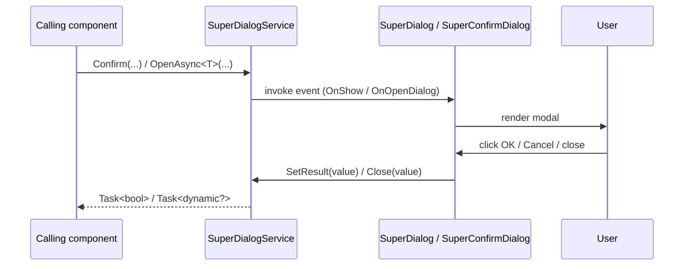
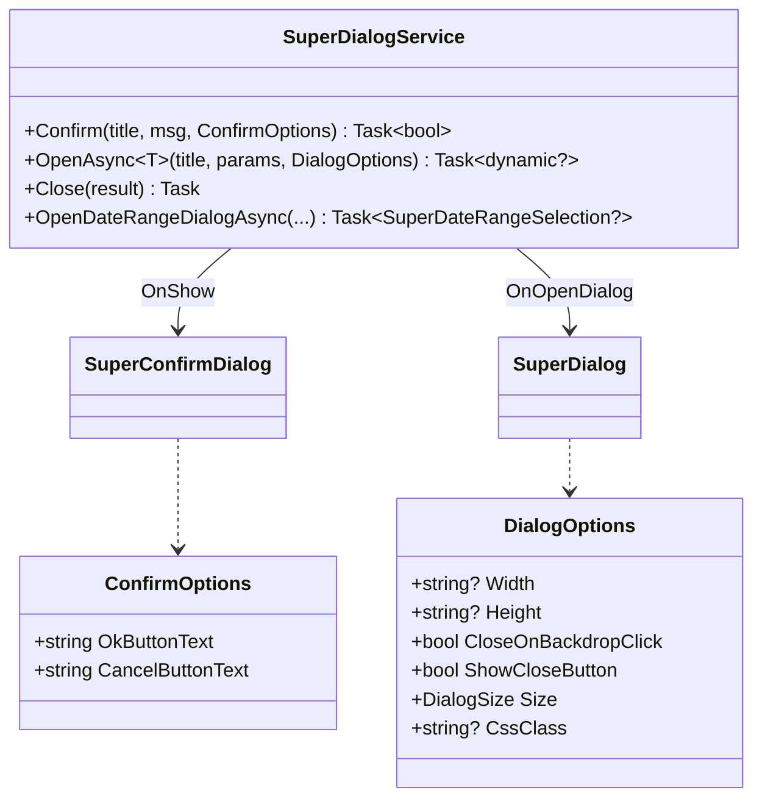

# 💬 SuperDialogs

> Service-driven modal dialogs for Blazor: confirmation prompts and dynamic component-hosted dialogs that return strongly-typed results.

[← Back to README](README.md)

---

## 📑 Table of Contents

- [Overview](#overview)
- [Getting Started](#getting-started)
- [Architecture](#architecture)
- [API Reference](#api-reference)
  - [SuperDialogService](#superdialogservice)
  - [SuperDialog (host)](#superdialog-host)
  - [SuperConfirmDialog (host)](#superconfirmdialog-host)
  - [DialogOptions](#dialogoptions)
  - [ConfirmOptions](#confirmoptions)
- [Usage Examples](#usage-examples)
- [Tips & Best Practices](#tips--best-practices)
- [Troubleshooting](#troubleshooting)

---

## Overview

`SuperDialogs` is composed of two host components and one orchestrating service:

- **`SuperDialogService`** — injectable service to open dialogs and await their result.
- **`SuperConfirmDialog`** — Bootstrap-styled yes/no modal returning `bool`.
- **`SuperDialog`** — generic modal that hosts an arbitrary Blazor component (`DynamicComponent`) and returns whatever value the component passes back via `Close(...)`.

**Key features**

- 🧩 Async `Confirm(...)` returning `Task<bool>`
- 🧩 Async `OpenAsync<T>(...)` returning `Task<dynamic?>` for component-based dialogs
- 🎨 Bootstrap modal sizes (`sm`, `lg`, `xl`) + custom width/height
- 🖱️ Optional close-on-backdrop, optional close button
- ♻️ Re-usable from any component or service via DI
- 🎯 Returns `null` when user cancels (component dialogs)

---

## Getting Started

### Service registration

Both the service and the host components are registered through:

```csharp
builder.Services.AddSuperComponents();
```

### Imports

```razor
@using SuperBlazorComponents.Components.Dialogs
@using SuperBlazorComponents.Services
```

### Place the hosts in your main layout

Both hosts must be placed exactly **once** in your application — typically in `MainLayout.razor`:

```razor
<SuperLayout>
    <BodyContent>
        @Body
    </BodyContent>
</SuperLayout>

<SuperDialog />
<SuperConfirmDialog />
```

### Minimal example

```razor
@inject SuperDialogService DialogService

<button class="btn btn-danger" @onclick="DeleteAsync">Delete</button>

@code {
    private async Task DeleteAsync()
    {
        var ok = await DialogService.Confirm(
            "Delete record?",
            "This action cannot be undone.",
            new ConfirmOptions { OkButtonText = "Delete", CancelButtonText = "Cancel" });

        if (ok) { /* delete */ }
    }
}
```

---

## Architecture





---

## API Reference

### SuperDialogService

| Member | Signature | Description |
|---|---|---|
| `Confirm` | `Task<bool> Confirm(string title, string message, ConfirmOptions confirmOptions)` | Shows a yes/no confirmation modal |
| `OpenAsync<T>` | `Task<dynamic?> OpenAsync<T>(string title, Dictionary<string,object>? parameters = null, DialogOptions? options = null) where T : IComponent` | Opens a Blazor component as a modal and waits for its result |
| `Close` | `Task Close(object? result)` | Closes the active dynamic dialog and returns `result` to the awaiter |
| `OpenDateRangeDialogAsync` | `Task<SuperDateRangeSelection?> OpenDateRangeDialogAsync(string title, SuperDateRangeSelection? value = null, bool displayWeekNumbers = true, bool disableFutureDates = true, DialogOptions? options = null)` | Opens the built-in date range picker as a modal |

### SuperDialog (host)

Empty by itself — listens to `SuperDialogService.OnOpenDialog` and renders the requested component using `DynamicComponent`. Place once in the application root.

### SuperConfirmDialog (host)

Listens to `SuperDialogService.OnShow`. Renders a Bootstrap modal with a single message and OK/Cancel buttons. Place once in the application root.

### DialogOptions

| Property | Type | Default | Description |
|---|---|---|---|
| `Width` | `string?` | `null` | Custom max-width (e.g. `"500px"`, `"80%"`) |
| `Height` | `string?` | `null` | Custom modal body height with auto overflow |
| `CloseOnBackdropClick` | `bool` | `true` | Click outside closes the modal (returns `null`) |
| `ShowCloseButton` | `bool` | `true` | Shows the `×` icon in the header |
| `CssClass` | `string?` | `null` | Extra CSS class on `.modal-content` |
| `Size` | `DialogSize` | `Default` | `Default`, `Small`, `Large`, `ExtraLarge` |

### ConfirmOptions

| Property | Type | Default |
|---|---|---|
| `OkButtonText` | `string` | `"OK"` |
| `CancelButtonText` | `string` | `"Cancel"` |

---

## Usage Examples

### 1. Simple confirmation

```razor
@inject SuperDialogService DialogService

<button class="btn btn-warning" @onclick="ResetAsync">Reset</button>

@code {
    private async Task ResetAsync()
    {
        if (await DialogService.Confirm("Reset settings?", "All changes will be lost.",
            new ConfirmOptions { OkButtonText = "Reset", CancelButtonText = "Keep" }))
        {
            // perform reset
        }
    }
}
```

### 2. Component-based dialog returning a value

`Components/CustomerPickerDialog.razor`:

```razor
@inject SuperDialogService DialogService

<div class="list-group">
    @foreach (var c in Customers)
    {
        <button class="list-group-item list-group-item-action"
                @onclick="() => DialogService.Close(c)">
            @c.Name
        </button>
    }
</div>

@code {
    [Parameter] public List<Customer> Customers { get; set; } = new();
}
```

Calling page:

```razor
@inject SuperDialogService DialogService

<button class="btn btn-primary" @onclick="PickAsync">Pick a customer</button>

@code {
    private async Task PickAsync()
    {
        var picked = await DialogService.OpenAsync<CustomerPickerDialog>(
            "Pick a customer",
            new Dictionary<string, object> { ["Customers"] = LoadCustomers() },
            new DialogOptions { Size = DialogSize.Large });

        if (picked is Customer c) { /* use c */ }
    }
}
```

### 3. Cancellation returns `null`

```csharp
var result = await DialogService.OpenAsync<CustomerPickerDialog>("Pick", null,
    new DialogOptions { CloseOnBackdropClick = true });

if (result is null)
{
    // user dismissed by clicking the backdrop or the × button
}
```

### 4. Custom width/height

```csharp
var options = new DialogOptions
{
    Width = "900px",
    Height = "70vh",
    Size = DialogSize.Large,
    CssClass = "border-primary"
};

await DialogService.OpenAsync<EditorDialog>("Edit", null, options);
```

### 5. Disable backdrop close (force a choice)

```csharp
await DialogService.OpenAsync<TermsDialog>("Terms of service", null,
    new DialogOptions
    {
        CloseOnBackdropClick = false,
        ShowCloseButton = false
    });
```

### 6. Bootstrap sizes

```csharp
await DialogService.OpenAsync<MyDialog>("Small",       options: new() { Size = DialogSize.Small });
await DialogService.OpenAsync<MyDialog>("Default");
await DialogService.OpenAsync<MyDialog>("Large",       options: new() { Size = DialogSize.Large });
await DialogService.OpenAsync<MyDialog>("Extra large", options: new() { Size = DialogSize.ExtraLarge });
```

### 7. Built-in date range dialog

```razor
@inject SuperDialogService DialogService

<button class="btn btn-secondary" @onclick="PickPeriodAsync">Pick period</button>

@code {
    private SuperDateRangeSelection? _period;

    private async Task PickPeriodAsync()
    {
        var result = await DialogService.OpenDateRangeDialogAsync(
            "Choose a period", _period);

        if (result is not null) _period = result;
    }
}
```

### 8. Confirmation localized

```csharp
await DialogService.Confirm(
    Loc["DeleteTitle"],
    Loc["DeleteMessage"],
    new ConfirmOptions
    {
        OkButtonText     = Loc["Yes"],
        CancelButtonText = Loc["No"]
    });
```

### 9. Form dialog with two-way result

```razor
<EditForm Model="_model" OnValidSubmit="OnSubmit">
    <InputText @bind-Value="_model.Name" class="form-control" />
    <div class="mt-3 d-flex justify-content-end gap-2">
        <button type="button" class="btn btn-secondary"
                @onclick="() => DialogService.Close(null)">Cancel</button>
        <button type="submit" class="btn btn-primary">Save</button>
    </div>
</EditForm>

@code {
    [Inject] SuperDialogService DialogService { get; set; } = default!;
    private CustomerEdit _model = new();
    private Task OnSubmit() => DialogService.Close(_model);
}
```

### 10. Re-entrancy guard

```csharp
try
{
    await DialogService.OpenAsync<EditorDialog>("Edit");
}
catch (InvalidOperationException)
{
    // a dialog is already open — ignore or queue
}
```

---

## Tips & Best Practices

- ✅ Always render **`<SuperDialog />`** and **`<SuperConfirmDialog />`** **once** at the application root, not in every page.
- ✅ For destructive actions, prefer **`SuperConfirmationButton`** (see [SUPERBUTTONS.md](SUPERBUTTONS.md)) — it wraps the confirm flow for free.
- ✅ Make dialog components self-sufficient: inject `SuperDialogService` and call `Close(value)` to return their result.
- ✅ Use **`DialogSize.ExtraLarge`** + custom `Width` for editor-style dialogs.
- ⚠️ Only **one** dialog of each kind (confirm / dynamic) can be open at a time — opening another throws `InvalidOperationException`.
- ⚠️ Avoid heavy initialization inside dialog components; they are mounted on every open.

---

## Troubleshooting

| Symptom | Cause | Fix |
|---|---|---|
| `InvalidOperationException: No dialog host is registered` | `<SuperDialog />` not placed in layout | Add it once to `MainLayout.razor` |
| `InvalidOperationException: A dialog is already open` | Concurrent `OpenAsync` calls | Await previous call or guard with try/catch |
| Dialog never returns | Component never calls `DialogService.Close(...)` | Ensure all close paths call `Close(result)` |
| Backdrop click discards user input | Default behavior | Set `CloseOnBackdropClick = false` |
| `result` is `null` when expected | User dismissed via backdrop/× | Check for `null` and treat as cancellation |

---

[← Back to README](README.md)
