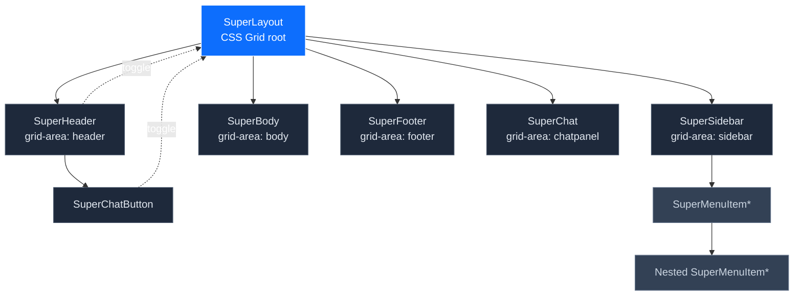
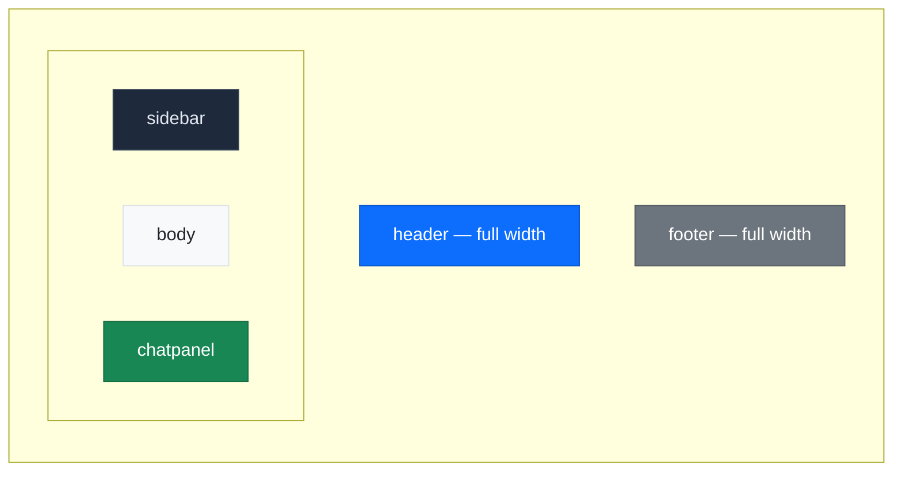
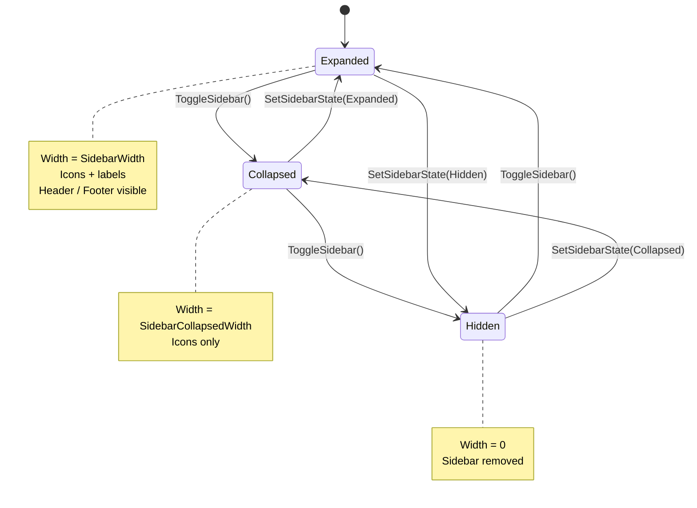
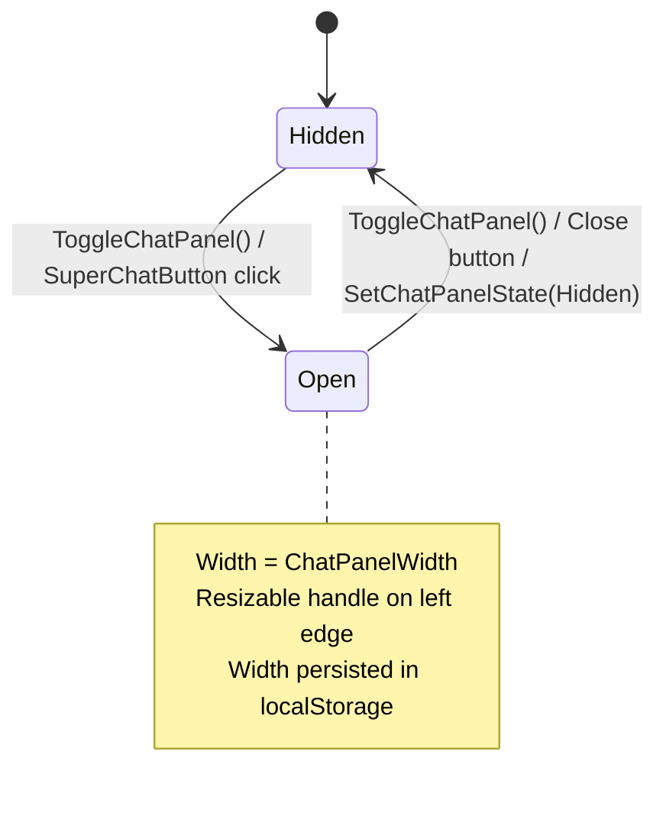
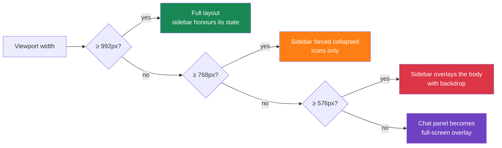
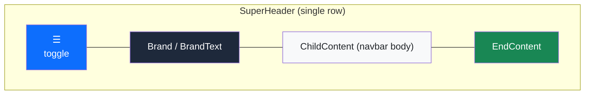
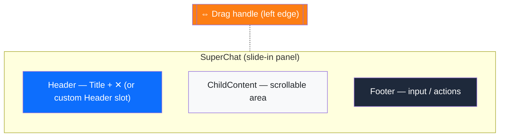
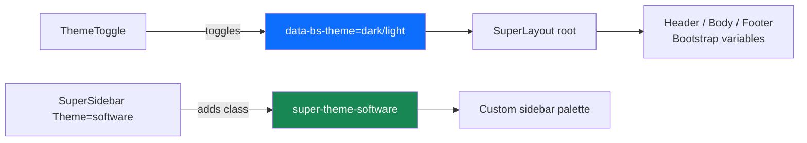

# 🖼️ SuperLayout — Complete Documentation

> A responsive application shell for Blazor built on Bootstrap 5.3 and CSS Grid: sticky header & footer, three‑state collapsible sidebar, resizable slide‑in chat panel, automatic device detection, and full dark / light theme support — with **zero third‑party JS dependencies**.

**[← Back to main README](README.md)**

---

## Table of Contents

- [Overview](#overview)
- [Getting Started](#getting-started)
  - [Installation](#installation)
  - [Service Registration](#service-registration)
  - [Minimal Example](#minimal-example)
- [Architecture](#architecture)
  - [Component Tree](#component-tree)
  - [CSS Grid Areas](#css-grid-areas)
  - [Cascading Parameter Pattern](#cascading-parameter-pattern)
  - [Sidebar State Machine](#sidebar-state-machine)
  - [Chat Panel State Machine](#chat-panel-state-machine)
  - [Responsive Breakpoints](#responsive-breakpoints)
- [API Reference](#api-reference)
  - [SuperLayout](#superlayout)
  - [SuperHeader](#superheader)
  - [SuperSidebar](#supersidebar)
  - [SuperBody](#superbody)
  - [SuperFooter](#superfooter)
  - [SuperChat](#superchat)
  - [SuperChatButton](#superchatbutton)
- [Enums & Models](#enums--models)
  - [SidebarState](#sidebarstate)
  - [ChatState](#chatstate)
  - [Device](#device)
- [Usage Examples](#usage-examples)
  - [1 — Minimal layout](#1--minimal-layout-header--body--footer)
  - [2 — Full layout with sidebar navigation](#2--full-layout-with-sidebar-navigation)
  - [3 — Custom sidebar widths](#3--custom-sidebar-widths)
  - [4 — Sidebar with header, footer and theme](#4--sidebar-with-header-footer-and-theme)
  - [5 — Programmatic sidebar control](#5--programmatic-sidebar-control)
  - [6 — Listening to state changes](#6--listening-to-state-changes)
  - [7 — Chat panel integration](#7--chat-panel-integration)
  - [8 — Resizable chat panel with persistence](#8--resizable-chat-panel-with-persistence)
  - [9 — Chat panel with custom header & footer](#9--chat-panel-with-custom-header--footer)
  - [10 — Header with brand logo and end content](#10--header-with-brand-logo-and-end-content)
  - [11 — SuperMenuItem navigation](#11--supermenuitem-navigation)
  - [12 — Nested submenu items](#12--nested-submenu-items)
  - [13 — Policy‑based menu visibility](#13--policybased-menu-visibility)
  - [14 — Body with custom background and padding](#14--body-with-custom-background-and-padding)
  - [15 — Non‑sticky header and footer](#15--nonsticky-header-and-footer)
  - [16 — Theme toggle in header](#16--theme-toggle-in-header)
  - [17 — Complete enterprise application layout](#17--complete-enterprise-application-layout)
- [CSS Custom Properties](#css-custom-properties)
- [Theming](#theming)
- [Tips & Best Practices](#tips--best-practices)
- [Troubleshooting](#troubleshooting)

---

## Overview

`SuperLayout` is the application shell at the heart of **SuperBlazorComponents**. It coordinates six dedicated child components into a single CSS Grid:

| Component | Role |
|---|---|
| `SuperHeader` | Top bar — brand, navbar, end content, sidebar toggle |
| `SuperSidebar` | Left navigation rail with three states (expanded / collapsed / hidden) |
| `SuperBody` | Scrollable main content area |
| `SuperFooter` | Bottom bar — sticky or scrolling |
| `SuperChat` | Right slide‑in panel (e.g. AI assistant), resizable |
| `SuperChatButton` | Toggle button for the chat panel |

All children discover the parent layout through a `[CascadingParameter]`, allowing them to read state and call public methods such as `ToggleSidebar()` or `ToggleChatPanel()`.

---

## Getting Started

### Installation

```bash
dotnet add package SuperBlazorComponents
```

### Service Registration

In `Program.cs`:

```csharp
builder.Services.AddSuperComponents(options =>
{
    options.DefaultSuperIconeStyle = SuperIconStyle.Solid;
});
```

### Minimal Example

```razor
@using SuperBlazorComponents.Components.SuperLayout

<SuperLayout>
    <SuperHeader BrandText="My App" />
    <SuperBody>
        <h1>Welcome!</h1>
        <p>This is the main content area.</p>
    </SuperBody>
    <SuperFooter>
        <span>© 2025 My Company</span>
    </SuperFooter>
</SuperLayout>
```

This produces a full‑viewport layout with a sticky header on top, a scrollable body, and a sticky footer at the bottom.

---

## Architecture

### Component Tree



### CSS Grid Areas

`SuperLayout` lays its children on a 3 × 3 named grid. The header and footer span all three columns; the sidebar, body and chat panel share the middle row.



The grid template adapts dynamically:

| Sidebar state | Chat state | `grid-template-columns` |
|---|---|---|
| Expanded | Hidden | `var(--super-sidebar-width) 1fr 0` |
| Collapsed | Hidden | `var(--super-sidebar-collapsed-width) 1fr 0` |
| Hidden | Hidden | `0 1fr 0` |
| Expanded | Open | `var(--super-sidebar-width) 1fr var(--super-chatpanel-width)` |

All transitions animate with `0.3s ease`.

### Cascading Parameter Pattern

`SuperLayout` exposes itself via `<CascadingValue>`. Every child component receives the parent reference automatically:

```csharp
[CascadingParameter]
public SuperLayout? ParentLayout { get; set; }
```

This enables children to:

- Read `ParentLayout.SidebarState` / `ParentLayout.ChatPanelState`
- Call `ParentLayout.ToggleSidebar()` / `ToggleChatPanel()` / `SetSidebarState(...)` / `SetChatPanelState(...)`
- Subscribe to the `OnSidebarStateChanged` and `OnChatPanelStateChanged` events for re‑rendering or analytics.

### Sidebar State Machine

The default toggle button cycles through three states:



### Chat Panel State Machine



### Responsive Breakpoints



---

## API Reference

### SuperLayout

The grid root. Defines sidebar / chat panel widths, owns the state and exposes the public API.

#### Parameters

| Parameter | Type | Default | Description |
|---|---|---|---|
| `ChildContent` | `RenderFragment?` | `null` | Children: `SuperHeader`, `SuperSidebar`, `SuperBody`, `SuperFooter`, `SuperChat`. |
| `CssClass` | `string?` | `null` | Extra CSS class on the grid root. |
| `Style` | `string?` | `null` | Extra inline style on the grid root. |
| `SidebarWidth` | `int` | `250` | Sidebar width (px) when expanded. |
| `SidebarCollapsedWidth` | `int` | `40` | Sidebar width (px) when collapsed. |
| `ChatPanelWidth` | `int` | `380` | Chat panel width (px) when open. |

#### Public Properties

| Property | Type | Description |
|---|---|---|
| `SidebarState` | `SidebarState` | Current sidebar state. |
| `ChatPanelState` | `ChatState` | Current chat panel state. |
| `CurrentSidebarWidth` | `int` | Width derived from `SidebarState`. |
| `CurrentChatPanelWidth` | `int` | Width derived from `ChatPanelState`. |

#### Public Methods

| Method | Description |
|---|---|
| `void ToggleSidebar()` | Cycles `Expanded → Collapsed → Hidden → Expanded`. |
| `void SetSidebarState(SidebarState state)` | Sets the sidebar to a specific state. |
| `void ToggleChatPanel()` | Toggles `Hidden ↔ Open`. |
| `void SetChatPanelState(ChatState state)` | Sets the chat panel to a specific state. |
| `void SetChatPanelWidth(int width)` | Updates `ChatPanelWidth` (used by the resizable handle). |

#### Events

| Event | Signature | Description |
|---|---|---|
| `OnSidebarStateChanged` | `Action<SidebarState, SidebarState>?` | `(previous, next)` — fired when sidebar state changes. |
| `OnChatPanelStateChanged` | `Action<ChatState, ChatState>?` | `(previous, next)` — fired when chat panel state changes. |

---

### SuperHeader

| Parameter | Type | Default | Description |
|---|---|---|---|
| `ChildContent` | `RenderFragment?` | `null` | Main navbar content (menu, links, actions). |
| `Brand` | `RenderFragment?` | `null` | Custom brand area (overrides `BrandText`). |
| `BrandText` | `string?` | `null` | Plain text brand label. |
| `EndContent` | `RenderFragment?` | `null` | Right‑aligned content (theme toggle, user menu, chat button…). |
| `Toolbar` | `RenderFragment?` | `null` | Optional secondary toolbar slot. |
| `CssClass` | `string?` | `null` | Extra CSS class. |
| `Sticky` | `bool` | `true` | Whether the header sticks to the top while scrolling. |
| `ShowToggle` | `bool` | `true` | Shows the hamburger button that calls `ToggleSidebar()`. |
| `NavbarClass` | `string?` | `null` | Bootstrap navbar color class (e.g. `"navbar-dark"`). |
| `Height` | `int` | `56` | Header height in pixels. |
| `OnToggle` | `EventCallback` | — | Fired after the toggle button is clicked. |

**Layout slots:**



The brand label is automatically hidden when the sidebar is `Collapsed` or `Hidden`, leaving only the toggle visible.

---

### SuperSidebar

| Parameter | Type | Default | Description |
|---|---|---|---|
| `ChildContent` | `RenderFragment?` | `null` | Navigation content — typically `SuperMenuItem` components. |
| `Header` | `RenderFragment?` | `null` | Content above the navigation. |
| `Footer` | `RenderFragment?` | `null` | Content below the navigation. |
| `CssClass` | `string?` | `null` | Extra CSS class. |
| `Theme` | `string?` | `null` | Theme name (e.g. `"software"`). Applies the `super-theme-{Theme}` class and loads the matching CSS file. |
| `Style` | `string?` | `null` | Extra inline style. |
| `ShowOverlay` | `bool` | `true` | Shows a backdrop on mobile when the sidebar is visible. |
| `OnOverlayClicked` | `EventCallback` | — | Fired when the mobile backdrop is clicked (sidebar is auto‑hidden). |

**Visual behaviour by state:**

| State | Width | Header / Footer | Menu items |
|---|---|---|---|
| `Expanded` | `SidebarWidth` | Visible | Icon + label |
| `Collapsed` | `SidebarCollapsedWidth` | Hidden | Icon only, centered |
| `Hidden` | `0` | Hidden | Hidden |

---

### SuperBody

| Parameter | Type | Default | Description |
|---|---|---|---|
| `ChildContent` | `RenderFragment?` | `null` | Page content. |
| `CssClass` | `string?` | `null` | Extra CSS class. |
| `Style` | `string?` | `null` | Extra inline style. |
| `Fluid` | `bool` | `true` | `true` → Bootstrap `container-fluid`; `false` → centered `container`. |
| `Padding` | `int` | `0` | Padding (px) around the content. |
| `BackgroundColor` | `string?` | `null` | CSS background color for the body region. |

The body has its own `overflow-y: auto`, so it scrolls independently from header and footer.

---

### SuperFooter

| Parameter | Type | Default | Description |
|---|---|---|---|
| `ChildContent` | `RenderFragment?` | `null` | Footer content. |
| `CssClass` | `string?` | `null` | Extra CSS class. |
| `Style` | `string?` | `null` | Extra inline style. |
| `Sticky` | `bool` | `true` | If `true`, footer sticks to the bottom. |
| `Fluid` | `bool` | `true` | `container-fluid` vs. `container`. |
| `Height` | `int` | `48` | Minimum footer height in pixels. |
| `BackgroundColor` | `string?` | `null` | CSS background color. |

---

### SuperChat

A right‑hand slide‑in panel, ideal for AI assistants, contextual help, or notifications. **Resizable** by dragging its left edge, with **localStorage persistence** of the chosen width.

| Parameter | Type | Default | Description |
|---|---|---|---|
| `ChildContent` | `RenderFragment?` | `null` | Main scrollable body. |
| `Header` | `RenderFragment?` | `null` | Custom header (replaces default title + close button). |
| `Footer` | `RenderFragment?` | `null` | Footer slot — typically the message input area. |
| `Title` | `string` | `"Chat IA"` | Title shown in the default header. |
| `CssClass` | `string?` | `null` | Extra CSS class. |
| `Style` | `string?` | `null` | Extra inline style. |
| `Resizable` | `bool` | `true` | Enables the drag handle on the left edge. |
| `MinWidth` | `int` | `240` | Minimum width (px) during resize. |
| `MaxWidth` | `int` | `800` | Maximum width (px) during resize. |
| `EnableStatePersistence` | `bool` | `true` | Persist the width in `localStorage`. |
| `PersistenceKey` | `string?` | `null` | Custom storage key. If `null`, a key is derived from the URL. |
| `OnWidthChanged` | `EventCallback<int>` | — | Fired at the end of a resize, with the new width. |

**Internal anatomy:**



On viewports `< 576px`, the panel opens as a **full‑screen overlay** with a subtle shadow.

---

### SuperChatButton

| Parameter | Type | Default | Description |
|---|---|---|---|
| `Icon` | `string` | `"fa-comments"` | Font Awesome icon name (without prefix). |
| `IconStyle` | `SuperIconStyle` | `Solid` | Font Awesome icon style. |
| `Text` | `string?` | `null` | Optional label next to the icon. |
| `Tooltip` | `string` | `"Chat IA"` | Tooltip text. |
| `CssClass` | `string?` | `null` | Extra CSS class. |
| `OnToggle` | `EventCallback` | — | Fired after click (the panel has already been toggled). |

The button automatically receives a `super-chat-active` class (highlighted in the primary color) when the chat panel is open.

---

## Enums & Models

### SidebarState

```csharp
public enum SidebarState
{
    Expanded,   // Full width sidebar with text and icons
    Collapsed,  // Narrow sidebar with icons only
    Hidden      // Sidebar fully hidden (0 width)
}
```

### ChatState

```csharp
public enum ChatState
{
    Hidden,  // Chat panel not visible
    Open     // Chat panel visible
}
```

### Device

`SuperLayout` automatically populates a `Device` instance via JS interop on first render. It is intended for diagnostics or analytics:

| Property | Type | Description |
|---|---|---|
| `UserAgent` | `string` | Browser user agent string. |
| `Name` | `string?` | Device name (default `"notdetected"`). |
| `Platform` | `string?` | Platform from `navigator.userAgentData`. |
| `Os` | `string?` | `"Windows"`, `"MacOS"`, `"Linux"`, `"Android"`, `"iOS"`, or `"Unknown OS"`. |
| `IsMobile` | `bool` | `true` for mobile devices. |
| `ScreenWidth` / `ScreenHeight` | `int` | `screen.width` / `screen.height`. |
| `AvailableWidth` / `AvailableHeight` | `int` | `screen.availWidth` / `screen.availHeight`. |
| `WindowInnerWidth` / `WindowInnerHeight` | `int` | Viewport size. |

---

## Usage Examples

### 1 — Minimal layout (header + body + footer)

```razor
@using SuperBlazorComponents.Components.SuperLayout

<SuperLayout SidebarWidth="0">
    <SuperHeader BrandText="My App" ShowToggle="false" />
    <SuperBody>
        <h1>Welcome</h1>
        <p>A simple layout without a sidebar.</p>
    </SuperBody>
    <SuperFooter>
        <span>© 2026 My Company</span>
    </SuperFooter>
</SuperLayout>
```

---

### 2 — Full layout with sidebar navigation

```razor
@using SuperBlazorComponents.Components.SuperLayout
@using SuperBlazorComponents.Components

<SuperLayout>
    <SuperHeader BrandText="Dashboard" />
    <SuperSidebar>
        <SuperMenuItem Icon="fa-house"      Text="Home"      Href="/" />
        <SuperMenuItem Icon="fa-chart-bar"  Text="Analytics" Href="/analytics" />
        <SuperMenuItem Icon="fa-users"      Text="Users"     Href="/users" />
        <SuperMenuItem Icon="fa-gear"       Text="Settings"  Href="/settings" />
    </SuperSidebar>
    <SuperBody Padding="16">
        @Body
    </SuperBody>
    <SuperFooter>
        <span class="text-muted">v1.0.0</span>
    </SuperFooter>
</SuperLayout>
```

---

### 3 — Custom sidebar widths

```razor
<SuperLayout SidebarWidth="300" SidebarCollapsedWidth="60">
    <SuperHeader BrandText="Wide Sidebar App" />
    <SuperSidebar>
        <SuperMenuItem Icon="fa-house" Text="Home" Href="/" />
        <SuperMenuItem Icon="fa-inbox" Text="Inbox" Href="/inbox"
                       BadgeText="5" BadgeCssClass="badge text-bg-danger" />
    </SuperSidebar>
    <SuperBody>
        <p>Sidebar is 300 px expanded and 60 px collapsed.</p>
    </SuperBody>
</SuperLayout>
```

---

### 4 — Sidebar with header, footer and theme

```razor
<SuperLayout>
    <SuperHeader BrandText="Studio" />
    <SuperSidebar Theme="software">
        <Header>
            <div class="text-center py-2">
                
                <div class="small text-muted mt-1">Studio v2</div>
            </div>
        </Header>

        <SuperMenuItem Icon="fa-house"    Text="Home"    Href="/" />
        <SuperMenuItem Icon="fa-code"     Text="Editor"  Href="/editor" />
        <SuperMenuItem Icon="fa-terminal" Text="Console" Href="/console" />

        <Footer>
            <div class="text-center small text-muted py-2">
                <i class="fa-solid fa-circle-info me-1"></i>Help &amp; Support
            </div>
        </Footer>
    </SuperSidebar>
    <SuperBody>
        @Body
    </SuperBody>
</SuperLayout>
```

`Theme="software"` loads `super-theme-software.css` and applies a dark sidebar with custom accents. Create your own themes by following the same naming convention.

---

### 5 — Programmatic sidebar control

```razor
<SuperLayout @ref="_layout">
    <SuperHeader BrandText="My App">
        <button class="btn btn-sm btn-outline-secondary" @onclick="ExpandSidebar">
            <i class="fa-solid fa-angles-right"></i> Expand
        </button>
        <button class="btn btn-sm btn-outline-secondary" @onclick="CollapseSidebar">
            <i class="fa-solid fa-angles-left"></i> Collapse
        </button>
        <button class="btn btn-sm btn-outline-secondary" @onclick="HideSidebar">
            <i class="fa-solid fa-eye-slash"></i> Hide
        </button>
    </SuperHeader>
    <SuperSidebar>
        <SuperMenuItem Icon="fa-house" Text="Home" Href="/" />
    </SuperSidebar>
    <SuperBody>
        <p>State: <strong>@_layout?.SidebarState</strong></p>
        <p>Width: <strong>@(_layout?.CurrentSidebarWidth)px</strong></p>
    </SuperBody>
</SuperLayout>

@code {
    private SuperLayout? _layout;

    private void ExpandSidebar()   => _layout?.SetSidebarState(SidebarState.Expanded);
    private void CollapseSidebar() => _layout?.SetSidebarState(SidebarState.Collapsed);
    private void HideSidebar()     => _layout?.SetSidebarState(SidebarState.Hidden);
}
```

---

### 6 — Listening to state changes

```razor
<SuperLayout @ref="_layout">
    <SuperHeader BrandText="My App" />
    <SuperSidebar>
        <SuperMenuItem Icon="fa-house" Text="Home" Href="/" />
    </SuperSidebar>
    <SuperBody>
        <p>Last transition: <strong>@_lastTransition</strong></p>
    </SuperBody>
</SuperLayout>

@code {
    private SuperLayout? _layout;
    private string _lastTransition = "—";

    protected override void OnAfterRender(bool firstRender)
    {
        if (firstRender && _layout is not null)
        {
            _layout.OnSidebarStateChanged += (prev, next) =>
            {
                _lastTransition = $"{prev} → {next}";
                InvokeAsync(StateHasChanged);
            };
        }
    }
}
```

---

### 7 — Chat panel integration

```razor
<SuperLayout ChatPanelWidth="400">
    <SuperHeader BrandText="Support App">
        <EndContent>
            <SuperChatButton Tooltip="Open assistant" />
        </EndContent>
    </SuperHeader>
    <SuperSidebar>
        <SuperMenuItem Icon="fa-house"  Text="Home"    Href="/" />
        <SuperMenuItem Icon="fa-ticket" Text="Tickets" Href="/tickets" />
    </SuperSidebar>
    <SuperBody>
        <p>Click the chat button in the header to open the assistant panel.</p>
    </SuperBody>
    <SuperChat Title="AI Assistant">
        <p>Hello! How can I help you today?</p>
    </SuperChat>
    <SuperFooter>
        <span>Support Center v3.0</span>
    </SuperFooter>
</SuperLayout>
```

---

### 8 — Resizable chat panel with persistence

The chat panel can be resized by dragging its left edge. The chosen width is persisted in `localStorage` and restored on the next visit.

```razor
<SuperLayout>
    <SuperHeader BrandText="AI Studio">
        <EndContent>
            <SuperChatButton Icon="fa-robot" />
        </EndContent>
    </SuperHeader>
    <SuperBody>
        <p>Drag the left edge of the chat panel to resize it.</p>
    </SuperBody>

    <SuperChat Title="Copilot"
               Resizable="true"
               MinWidth="320"
               MaxWidth="900"
               EnableStatePersistence="true"
               PersistenceKey="copilot-panel-width"
               OnWidthChanged="OnChatResized">
        <p>Width is saved automatically.</p>
    </SuperChat>
</SuperLayout>

@code {
    private void OnChatResized(int width)
    {
        Console.WriteLine($"Chat panel resized to {width}px");
    }
}
```

---

### 9 — Chat panel with custom header & footer

```razor
<SuperLayout @ref="_layout">
    <SuperHeader BrandText="My App">
        <EndContent>
            <SuperChatButton Icon="fa-robot" Text="Ask AI" />
        </EndContent>
    </SuperHeader>
    <SuperBody>
        <p>Custom chat header and input footer.</p>
    </SuperBody>

    <SuperChat>
        <Header>
            <div class="d-flex align-items-center justify-content-between w-100 px-3 py-2">
                <div>
                    <i class="fa-solid fa-robot me-2"></i>
                    <strong>AI Copilot</strong>
                    <span class="badge text-bg-success ms-2">Online</span>
                </div>
                <button class="btn btn-sm btn-link" @onclick="CloseChat">
                    <i class="fa-solid fa-xmark"></i>
                </button>
            </div>
        </Header>

        <div class="chat-messages">
            <p>Welcome! Ask me anything.</p>
        </div>

        <Footer>
            <div class="input-group">
                <input type="text" class="form-control" placeholder="Type your message..." />
                <button class="btn btn-primary">
                    <i class="fa-solid fa-paper-plane"></i>
                </button>
            </div>
        </Footer>
    </SuperChat>
</SuperLayout>

@code {
    private SuperLayout? _layout;
    private void CloseChat() => _layout?.SetChatPanelState(ChatState.Hidden);
}
```

---

### 10 — Header with brand logo and end content

```razor
<SuperLayout>
    <SuperHeader>
        <Brand>
            <a href="/" class="d-flex align-items-center text-decoration-none">
                
                <span class="fw-bold">Acme Corp</span>
            </a>
        </Brand>
        <EndContent>
            <div class="d-flex align-items-center gap-3">
                <SuperChatButton />
                <ThemeToggle />
                <div class="dropdown">
                    <button class="btn btn-link text-body-secondary p-0" data-bs-toggle="dropdown">
                        <i class="fa-solid fa-circle-user fa-lg"></i>
                    </button>
                    <ul class="dropdown-menu dropdown-menu-end">
                        <li><a class="dropdown-item" href="/profile">Profile</a></li>
                        <li><a class="dropdown-item" href="/logout">Logout</a></li>
                    </ul>
                </div>
            </div>
        </EndContent>
    </SuperHeader>
    <SuperSidebar>
        <SuperMenuItem Icon="fa-house" Text="Home" Href="/" />
    </SuperSidebar>
    <SuperBody>@Body</SuperBody>
</SuperLayout>
```

---

### 11 — SuperMenuItem navigation

```razor
<SuperSidebar>
    <SuperMenuItem Icon="fa-house"        Text="Dashboard" Href="/"
                   Match="NavLinkMatch.All" />
    <SuperMenuItem Icon="fa-chart-line"   Text="Analytics" Href="/analytics" />
    <SuperMenuItem Icon="fa-inbox"        Text="Messages"  Href="/messages"
                   BadgeText="12" BadgeCssClass="badge text-bg-danger" />
    <SuperMenuItem Icon="fa-calendar"     Text="Calendar"  Href="/calendar"
                   IconStyle="SuperIconStyle.Regular" />
    <SuperMenuItem Icon="fa-file-lines"   Text="Documents" Href="/documents" />
    <SuperMenuItem Icon="fa-gear"         Text="Settings"  Href="/settings" />
</SuperSidebar>
```

Key `SuperMenuItem` parameters:

| Parameter | Type | Default | Description |
|---|---|---|---|
| `Icon` | `string?` | `null` | Font Awesome icon name. |
| `IconStyle` | `SuperIconStyle` | `Configuration` | Icon style (falls back to global config). |
| `Text` | `string?` | `null` | Menu label. |
| `Href` | `string?` | `null` | Navigation URL. |
| `Match` | `NavLinkMatch` | `Prefix` | URL matching mode for active state. |
| `BadgeText` | `string?` | `null` | Badge text. |
| `BadgeCssClass` | `string` | `"badge text-bg-success"` | CSS class for the badge. |
| `Theme` | `string?` | `null` | Per‑item theme class. |
| `PolicyName` | `string?` | `null` | Authorization policy — hides item if unauthorized. |
| `Items` | `RenderFragment?` | `null` | Submenu items. |
| `ChildContent` | `RenderFragment?` | `null` | Custom content (used when `Text` is not set). |

---

### 12 — Nested submenu items

```razor
<SuperSidebar>
    <SuperMenuItem Icon="fa-house" Text="Home" Href="/" />

    <SuperMenuItem Icon="fa-chart-bar" Text="Reports">
        <Items>
            <SuperMenuItem Icon="fa-chart-pie"   Text="Sales Report"   Href="/reports/sales" />
            <SuperMenuItem Icon="fa-chart-line"  Text="Traffic Report" Href="/reports/traffic" />
            <SuperMenuItem Icon="fa-file-export" Text="Export"         Href="/reports/export" />
        </Items>
    </SuperMenuItem>

    <SuperMenuItem Icon="fa-sliders" Text="Administration">
        <Items>
            <SuperMenuItem Icon="fa-users"    Text="Users"    Href="/admin/users" />
            <SuperMenuItem Icon="fa-shield"   Text="Roles"    Href="/admin/roles" />
            <SuperMenuItem Icon="fa-database" Text="Database" Href="/admin/database" />
        </Items>
    </SuperMenuItem>
</SuperSidebar>
```

Submenus auto‑collapse when the sidebar is `Collapsed` or `Hidden`. The parent item shows a chevron indicator.

---

### 13 — Policy‑based menu visibility

`PolicyName` leverages Blazor's `AuthorizeView` internally to hide items the current user is not authorized to see.

```razor
<SuperSidebar>
    <SuperMenuItem Icon="fa-house"      Text="Home"      Href="/" />
    <SuperMenuItem Icon="fa-chart-bar"  Text="Dashboard" Href="/dashboard" />

    @* Visible only to users matching the "Admin" policy *@
    <SuperMenuItem Icon="fa-shield"      Text="Administration"
                   Href="/admin"          PolicyName="Admin" />

    @* Visible only to users matching the "Manager" policy *@
    <SuperMenuItem Icon="fa-users-gear"  Text="Team Management"
                   Href="/team"           PolicyName="Manager" />
</SuperSidebar>
```

---

### 14 — Body with custom background and padding

```razor
<SuperBody Padding="24"
           BackgroundColor="var(--bs-tertiary-bg)"
           Fluid="false">
    <div class="card">
        <div class="card-body">
            <h5 class="card-title">Centered Content</h5>
            <p class="card-text">Uses a Bootstrap <code>container</code> (not fluid)
                with extra padding and a tinted background.</p>
        </div>
    </div>
</SuperBody>
```

---

### 15 — Non‑sticky header and footer

```razor
<SuperLayout>
    <SuperHeader BrandText="Scrollable App" Sticky="false" />
    <SuperSidebar>
        <SuperMenuItem Icon="fa-house" Text="Home" Href="/" />
    </SuperSidebar>
    <SuperBody>
        <p>Header and footer scroll with the content.</p>
        @for (int i = 0; i < 100; i++)
        {
            <p>Content line @i</p>
        }
    </SuperBody>
    <SuperFooter Sticky="false">
        <span>End of page</span>
    </SuperFooter>
</SuperLayout>
```

---

### 16 — Theme toggle in header

```razor
@using SuperBlazorComponents.Components.Themes

<SuperLayout>
    <SuperHeader BrandText="Themed App">
        <EndContent>
            <ThemeToggle />
        </EndContent>
    </SuperHeader>
    <SuperSidebar>
        <SuperMenuItem Icon="fa-house" Text="Home" Href="/" />
    </SuperSidebar>
    <SuperBody>
        <p>Click the sun / moon icon in the header to switch themes.</p>
    </SuperBody>
</SuperLayout>
```

The whole layout honours Bootstrap's `data-bs-theme` attribute, so every component picks up dark / light mode without further configuration.

---

### 17 — Complete enterprise application layout

A production‑ready combination of every feature: branded header, themed sidebar with submenus, resizable chat panel and stateful programmatic control.

```razor
@using SuperBlazorComponents.Components.SuperLayout
@using SuperBlazorComponents.Components
@using SuperBlazorComponents.Components.Themes

<SuperLayout @ref="_layout"
             SidebarWidth="260"
             SidebarCollapsedWidth="50"
             ChatPanelWidth="400"
             CssClass="my-app-layout">

    <SuperHeader Height="56">
        <Brand>
            <a href="/" class="d-flex align-items-center text-decoration-none">
                
                <span class="fw-bold">Acme Suite</span>
            </a>
        </Brand>
        <EndContent>
            <div class="d-flex align-items-center gap-3">
                <SuperChatButton Icon="fa-robot" Tooltip="Open Copilot" />
                <ThemeToggle />
                <div class="dropdown">
                    <button class="btn btn-link p-0" data-bs-toggle="dropdown">
                        <i class="fa-solid fa-circle-user fa-lg"></i>
                    </button>
                    <ul class="dropdown-menu dropdown-menu-end">
                        <li><a class="dropdown-item" href="/profile">Profile</a></li>
                        <li><a class="dropdown-item" href="/logout">Logout</a></li>
                    </ul>
                </div>
            </div>
        </EndContent>
    </SuperHeader>

    <SuperSidebar Theme="software">
        <SuperMenuItem Icon="fa-house"     Text="Dashboard" Href="/"
                       Match="NavLinkMatch.All" />
        <SuperMenuItem Icon="fa-chart-bar" Text="Reports">
            <Items>
                <SuperMenuItem Icon="fa-chart-pie"  Text="Sales"   Href="/reports/sales" />
                <SuperMenuItem Icon="fa-chart-line" Text="Traffic" Href="/reports/traffic" />
            </Items>
        </SuperMenuItem>
        <SuperMenuItem Icon="fa-inbox" Text="Messages" Href="/messages"
                       BadgeText="3" BadgeCssClass="badge text-bg-danger" />
        <SuperMenuItem Icon="fa-shield" Text="Administration"
                       Href="/admin" PolicyName="Admin" />
    </SuperSidebar>

    <SuperBody Padding="24" BackgroundColor="var(--bs-tertiary-bg)">
        @Body
    </SuperBody>

    <SuperChat Title="Copilot"
               Resizable="true"
               MinWidth="320"
               MaxWidth="800"
               PersistenceKey="acme-copilot">
        <p>Hello! How can I help today?</p>
        <Footer>
            <div class="input-group">
                <input class="form-control" placeholder="Ask anything..." />
                <button class="btn btn-primary">
                    <i class="fa-solid fa-paper-plane"></i>
                </button>
            </div>
        </Footer>
    </SuperChat>

    <SuperFooter Height="40">
        <span class="text-muted small">© 2026 Acme Corp — v2.4.1</span>
    </SuperFooter>
</SuperLayout>

@code {
    private SuperLayout? _layout;
}
```

---

## CSS Custom Properties

`SuperLayout` exposes its measurements as CSS custom properties on the grid root, so you can reuse them in your own styles:

| Variable | Description |
|---|---|
| `--super-sidebar-width` | Sidebar width when expanded (from `SidebarWidth`). |
| `--super-sidebar-collapsed-width` | Sidebar width when collapsed (from `SidebarCollapsedWidth`). |
| `--super-chatpanel-width` | Chat panel width when open (from `ChatPanelWidth`). |

Example — aligning a custom toolbar with the sidebar:

```css
.my-toolbar {
    margin-left: var(--super-sidebar-collapsed-width);
    transition: margin-left 0.3s ease;
}
```

---

## Theming

`SuperLayout` honours Bootstrap 5.3's `data-bs-theme` attribute (set by `ThemeToggle`). You can also theme the sidebar independently with `SuperSidebar Theme="..."`.



To create a custom sidebar theme:

1. Add a CSS file `super-theme-mytheme.css` to your `wwwroot`.
2. Reference it in your `_Host.cshtml` / `App.razor` (or copy the convention used by `super-theme-software.css`).
3. Use `<SuperSidebar Theme="mytheme">`.

---

## Tips & Best Practices

- **One `SuperLayout` per page tree.** Place it in `MainLayout.razor` and let pages render through `@Body` inside `SuperBody`.
- **Use `SidebarWidth="0"` and `ShowToggle="false"`** when you don't need a sidebar — keeps the grid simple and avoids wasted horizontal space.
- **Always wrap multiple actions in `EndContent`** in a flex container (`<div class="d-flex gap-3">`) to keep spacing consistent.
- **Use `PolicyName`** for authorization rather than wrapping menu items in `<AuthorizeView>` manually — it integrates with the sidebar's collapsed state and badges.
- **Persist chat panel width per page** by setting `PersistenceKey` to a stable identifier; otherwise the URL is used and width resets when navigating.
- **Subscribe with `+=` and unsubscribe with `-=`** on `OnSidebarStateChanged` / `OnChatPanelStateChanged` from `IDisposable.Dispose` to avoid memory leaks.
- **Avoid setting `Sticky="false"` together with very long pages** unless you also adjust `SuperBody`'s overflow — the body owns the scroll region by default.
- **Mobile testing**: emulate a `< 576px` viewport to validate that the chat panel becomes a full‑screen overlay and the sidebar overlays the body correctly.

---

## Troubleshooting

| Symptom | Likely cause | Fix |
|---|---|---|
| Sidebar toggle does nothing | `SuperHeader` is not nested directly inside `SuperLayout` | Make sure children are direct descendants of `SuperLayout` so `[CascadingParameter]` resolves. |
| Chat panel never opens | No `SuperChat` declared in the layout | Add a `<SuperChat>...</SuperChat>` element as a child of `SuperLayout`. |
| Sidebar theme not applied | CSS file `super-theme-{name}.css` not loaded | Include the theme stylesheet in your host file. |
| Width not persisted across reloads | `EnableStatePersistence` disabled or `localStorage` blocked | Re‑enable persistence; verify the browser allows storage. |
| State events fire twice | Subscribed in both `OnInitialized` and `OnAfterRender` | Subscribe once (typically in `OnAfterRender(firstRender)`), and always unsubscribe. |

---

**[← Back to main README](README.md)**
