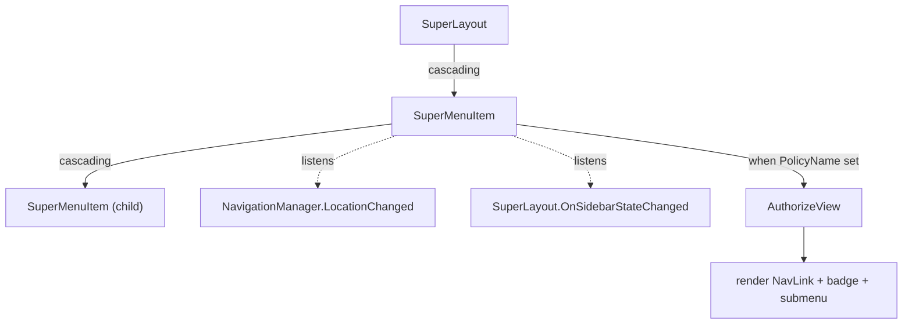
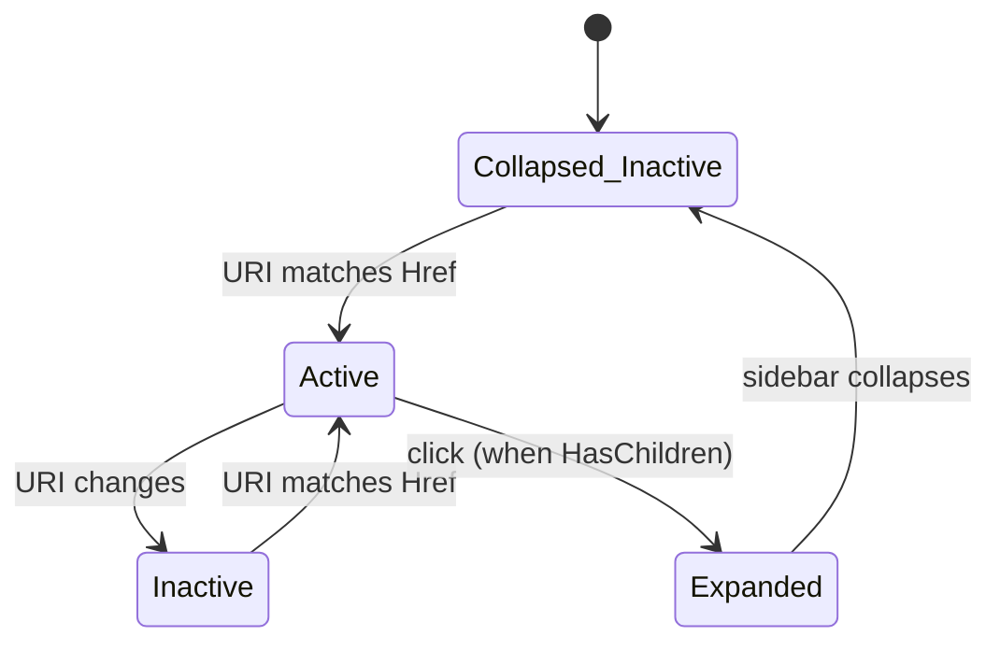

# 📂 SuperMenuItem

> Sidebar menu item for `SuperLayout` — supports icons, badges, nested submenus, authorization policies, and adapts automatically when the sidebar collapses to icon-only mode.

[← Back to README](README.md)

---

## 📑 Table of Contents

- [Overview](#overview)
- [Getting Started](#getting-started)
- [Architecture](#architecture)
- [API Reference](#api-reference)
- [Usage Examples](#usage-examples)
- [Tips & Best Practices](#tips--best-practices)
- [Troubleshooting](#troubleshooting)

---

## Overview

`SuperMenuItem` is the building block for the navigation sidebar of `SuperLayout`. It renders a `NavLink`-style element with active-state matching, optional icon (Font Awesome), optional badge, and an optional nested `Items` render fragment to create submenus. It cooperates with `SuperLayout` to:

- show **icon-only** when the sidebar is collapsed/hidden,
- collapse expanded submenus when the sidebar collapses,
- wrap itself in `AuthorizeView` when a `PolicyName` is provided.

**Key features**

- 🧭 NavLink-like active matching (`Prefix` or `All`)
- 🖼️ Font Awesome icons (Solid/Regular/Brands/Duotone via `SuperIconStyle`)
- 🏷️ Optional badge with custom CSS class
- 🌳 Nested submenus via the `Items` render fragment
- 🔐 Authorization via `PolicyName` → wraps content in `AuthorizeView`
- 🎨 Per-item theme via `Theme` (adds `super-theme-{Theme}` CSS class)
- ↔️ Automatic icon-only mode when the sidebar collapses

---

## Getting Started

### Imports

```razor
@using SuperBlazorComponents.Components
```

### Minimal example

```razor
<SuperLayout>
    <SidebarContent>
        <SuperMenuItem Href="/" Icon="fa-house" Text="Home" Match="NavLinkMatch.All" />
        <SuperMenuItem Href="/customers" Icon="fa-users" Text="Customers" />
        <SuperMenuItem Href="/orders" Icon="fa-receipt" Text="Orders" BadgeText="3" />
    </SidebarContent>
</SuperLayout>
```

---

## Architecture





---

## API Reference

### Parameters

| Parameter | Type | Default | Description |
|---|---|---|---|
| `Href` | `string?` | `null` | Navigation target (use `null` for grouping items with children) |
| `Text` | `string?` | `null` | Label |
| `Icon` | `string?` | `null` | Font Awesome icon (e.g. `fa-house`) |
| `IconStyle` | `SuperIconStyle` | `Configuration` | Icon family — Solid/Regular/Brands/Duotone |
| `Match` | `NavLinkMatch` | `Prefix` | Active-state matching |
| `BadgeText` | `string?` | `null` | Optional badge text |
| `BadgeCssClass` | `string` | `badge text-bg-success` | CSS classes of the badge |
| `Theme` | `string?` | `null` | Adds `super-theme-{Theme}` CSS class |
| `PolicyName` | `string?` | `null` | When set, wraps the item in `AuthorizeView Policy="..."` |
| `ChildContent` | `RenderFragment?` | `null` | Custom inner content (used when `Text` is empty) |
| `Items` | `RenderFragment?` | `null` | Nested submenu items |
| `CapturedAttributes` | `Dictionary<string,object>` | — | Forwarded to `<a>` |

### Cascading parameters consumed

| Parameter | Type | Source |
|---|---|---|
| `MainLayout` | `SuperLayout` | Provided by `<SuperLayout>` |
| `Parent` | `SuperMenuItem?` | Provided by parent menu item |

---

## Usage Examples

### 1. Basic items

```razor
<SuperMenuItem Href="/" Icon="fa-house" Text="Home" Match="NavLinkMatch.All" />
<SuperMenuItem Href="/dashboard" Icon="fa-gauge" Text="Dashboard" />
```

### 2. Item with badge

```razor
<SuperMenuItem Href="/inbox" Icon="fa-inbox" Text="Inbox"
               BadgeText="@unreadCount.ToString()"
               BadgeCssClass="badge text-bg-danger" />
```

### 3. Nested submenu

```razor
<SuperMenuItem Icon="fa-folder" Text="Reports">
    <Items>
        <SuperMenuItem Href="/reports/sales"   Icon="fa-chart-line" Text="Sales" />
        <SuperMenuItem Href="/reports/payroll" Icon="fa-money-bill" Text="Payroll" />
    </Items>
</SuperMenuItem>
```

### 4. Strict matching for the home item

```razor
<SuperMenuItem Href="/" Icon="fa-house" Text="Home" Match="NavLinkMatch.All" />
```

Without `NavLinkMatch.All`, the home item would stay active on every page.

### 5. Authorization policy

```razor
<SuperMenuItem Href="/admin"
               Icon="fa-screwdriver-wrench"
               Text="Admin"
               PolicyName="RequireAdminRole" />
```

The item is hidden when the user is not authorized.

### 6. Brand icon

```razor
<SuperMenuItem Href="https://github.com/example"
               Icon="fa-github"
               IconStyle="SuperIconStyle.Brands"
               Text="GitHub" />
```

### 7. Per-item theme

```razor
<SuperMenuItem Href="/danger-zone"
               Icon="fa-fire"
               Text="Danger zone"
               Theme="danger" />
```

`super-theme-danger` is added to the item — style it via your CSS.

### 8. Custom child content (no `Text`)

```razor
<SuperMenuItem Href="/profile">
    <ChildContent>
        <span class="d-inline-flex align-items-center gap-2">
            
            <span>@_user.DisplayName</span>
        </span>
    </ChildContent>
</SuperMenuItem>
```

### 9. Pure group (no link)

```razor
<SuperMenuItem Icon="fa-cog" Text="Settings">
    <Items>
        <SuperMenuItem Href="/settings/general"  Text="General" />
        <SuperMenuItem Href="/settings/security" Text="Security" />
    </Items>
</SuperMenuItem>
```

When `Href` is null AND `Items` is set, the item only toggles its submenu.

### 10. Dynamic menu

```razor
@foreach (var entry in _menu)
{
    <SuperMenuItem Href="@entry.Href"
                   Icon="@entry.Icon"
                   Text="@entry.Text"
                   PolicyName="@entry.Policy" />
}
```

### 11. Combining with `SuperLayout`

```razor
<SuperLayout>
    <SidebarContent>
        <SuperMenuItem Href="/" Icon="fa-house" Text="Home" Match="NavLinkMatch.All" />
        <SuperMenuItem Icon="fa-folder" Text="Catalog">
            <Items>
                <SuperMenuItem Href="/catalog/products"  Icon="fa-box" Text="Products" />
                <SuperMenuItem Href="/catalog/brands"    Icon="fa-tag" Text="Brands" />
            </Items>
        </SuperMenuItem>
    </SidebarContent>
</SuperLayout>
```

---

## Tips & Best Practices

- ✅ Always pair the home item with `Match="NavLinkMatch.All"`.
- ✅ Provide an `Icon` so the menu remains usable when the sidebar collapses (the title falls back to `Text`).
- ✅ Group related routes inside an `<Items>` submenu instead of flat lists for >7 items.
- ✅ Use `PolicyName` rather than wrapping items in your own `<AuthorizeView>` — it preserves layout integration.
- ⚠️ Submenus auto-close when the sidebar collapses; design your IA around that.

---

## Troubleshooting

| Symptom | Cause | Fix |
|---|---|---|
| Home item highlights everywhere | `Match` defaults to `Prefix` | Set `Match="NavLinkMatch.All"` for `/` |
| Submenu won't open | The chevron is hidden because the sidebar is collapsed | Expand the sidebar via the toggle button |
| Item not visible for authorized user | Wrong `PolicyName` or missing policy registration | Check `services.AddAuthorizationBuilder().AddPolicy(...)` |
| Icon style ignored | `IconStyle="Configuration"` falls back to global `DefaultSuperIconeStyle` | Set the global config or pass an explicit style |
| Badge text wraps | Long text + narrow sidebar | Use a numeric badge or shorten the value |

---

[← Back to README](README.md)
