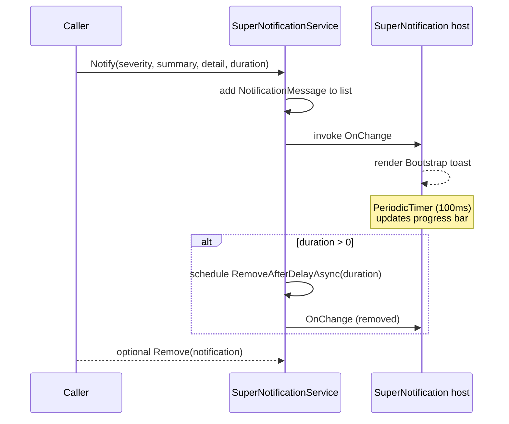
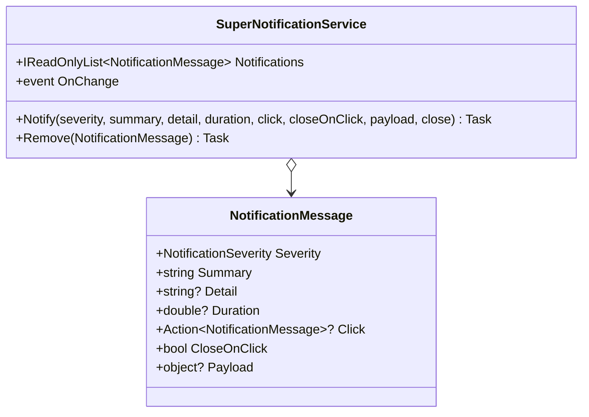

# 🔔 SuperNotifications

> Bootstrap-styled toast notification system for Blazor with severity levels, auto-dismiss progress bar, click handlers and configurable position.

[← Back to README](README.md)

---

## 📑 Table of Contents

- [Overview](#overview)
- [Getting Started](#getting-started)
- [Architecture](#architecture)
- [API Reference](#api-reference)
  - [SuperNotificationService](#supernotificationservice)
  - [SuperNotification (host)](#supernotification-host)
  - [NotificationMessage](#notificationmessage)
  - [Enums](#enums)
- [Usage Examples](#usage-examples)
- [Tips & Best Practices](#tips--best-practices)
- [Troubleshooting](#troubleshooting)

---

## Overview

`SuperNotifications` provides a single host component (`<SuperNotification />`) that listens to a singleton `SuperNotificationService` and renders Bootstrap toasts. Any component or service can call `NotificationService.Notify(...)` to display a toast.

**Key features**

- 🎨 4 severity levels with built-in icons & colors (`Info`, `Success`, `Warning`, `Error`)
- ⏱️ Configurable **duration** with smooth countdown progress bar
- 🖱️ Optional **click handler** + **close handler** + **payload**
- 📍 4 stack positions (`TopLeft`, `TopRight`, `BottomLeft`, `BottomRight`)
- 🧱 Multiple toasts stack automatically
- 🚫 `Duration = 0` keeps the toast until manually closed

---

## Getting Started

### Service registration

```csharp
builder.Services.AddSuperComponents();
```

### Imports

```razor
@using SuperBlazorComponents.Components.Notifications
@using SuperBlazorComponents.Services
```

### Place the host (once)

In `MainLayout.razor`:

```razor
@Body

<SuperNotification Position="NotificationPosition.BottomRight" />
```

### Minimal example

```razor
@inject SuperNotificationService NotificationService

<button class="btn btn-success" @onclick="Save">Save</button>

@code {
    private async Task Save()
    {
        await NotificationService.Notify(
            NotificationSeverity.Success,
            "Saved",
            "Your changes have been saved successfully.");
    }
}
```

---

## Architecture





---

## API Reference

### SuperNotificationService

| Member | Signature | Description |
|---|---|---|
| `Notifications` | `IReadOnlyList<NotificationMessage>` | Current active toasts |
| `OnChange` | `event Func<Task>?` | Fired when the list changes |
| `Notify` | `Task Notify(NotificationSeverity severity, string summary = "", string detail = "", double duration = 3000, Action<NotificationMessage>? click = null, bool closeOnClick = false, object? payload = null, Action<NotificationMessage>? close = null)` | Adds a notification |
| `Remove` | `Task Remove(NotificationMessage notification)` | Manually removes a notification |

### SuperNotification (host)

| Parameter | Type | Default | Description |
|---|---|---|---|
| `Position` | `NotificationPosition` | `BottomRight` | Stack position of toasts |
| `Opacity` | `int?` | `null` | Opacity level of every toast (0 = fully transparent, 100 = fully opaque). `null` renders toasts at full opacity. |

### NotificationMessage

| Property | Type | Default | Description |
|---|---|---|---|
| `Severity` | `NotificationSeverity` | `Error` (enum default) | Visual severity |
| `Summary` | `string` | `""` | Title (bold) |
| `Detail` | `string?` | `null` | Body text |
| `SummaryContent` | `RenderFragment?` | `null` | Custom title content |
| `DetailContent` | `RenderFragment?` | `null` | Custom body content |
| `Duration` | `double?` | `3000` | Auto-dismiss in ms (`0` = sticky) |
| `Click` | `Action<NotificationMessage>?` | `null` | Click on body |
| `CloseOnClick` | `bool` | `false` | Close after click |
| `Close` | `Action<NotificationMessage>?` | `null` | Called when removed |
| `Payload` | `object?` | `null` | Custom data |
| `Style` | `string?` | `null` | Inline style |
| `CreatedAt` | `DateTimeOffset?` | set by service | Used for progress bar |

### Enums

```csharp
public enum NotificationSeverity { Error, Info, Success, Warning }
public enum NotificationPosition { BottomRight, BottomLeft, TopRight, TopLeft }
```

---

## Usage Examples

### 1. Success toast

```csharp
await NotificationService.Notify(
    NotificationSeverity.Success, "Saved", "Customer updated.");
```

### 2. Error toast — sticky

```csharp
await NotificationService.Notify(
    NotificationSeverity.Error,
    "Save failed",
    "Network is unreachable. Click to retry.",
    duration: 0);
```

### 3. Custom duration

```csharp
await NotificationService.Notify(
    NotificationSeverity.Info, "Job started", "ETA 2 minutes",
    duration: 6000);
```

### 4. Click handler with payload

```csharp
await NotificationService.Notify(
    NotificationSeverity.Info,
    "New email",
    "From john@example.com",
    duration: 8000,
    payload: emailId,
    click: n => NavigationManager.NavigateTo($"/inbox/{n.Payload}"),
    closeOnClick: true);
```

### 5. Cleanup hook

```csharp
await NotificationService.Notify(
    NotificationSeverity.Warning, "Disk almost full", "85% used",
    close: n => Logger.LogInformation("User dismissed disk warning"));
```

### 6. Top-right corner

```razor
<SuperNotification Position="NotificationPosition.TopRight" />
```

### 7. Semi-transparent notifications

```razor
<SuperNotification Position="NotificationPosition.TopRight" Opacity="80" />
```

Set any value from `0` (invisible) to `100` (fully opaque). Omit the parameter to keep the default full-opacity rendering.

---

### 8. Manual remove

```csharp
var msg = new NotificationMessage
{
    Severity = NotificationSeverity.Info,
    Summary  = "Uploading...",
    Duration = 0
};

NotificationService.Notifications.ToList().Add(msg);  // (use Notify in real code)
// later...
await NotificationService.Remove(msg);
```

### 9. Severity matrix

```csharp
foreach (NotificationSeverity s in Enum.GetValues<NotificationSeverity>())
{
    await NotificationService.Notify(s, s.ToString(), $"Sample {s} toast.");
}
```

### 10. Progress bar (built-in)

When `Duration > 0`, the host automatically renders a 2px progress bar at the bottom of the toast that drains over the lifetime. No code required.

### 11. Helper extension (recommended pattern)

```csharp
public static class NotificationsExtensions
{
    public static Task Success(this SuperNotificationService s, string detail, string summary = "Success")
        => s.Notify(NotificationSeverity.Success, summary, detail);

    public static Task Error(this SuperNotificationService s, string detail, string summary = "Error")
        => s.Notify(NotificationSeverity.Error, summary, detail, duration: 0);
}
```

```csharp
await NotificationService.Success("Saved.");
await NotificationService.Error("Connection lost.");
```

---

## Tips & Best Practices

- ✅ Place **`<SuperNotification />`** **once** in your main layout.
- ✅ Use **`duration: 0`** for errors that the user must explicitly dismiss.
- ✅ Use the `Payload` property to thread data into the click handler instead of capturing variables.
- ✅ For long-running operations, keep a reference and call `Remove(...)` once the operation finishes.
- ⚠️ The progress bar updates every 100 ms via a `PeriodicTimer`; this only ticks when at least one toast has `Duration > 0`.
- ⚠️ Do not place multiple `<SuperNotification />` hosts — they would render duplicates.

---

## Troubleshooting

| Symptom | Cause | Fix |
|---|---|---|
| Nothing appears | `<SuperNotification />` not in layout | Add it to `MainLayout.razor` |
| Toast auto-closes too fast | Default duration is 3000 ms | Pass a longer `duration` |
| Click handler never fires | `closeOnClick: true` triggers close before navigation | Navigate inside the handler before close happens — or set `closeOnClick: false` |
| Toasts pile up forever | `duration: 0` and never removed | Track and call `Remove(...)` |
| Duplicates show | Multiple host components | Keep exactly one `<SuperNotification />` |

---

[← Back to README](README.md)
