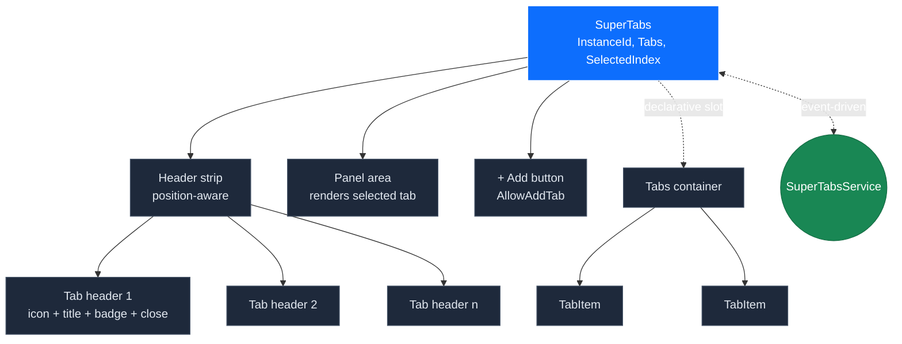
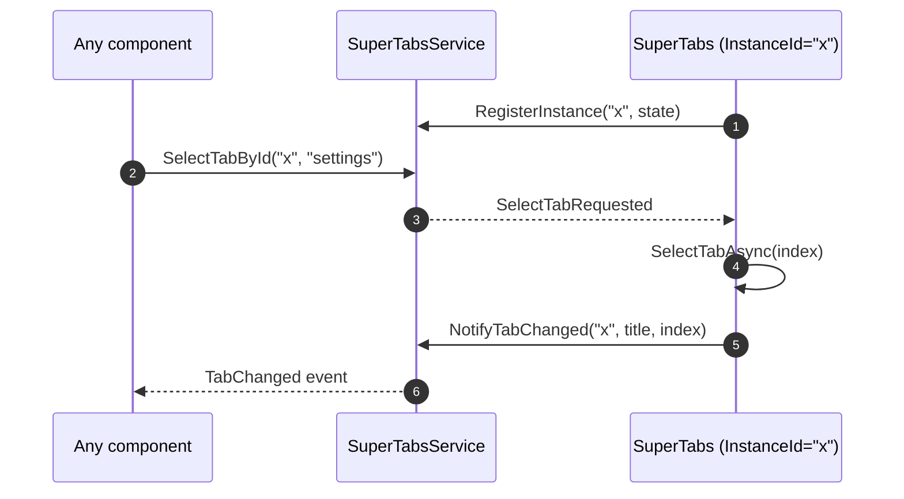
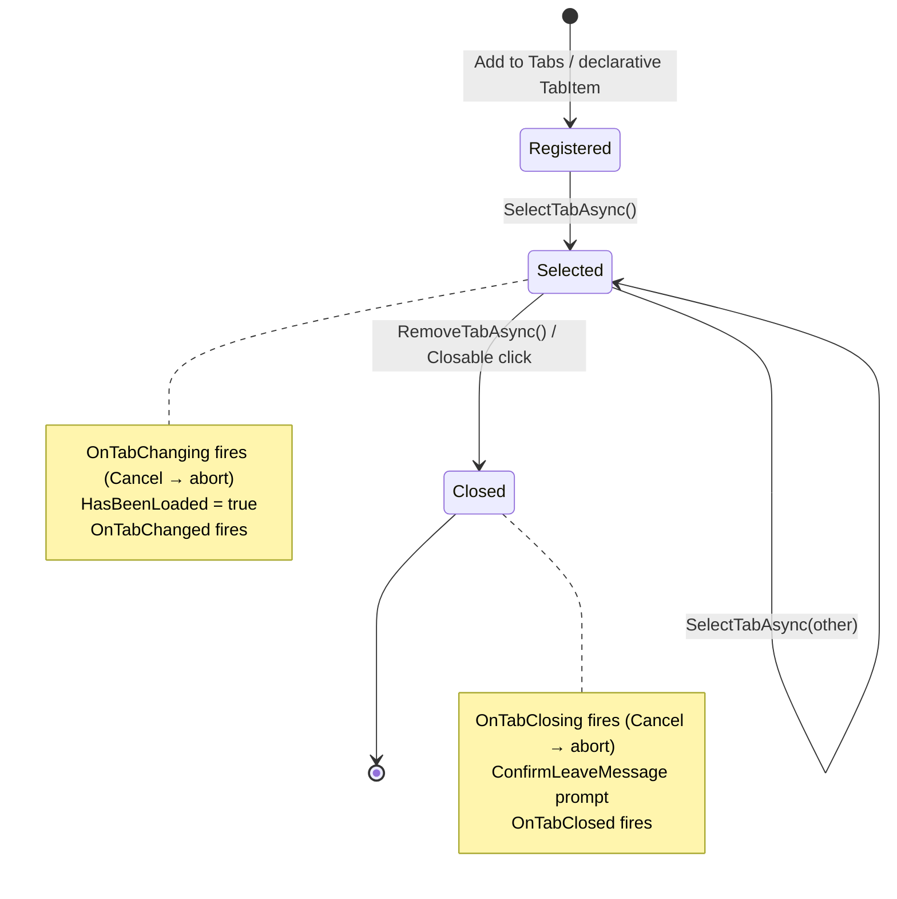
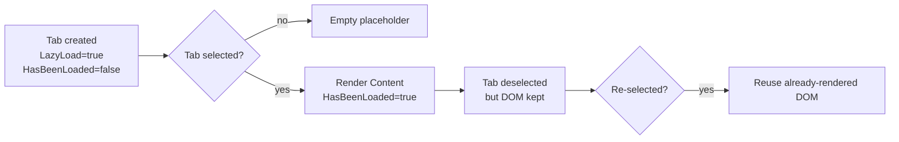
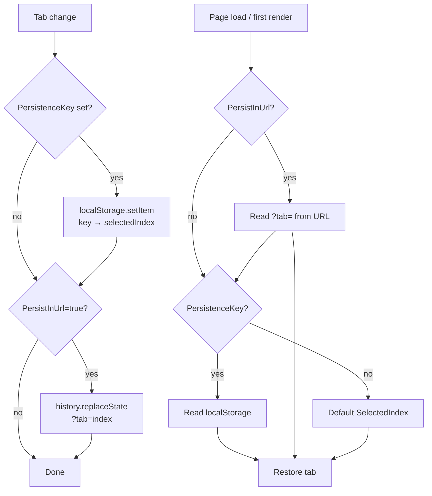
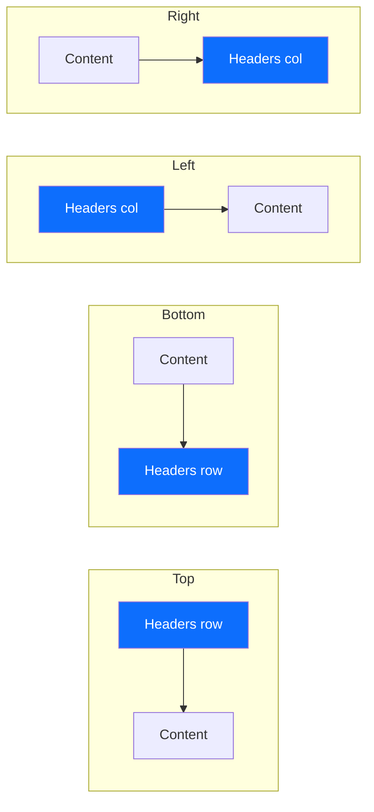

# 🗂️ SuperTabs — Complete Documentation

> A powerful, service‑driven tabbed interface for Blazor with badges, closable tabs, lazy loading, drag‑and‑drop ready ordering, six tab positions, keyboard navigation, URL + `localStorage` persistence and authorization‑aware rendering — all crafted in pure C# / Razor with **zero third‑party JS dependencies**.

**[← Back to main README](README.md)**

---

## Table of Contents

- [Overview](#overview)
- [Getting Started](#getting-started)
  - [Installation](#installation)
  - [Service Registration](#service-registration)
  - [Two Ways to Define Tabs](#two-ways-to-define-tabs)
- [Architecture](#architecture)
  - [Component Tree](#component-tree)
  - [Service‑Driven Communication](#servicedriven-communication)
  - [Tab Lifecycle](#tab-lifecycle)
  - [Lazy Loading Flow](#lazy-loading-flow)
  - [Persistence Pipeline](#persistence-pipeline)
  - [Tab Positions](#tab-positions)
- [API Reference](#api-reference)
  - [SuperTabs Parameters](#supertabs-parameters)
  - [SuperTabs Public Methods](#supertabs-public-methods)
  - [SuperTabItem](#supertabitem)
  - [TabItem (declarative)](#tabitem-declarative)
  - [SuperTabsService](#supertabsservice)
  - [Event Args](#event-args)
- [Enums](#enums)
  - [SuperTabPosition](#supertabposition)
- [Usage Examples](#usage-examples)
  - [1 — Minimal declarative tabs](#1--minimal-declarative-tabs)
  - [2 — Programmatic tabs (List‑based)](#2--programmatic-tabs-listbased)
  - [3 — Two‑way binding on selected index](#3--twoway-binding-on-selected-index)
  - [4 — Icons, colors and badges](#4--icons-colors-and-badges)
  - [5 — Closable tabs with confirmation](#5--closable-tabs-with-confirmation)
  - [6 — Dynamic add/remove via the toolbar](#6--dynamic-addremove-via-the-toolbar)
  - [7 — Lazy loading expensive content](#7--lazy-loading-expensive-content)
  - [8 — URL & localStorage persistence](#8--url--localstorage-persistence)
  - [9 — Tab positions: top, bottom, left, right](#9--tab-positions-top-bottom-left-right)
  - [10 — Vertical tabs with custom column width](#10--vertical-tabs-with-custom-column-width)
  - [11 — Cancel tab change with `OnTabChanging`](#11--cancel-tab-change-with-ontabchanging)
  - [12 — Unsaved‑changes warning](#12--unsavedchanges-warning)
  - [13 — Keyboard navigation](#13--keyboard-navigation)
  - [14 — Service‑driven control from anywhere](#14--servicedriven-control-from-anywhere)
  - [15 — Live badge updates from a background task](#15--live-badge-updates-from-a-background-task)
  - [16 — Dynamic component rendering](#16--dynamic-component-rendering)
  - [17 — Policy‑based tab visibility](#17--policybased-tab-visibility)
  - [18 — Multiple `SuperTabs` instances coordinated by service](#18--multiple-supertabs-instances-coordinated-by-service)
- [Tips & Best Practices](#tips--best-practices)
- [Troubleshooting](#troubleshooting)

---

## Overview

`SuperTabs` is a flexible tab container that supports **two complementary APIs**:

| Approach | When to use it |
|---|---|
| **Declarative** — `<Tabs><TabItem>...</TabItem></Tabs>` | Static tabs known at compile time, content authored in Razor markup. |
| **Programmatic** — `Tabs="@_tabs"` (`List<SuperTabItem>`) | Dynamic tabs (built from data, opened on demand, ComponentType rendering). |

Both modes can be mixed, and any tab — declarative or programmatic — can be controlled from anywhere in the app via the **`SuperTabsService`**.

Highlights:

- 6 tab positions (`Top`, `TopRight`, `Bottom`, `BottomRight`, `Left`, `Right`)
- Per‑tab icon, icon color, badge (text + class + icon), tooltip, order
- Closable tabs with `Cancel` events and unsaved‑changes confirmation
- Lazy loading (`LazyLoad = true`) — content rendered only after first activation
- Persistence in `localStorage` (`PersistenceKey`) and/or URL query string (`PersistInUrl`)
- Keyboard navigation (`ArrowLeft/Right/Up/Down`, `Home`, `End`, `Ctrl+1..9`)
- Authorization‑aware tabs via `PolicyName` (`AuthorizeView` integration)
- Service API — `SelectTab`, `AddTab`, `RemoveTab`, `UpdateBadge`, `SetTabVisibility`, `SetTabDisabled`, `Reset` …
- Two‑way binding on `SelectedIndex`

---

## Getting Started

### Installation

```bash
dotnet add package SuperBlazorComponents
```

### Service Registration

In `Program.cs`:

```csharp
builder.Services.AddSuperComponents();
```

`AddSuperComponents()` already registers the `SuperTabsService` as a scoped singleton. Inject it wherever you need to drive tabs from outside.

### Two Ways to Define Tabs

#### Declarative

```razor
@using SuperBlazorComponents.Components.SuperTabs

<SuperTabs InstanceId="settings" Height="500px">
    <Tabs>
        <TabItem Title="General" Icon="fa-gear">
            <p>General settings...</p>
        </TabItem>
        <TabItem Title="Security" Icon="fa-shield">
            <p>Security settings...</p>
        </TabItem>
    </Tabs>
</SuperTabs>
```

#### Programmatic

```razor
<SuperTabs InstanceId="settings" Tabs="_tabs" Height="500px" />

@code {
    private List<SuperTabItem> _tabs = new()
    {
        new SuperTabItem { Title = "General",  Icon = "fa-gear",   Content = b => b.AddMarkupContent(0, "<p>General...</p>") },
        new SuperTabItem { Title = "Security", Icon = "fa-shield", Content = b => b.AddMarkupContent(0, "<p>Security...</p>") },
    };
}
```

---

## Architecture

### Component Tree



### Service‑Driven Communication

Every `SuperTabs` registers itself with the `SuperTabsService` under its `InstanceId`. Any component can resolve the service and emit requests, which the corresponding `SuperTabs` honours.



### Tab Lifecycle



### Lazy Loading Flow

When `LazyLoad = true`, the tab's content is **not rendered** until the user activates it for the first time. After that, `HasBeenLoaded` flips to `true` and the content stays alive.



### Persistence Pipeline



### Tab Positions



`TopRight` and `BottomRight` are variants where headers are pushed to the right edge of the strip (useful for action‑style tabs).

---

## API Reference

### SuperTabs Parameters

| Parameter | Type | Default | Description |
|---|---|---|---|
| `InstanceId` | `string` | `Guid.NewGuid().ToString()` | Unique id used by `SuperTabsService` to route events. **Pin a stable id** if you want to control tabs from outside. |
| `Tabs` | `List<SuperTabItem>` | `new()` | Source of truth for programmatic tabs. Declarative `<TabItem>` elements register into this list automatically. |
| `SelectedIndex` | `int` | `0` | Currently active tab index. Supports two‑way binding via `SelectedIndexChanged`. |
| `SelectedIndexChanged` | `EventCallback<int>` | — | Two‑way binding callback. |
| `Position` | `SuperTabPosition` | `Top` | Tab strip position. |
| `SuperIconStyle` | `SuperIconStyle` | `Configuration` | Default Font Awesome style for tab icons (overridable per tab). |
| `LeftHeaderWidth` | `string?` | `null` | Width of the header column when `Position` is `Left` or `Right` (e.g. `"220px"`, `"16rem"`). |
| `AllowAddTab` | `bool` | `false` | Shows a `+` button at the end of the strip. |
| `PersistenceKey` | `string?` | `null` | Key for persisting `SelectedIndex` in `localStorage`. |
| `PersistInUrl` | `bool` | `false` | Persist `SelectedIndex` in the URL query string (`?tab=`). |
| `Height` | `string` | `"100%"` | Component height (CSS value: `"500px"`, `"calc(100vh - 80px)"`…). |
| `EnableAnimations` | `bool` | `true` | Enables CSS transitions on tab switching. |
| `EnableKeyboardNavigation` | `bool` | `false` | Enables `←/→/↑/↓ Home End Ctrl+1..9` shortcuts when the strip has focus. |
| `OnTabChanging` | `EventCallback<SuperTabChangeEventArgs>` | — | Fires **before** the tab changes — set `Cancel = true` to abort. |
| `OnTabChanged` | `EventCallback<SuperTabChangeEventArgs>` | — | Fires after the tab changed. |
| `OnTabClosing` | `EventCallback<SuperTabCloseEventArgs>` | — | Fires before a tab is removed — set `Cancel = true` to abort. |
| `OnTabClosed` | `EventCallback<SuperTabCloseEventArgs>` | — | Fires after a tab has been removed. |
| `OnAddTabClicked` | `EventCallback` | — | Fires when the `+` button is clicked. |
| `ChildContent` | `RenderFragment?` | `null` | Declarative slot for `<Tabs><TabItem>...</TabItem></Tabs>`. |

### SuperTabs Public Methods

| Method | Description |
|---|---|
| `Task SelectTabAsync(int index)` | Selects a tab by index (respects `Disabled`/`Visible`, fires events). |
| `Task SelectTabByIdAsync(string id)` | Selects a tab by its `Id`. |
| `Task SelectTabByTitleAsync(string title)` | Selects a tab by exact title match (case‑insensitive). |
| `Task AddTabAsync(SuperTabItem tab)` | Adds and selects a new tab. |
| `Task RemoveTabAsync(int index)` | Removes a tab (fires `OnTabClosing` / `OnTabClosed`). |
| `void UpdateBadge(int index, string? text, string? badgeClass = null, string? badgeIcon = null)` | Updates a tab's badge. |
| `void UpdateBadgeById(string id, string? text, string? badgeClass = null, string? badgeIcon = null)` | Updates a tab's badge by `Id`. |
| `SuperTabItem? GetSelectedTab()` | Returns the currently selected tab, or `null`. |

### SuperTabItem

The data model for a tab.

| Property | Type | Default | Description |
|---|---|---|---|
| `Id` | `string` | `Guid.NewGuid()` | Unique identifier. |
| `Title` | `string` | `""` | Tab label. |
| `Icon` | `string?` | `null` | Font Awesome icon (e.g. `"fa-house"`). |
| `SuperIconStyle` | `SuperIconStyle` | `Configuration` | Icon style override (`Solid`, `Regular`, `Brands`, `Duotone`). |
| `IconColor` | `string?` | `null` | CSS color for the icon (e.g. `"#FF5733"`, `"var(--bs-danger)"`). |
| `BadgeText` | `string?` | `null` | Badge text/number. |
| `BadgeClass` | `string` | `"badge-primary"` | CSS class on the badge wrapper. |
| `BadgeIcon` | `string?` | `null` | Optional badge icon. |
| `Visible` | `bool` | `true` | Hides the tab when `false`. |
| `Disabled` | `bool` | `false` | Greys out and prevents selection. |
| `LazyLoad` | `bool` | `false` | Defer rendering until first activation. |
| `HasBeenLoaded` | `bool` | `false` | Flips to `true` after first activation (do not set manually). |
| `Closable` | `bool` | `false` | Shows a close (✕) button. |
| `Order` | `int` | `int.MaxValue` | Sort order in the strip (lower = earlier). |
| `Tooltip` | `string?` | `null` | Tooltip on hover. |
| `ComponentType` | `Type?` | `null` | Component to render dynamically (alternative to `Content`). |
| `ComponentParameters` | `Dictionary<string, object>?` | `null` | Parameters passed to `ComponentType`. |
| `Content` | `RenderFragment?` | `null` | Inline content fragment. |
| `Tag` | `object?` | `null` | Free‑form data attached to the tab. |
| `PersistenceKey` | `string?` | `null` | Per‑tab persistence key (reserved for advanced scenarios). |
| `HasUnsavedChanges` | `bool` | `false` | Shows a `●` indicator and triggers `ConfirmLeaveMessage`. |
| `ConfirmLeaveMessage` | `string?` | `null` | `confirm(...)` message shown before leaving/closing the tab. |
| `PolicyName` | `string?` | `null` | Authorization policy — hides the tab when the user fails the policy. |

### TabItem (declarative)

`<TabItem>` is the Razor wrapper. It exposes the same public surface as `SuperTabItem` and registers itself into the parent `SuperTabs.Tabs` list. Its `ChildContent` becomes the tab's `Content`.

```razor
<TabItem Title="Logs"
         Icon="fa-file-lines"
         BadgeText="42"
         BadgeClass="badge text-bg-warning"
         Closable="true"
         LazyLoad="true"
         Tooltip="Application logs">
    <p>Lazy logs panel</p>
</TabItem>
```

### SuperTabsService

Inject and use anywhere — pages, layouts, background services, even outside the page that hosts `SuperTabs`.

| Method | Description |
|---|---|
| `void SelectTab(string? instanceId, int index)` | Select by index. Pass `null` to broadcast to all instances. |
| `void SelectTabByTitle(string? instanceId, string title)` | Select by title. |
| `void SelectTabById(string? instanceId, string tabId)` | Select by `Id`. |
| `void AddTab(string instanceId, SuperTabItem tab, bool selectAfterAdd = true)` | Add a tab at runtime. |
| `void RemoveTab(string instanceId, int index)` | Remove a tab. |
| `void RemoveTabById(string instanceId, string tabId)` | Remove a tab by `Id`. |
| `void UpdateBadge(string instanceId, string tabId, string? badgeText, string? badgeClass = null, string? badgeIcon = null)` | Update a badge by `Id`. |
| `void UpdateBadgeByIndex(string instanceId, int index, string? badgeText, string? badgeClass = null)` | Update a badge by index. |
| `void SetTabVisibility(string instanceId, string tabId, bool visible)` | Show/hide a tab. |
| `void SetTabDisabled(string instanceId, string tabId, bool disabled)` | Enable/disable a tab. |
| `void Reset(string? instanceId = null)` | Reset to first tab. |
| `string? GetCurrentTabTitle(string instanceId)` | Read‑only helper. |
| `SuperTabItem? GetCurrentTab(string instanceId)` | Read‑only helper. |

| Event | Args | Description |
|---|---|---|
| `TabChanged` | `SuperTabServiceEventArgs` | Fired by every `SuperTabs` after a tab change — `(InstanceId, TabTitle, TabIndex)`. |

### Event Args

```csharp
public class SuperTabChangeEventArgs
{
    public int           PreviousIndex { get; set; }
    public int           NewIndex      { get; set; }
    public SuperTabItem? PreviousTab   { get; set; }
    public SuperTabItem? NewTab        { get; set; }
    public bool          Cancel        { get; set; } // set true to abort
}

public class SuperTabCloseEventArgs
{
    public SuperTabItem Tab    { get; set; } = default!;
    public int          Index  { get; set; }
    public bool         Cancel { get; set; }          // set true to abort
}

public class SuperTabServiceEventArgs : EventArgs
{
    public string InstanceId { get; set; } = "";
    public string TabTitle   { get; set; } = "";
    public int    TabIndex   { get; set; }
}
```

---

## Enums

### SuperTabPosition

```csharp
public enum SuperTabPosition
{
    Top,          // Headers above content
    TopRight,     // Headers above, aligned right
    Bottom,       // Headers below content
    BottomRight,  // Headers below, aligned right
    Left,         // Headers on the left (vertical)
    Right         // Headers on the right (vertical)
}
```

---

## Usage Examples

### 1 — Minimal declarative tabs

```razor
@using SuperBlazorComponents.Components.SuperTabs

<SuperTabs InstanceId="demo" Height="400px">
    <Tabs>
        <TabItem Title="Overview" Icon="fa-house">
            <h4>Overview</h4>
            <p>Welcome to the dashboard.</p>
        </TabItem>
        <TabItem Title="Reports" Icon="fa-chart-bar">
            <p>Reports content...</p>
        </TabItem>
        <TabItem Title="Settings" Icon="fa-gear">
            <p>Settings content...</p>
        </TabItem>
    </Tabs>
</SuperTabs>
```

---

### 2 — Programmatic tabs (List‑based)

```razor
<SuperTabs InstanceId="docs" Tabs="_tabs" Height="500px" />

@code {
    private List<SuperTabItem> _tabs = new()
    {
        new SuperTabItem
        {
            Id      = "readme",
            Title   = "README",
            Icon    = "fa-book",
            Content = b => b.AddMarkupContent(0, "<p>README content</p>")
        },
        new SuperTabItem
        {
            Id      = "api",
            Title   = "API",
            Icon    = "fa-code",
            Content = b => b.AddMarkupContent(0, "<p>API reference</p>")
        },
    };
}
```

---

### 3 — Two‑way binding on selected index

```razor
<SuperTabs InstanceId="bind"
           @bind-SelectedIndex="_index"
           Height="350px">
    <Tabs>
        <TabItem Title="One"><p>One</p></TabItem>
        <TabItem Title="Two"><p>Two</p></TabItem>
        <TabItem Title="Three"><p>Three</p></TabItem>
    </Tabs>
</SuperTabs>

<div class="mt-3">
    Active tab: <strong>@_index</strong>
    <button class="btn btn-sm btn-primary ms-2" @onclick="() => _index = 0">Go to first</button>
</div>

@code {
    private int _index;
}
```

---

### 4 — Icons, colors and badges

```razor
<SuperTabs InstanceId="badges" Height="400px">
    <Tabs>
        <TabItem Title="Inbox"
                 Icon="fa-inbox"
                 IconColor="var(--bs-primary)"
                 BadgeText="12"
                 BadgeClass="badge text-bg-danger">
            <p>You have 12 unread messages.</p>
        </TabItem>

        <TabItem Title="Tasks"
                 Icon="fa-list-check"
                 IconColor="#22c55e"
                 BadgeText="3"
                 BadgeIcon="fa-solid fa-circle-exclamation"
                 BadgeClass="badge text-bg-warning">
            <p>3 tasks need your attention.</p>
        </TabItem>

        <TabItem Title="Archive"
                 Icon="fa-box-archive"
                 IconColor="var(--bs-secondary)">
            <p>Archived items.</p>
        </TabItem>
    </Tabs>
</SuperTabs>
```

---

### 5 — Closable tabs with confirmation

```razor
<SuperTabs InstanceId="docs"
           Tabs="_tabs"
           OnTabClosing="OnTabClosing"
           Height="500px" />

@code {
    private List<SuperTabItem> _tabs = new()
    {
        new SuperTabItem { Title = "Doc 1", Closable = true,
                           Content = b => b.AddMarkupContent(0, "<p>Doc 1</p>") },
        new SuperTabItem { Title = "Doc 2", Closable = true,
                           ConfirmLeaveMessage = "Discard changes to Doc 2?",
                           HasUnsavedChanges = true,
                           Content = b => b.AddMarkupContent(0, "<p>Doc 2</p>") },
    };

    private Task OnTabClosing(SuperTabCloseEventArgs e)
    {
        if (e.Tab.Title == "Doc 1")
        {
            // Refuse to close Doc 1
            e.Cancel = true;
        }
        return Task.CompletedTask;
    }
}
```

---

### 6 — Dynamic add/remove via the toolbar

```razor
<SuperTabs @ref="_tabsRef"
           InstanceId="dyn"
           Tabs="_tabs"
           AllowAddTab="true"
           OnAddTabClicked="OnAddTab"
           Height="450px" />

@code {
    private SuperTabs? _tabsRef;
    private int _counter = 1;
    private List<SuperTabItem> _tabs = new();

    private async Task OnAddTab()
    {
        await _tabsRef!.AddTabAsync(new SuperTabItem
        {
            Title    = $"Tab {_counter++}",
            Icon     = "fa-file",
            Closable = true,
            Content  = b => b.AddMarkupContent(0, $"<p>Content {_counter - 1}</p>")
        });
    }
}
```

---

### 7 — Lazy loading expensive content

```razor
<SuperTabs InstanceId="lazy" Height="500px">
    <Tabs>
        <TabItem Title="Light"><p>Cheap content.</p></TabItem>

        <TabItem Title="Heavy"
                 Icon="fa-database"
                 LazyLoad="true">
            @* Rendered only after the user activates this tab *@
            <ExpensiveDashboard />
        </TabItem>

        <TabItem Title="Even heavier"
                 Icon="fa-chart-area"
                 LazyLoad="true">
            <BigChart />
        </TabItem>
    </Tabs>
</SuperTabs>
```

Once activated, the content stays mounted (state is preserved). Use `HasBeenLoaded` if you need to know whether a tab has ever been opened.

---

### 8 — URL & localStorage persistence

```razor
<SuperTabs InstanceId="persist"
           PersistenceKey="my-app.tabs.persist"
           PersistInUrl="true"
           Height="400px">
    <Tabs>
        <TabItem Title="Profile"><p>Profile</p></TabItem>
        <TabItem Title="Security"><p>Security</p></TabItem>
        <TabItem Title="Billing"><p>Billing</p></TabItem>
    </Tabs>
</SuperTabs>
```

- The current `SelectedIndex` is written to `localStorage["my-app.tabs.persist"]`.
- The URL gets a `?tab=N` query string updated via `history.replaceState`.
- On reload, the URL takes priority, falling back to `localStorage`.

---

### 9 — Tab positions: top, bottom, left, right

```razor
<SuperTabs InstanceId="pos" Position="SuperTabPosition.Bottom" Height="400px">
    <Tabs>
        <TabItem Title="One"  Icon="fa-1"><p>One</p></TabItem>
        <TabItem Title="Two"  Icon="fa-2"><p>Two</p></TabItem>
        <TabItem Title="Three" Icon="fa-3"><p>Three</p></TabItem>
    </Tabs>
</SuperTabs>
```

Try also: `Top`, `TopRight`, `BottomRight`, `Left`, `Right`.

---

### 10 — Vertical tabs with custom column width

```razor
<SuperTabs InstanceId="vert"
           Position="SuperTabPosition.Left"
           LeftHeaderWidth="240px"
           Height="500px">
    <Tabs>
        <TabItem Title="General"  Icon="fa-gear"><p>General</p></TabItem>
        <TabItem Title="Security" Icon="fa-shield"><p>Security</p></TabItem>
        <TabItem Title="Billing"  Icon="fa-credit-card"><p>Billing</p></TabItem>
        <TabItem Title="Team"     Icon="fa-users"><p>Team</p></TabItem>
    </Tabs>
</SuperTabs>
```

`LeftHeaderWidth` is honoured only when `Position` is `Left` or `Right`.

---

### 11 — Cancel tab change with `OnTabChanging`

```razor
<SuperTabs InstanceId="guard"
           OnTabChanging="OnChanging"
           Height="400px">
    <Tabs>
        <TabItem Title="Form"><EditForm Model="_form">...</EditForm></TabItem>
        <TabItem Title="Preview"><p>Preview</p></TabItem>
    </Tabs>
</SuperTabs>

@code {
    private MyForm _form = new();

    private Task OnChanging(SuperTabChangeEventArgs e)
    {
        if (e.PreviousTab?.Title == "Form" && _form.IsDirty)
        {
            e.Cancel = true; // prevent leaving the form while dirty
        }
        return Task.CompletedTask;
    }
}
```

---

### 12 — Unsaved‑changes warning

Set `HasUnsavedChanges = true` and `ConfirmLeaveMessage` on the tab — `SuperTabs` shows a `●` indicator and prompts before switching/closing.

```razor
<SuperTabs InstanceId="dirty" Tabs="_tabs" Height="400px" />

@code {
    private List<SuperTabItem> _tabs = new()
    {
        new SuperTabItem
        {
            Title               = "Editor",
            Icon                = "fa-pen",
            HasUnsavedChanges   = true,
            ConfirmLeaveMessage = "You have unsaved changes. Leave anyway?",
            Content             = b => b.AddMarkupContent(0, "<p>Editor</p>")
        },
        new SuperTabItem
        {
            Title   = "Logs",
            Icon    = "fa-file-lines",
            Content = b => b.AddMarkupContent(0, "<p>Logs</p>")
        },
    };
}
```

---

### 13 — Keyboard navigation

```razor
<SuperTabs InstanceId="keys"
           EnableKeyboardNavigation="true"
           Height="400px">
    <Tabs>
        <TabItem Title="Alpha"  Icon="fa-1"><p>Alpha</p></TabItem>
        <TabItem Title="Beta"   Icon="fa-2"><p>Beta</p></TabItem>
        <TabItem Title="Gamma"  Icon="fa-3"><p>Gamma</p></TabItem>
        <TabItem Title="Delta"  Icon="fa-4"><p>Delta</p></TabItem>
    </Tabs>
</SuperTabs>
```

Shortcuts when the tab strip has focus:

| Key | Action |
|---|---|
| `←` / `↑` | Previous visible (non‑disabled) tab |
| `→` / `↓` | Next visible (non‑disabled) tab |
| `Home` | First visible tab |
| `End` | Last visible tab |
| `Ctrl + 1` … `Ctrl + 9` | Jump to nth visible tab |

---

### 14 — Service‑driven control from anywhere

```razor
@inject SuperTabsService TabsService

<button class="btn btn-primary" @onclick="OpenSettings">Open Settings tab</button>
<button class="btn btn-outline-secondary" @onclick="DisableBilling">Disable Billing</button>

<SuperTabs InstanceId="account" Height="400px">
    <Tabs>
        <TabItem Id="profile"  Title="Profile"  Icon="fa-user"><p>Profile</p></TabItem>
        <TabItem Id="security" Title="Security" Icon="fa-shield"><p>Security</p></TabItem>
        <TabItem Id="billing"  Title="Billing"  Icon="fa-credit-card"><p>Billing</p></TabItem>
    </Tabs>
</SuperTabs>

@code {
    private void OpenSettings()
    {
        TabsService.SelectTabById("account", "security");
    }

    private void DisableBilling()
    {
        TabsService.SetTabDisabled("account", "billing", disabled: true);
    }
}
```

---

### 15 — Live badge updates from a background task

```razor
@inject SuperTabsService TabsService
@implements IDisposable

<SuperTabs InstanceId="inbox" Height="400px">
    <Tabs>
        <TabItem Id="messages" Title="Messages" Icon="fa-envelope" />
        <TabItem Id="alerts"   Title="Alerts"   Icon="fa-bell" />
    </Tabs>
</SuperTabs>

@code {
    private System.Threading.Timer? _timer;
    private int _count = 0;

    protected override void OnInitialized()
    {
        _timer = new System.Threading.Timer(_ =>
        {
            _count++;
            TabsService.UpdateBadge("inbox", "messages",
                _count.ToString(),
                badgeClass: "badge text-bg-danger");
        }, null, 0, 5000);
    }

    public void Dispose() => _timer?.Dispose();
}
```

---

### 16 — Dynamic component rendering

Render arbitrary Blazor components inside tabs by setting `ComponentType` on a `SuperTabItem`.

```razor
<SuperTabs InstanceId="dyncomp" Tabs="_tabs" Height="500px" />

@code {
    private List<SuperTabItem> _tabs = new()
    {
        new SuperTabItem
        {
            Id            = "users",
            Title         = "Users",
            Icon          = "fa-users",
            ComponentType = typeof(UsersGrid),
            ComponentParameters = new Dictionary<string, object>
            {
                ["RoleFilter"] = "Admin",
                ["PageSize"]   = 25
            }
        },
        new SuperTabItem
        {
            Id            = "audit",
            Title         = "Audit",
            Icon          = "fa-clipboard-list",
            ComponentType = typeof(AuditLog),
            LazyLoad      = true
        }
    };
}
```

---

### 17 — Policy‑based tab visibility

`PolicyName` integrates with `AuthorizeView` — the tab disappears entirely for users that fail the policy.

```razor
<SuperTabs InstanceId="admin" Height="450px">
    <Tabs>
        <TabItem Title="Overview" Icon="fa-chart-line">
            <p>Visible to everyone.</p>
        </TabItem>

        <TabItem Title="Audit Trail"
                 Icon="fa-clipboard-list"
                 PolicyName="Auditor">
            <p>Visible to Auditors only.</p>
        </TabItem>

        <TabItem Title="System"
                 Icon="fa-server"
                 PolicyName="Admin">
            <p>Visible to Admins only.</p>
        </TabItem>
    </Tabs>
</SuperTabs>
```

---

### 18 — Multiple `SuperTabs` instances coordinated by service

```razor
@inject SuperTabsService TabsService

<div class="row">
    <div class="col-6">
        <SuperTabs InstanceId="left" Height="350px">
            <Tabs>
                <TabItem Id="a" Title="A"><p>Left A</p></TabItem>
                <TabItem Id="b" Title="B"><p>Left B</p></TabItem>
            </Tabs>
        </SuperTabs>
    </div>
    <div class="col-6">
        <SuperTabs InstanceId="right" Height="350px">
            <Tabs>
                <TabItem Id="a" Title="A"><p>Right A</p></TabItem>
                <TabItem Id="b" Title="B"><p>Right B</p></TabItem>
            </Tabs>
        </SuperTabs>
    </div>
</div>

<button class="btn btn-primary mt-3" @onclick="SyncBoth">Sync both to B</button>

@code {
    private void SyncBoth()
    {
        // Pass null to broadcast to all registered instances
        TabsService.SelectTabById(instanceId: null, tabId: "b");
    }

    protected override void OnInitialized()
    {
        TabsService.TabChanged += (_, e) =>
            Console.WriteLine($"[{e.InstanceId}] → {e.TabTitle} (#{e.TabIndex})");
    }
}
```

---

## Tips & Best Practices

- **Pin a stable `InstanceId`.** Without it, every render generates a new GUID and the service can't address the component reliably.
- **Prefer the declarative API for static tabs**; use the programmatic list for tabs derived from data or opened on demand.
- **Use `LazyLoad = true`** on tabs that mount heavy components or perform initial data fetches — defer the work until needed.
- **Combine `PersistenceKey` and `PersistInUrl`**: URL wins for shareable links, `localStorage` is the fallback when the URL has no `?tab=`.
- **Keep `Closable` opt‑in.** Closing a tab removes it permanently from the list — pair with `OnTabClosing` to prevent accidents.
- **Use `Order`** to reorder tabs without changing the source list (lower values come first).
- **Subscribe with `+=`, unsubscribe with `-=`** on `SuperTabsService.TabChanged` from `IDisposable.Dispose` to avoid leaks.
- **Disabled tabs are still keyboard‑skippable** — keyboard navigation jumps over `Disabled` tabs automatically.
- **For two‑way binding**, use `@bind-SelectedIndex` rather than handling `SelectedIndexChanged` manually.

---

## Troubleshooting

| Symptom | Likely cause | Fix |
|---|---|---|
| Service calls do nothing | `InstanceId` mismatch (or default GUID) | Pin a stable `InstanceId` and pass the same string to `TabsService.*`. |
| Tab content is blank after first selection | `LazyLoad = true` and content threw at first render | Inspect logs; `HasBeenLoaded` flips to `true` even on errors — guard with a try/catch in your component. |
| Persistence not restored | `PersistenceKey` set after first render, or `localStorage` blocked | Set the key statically; verify browser allows storage on the site. |
| `?tab=` not updated | Running in pre‑render mode where JS interop is disabled | Persistence runs only after first interactive render — expected during SSR. |
| Keyboard shortcuts ignored | Strip not focused | Click the strip first or set focus programmatically — `EnableKeyboardNavigation` requires focus. |
| `OnTabChanged` fires but UI doesn't refresh | Mutating `Tabs` from outside without notifying | Call `TabsService` mutation methods (which trigger refresh) or `StateHasChanged()` after editing the list. |
| Declarative `<TabItem>` appears twice | Hot reload re‑registered the item | This is harmless during dev; on reload the service replaces the existing item by `Id`. |

---

**[← Back to main README](README.md)**
