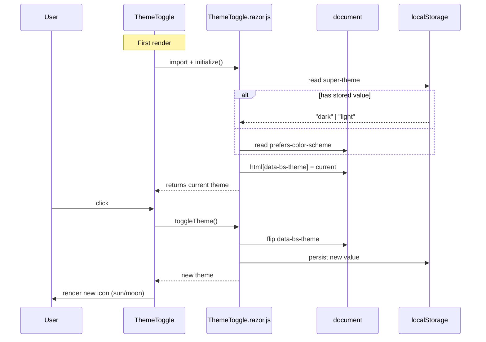

# 🌓 ThemeToggle

> One-click dark / light theme toggle for Blazor — applies Bootstrap's `data-bs-theme` and persists the user choice.

[← Back to README](README.md)

---

## 📑 Table of Contents

- [Overview](#overview)
- [Getting Started](#getting-started)
- [How it Works](#how-it-works)
- [API Reference](#api-reference)
- [Usage Examples](#usage-examples)
- [Localization](#localization)
- [Tips & Best Practices](#tips--best-practices)
- [Troubleshooting](#troubleshooting)

---

## Overview

`ThemeToggle` is a tiny stateless button (`<button class="btn btn-link">`) that switches between the **dark** and **light** Bootstrap themes by setting `data-bs-theme` on the `<html>` element. The current value is read from and written to `localStorage` from the companion JS module.

**Key features**

- 🌗 Toggles between `dark` and `light`
- 💾 Persists in `localStorage` (key: `super-theme`)
- 🖥️ Falls back to the user's system preference (`prefers-color-scheme`) on first load
- 🌐 Localized button title via `IStringLocalizer`
- ☁️ Zero parameters — drop it anywhere
- ⚡ Auto-applies the theme **before** the first render via the JS `initialize()` call

---

## Getting Started

### Service registration

```csharp
builder.Services.AddSuperComponents();
```

### Imports

```razor
@using SuperBlazorComponents.Components.Themes
```

### Place the toggle

Anywhere — typically in the `SuperLayout` header:

```razor
<SuperLayout>
    <HeaderRightContent>
        <ThemeToggle />
    </HeaderRightContent>
</SuperLayout>
```

---

## How it Works



---

## API Reference

### Parameters

`ThemeToggle` exposes **no parameters**.

### Internal contract (JS module)

| JS export | Returns | Side effects |
|---|---|---|
| `initialize()` | `string` (`"dark"` or `"light"`) | Reads `localStorage` (or `prefers-color-scheme`), sets `data-bs-theme` |
| `toggleTheme()` | `string` (new theme) | Flips `data-bs-theme`, persists to `localStorage` |

The module is loaded from `_content/SuperBlazorComponents/Components/Themes/ThemeToggle.razor.js`.

### Rendered button

```html
<button class="btn btn-link text-body-secondary p-1" title="…">
    <i class="fa fa-sun fa-lg"></i>   <!-- when dark -->
    <i class="fa fa-moon fa-lg"></i>  <!-- when light -->
</button>
```

The icon flips between `fa-sun` (currently dark, click to go light) and `fa-moon` (currently light, click to go dark).

---

## Usage Examples

### 1. In the layout header

```razor
<SuperLayout>
    <HeaderRightContent>
        <ThemeToggle />
    </HeaderRightContent>
</SuperLayout>
```

### 2. In a top app bar

```razor
<header class="navbar bg-body-tertiary border-bottom px-3">
    <span class="navbar-brand">My App</span>
    <div class="ms-auto">
        <ThemeToggle />
    </div>
</header>
```

### 3. Side-by-side with other actions

```razor
<div class="d-flex align-items-center gap-2">
    <ThemeToggle />
    <SuperButton Text="Settings" Icon="fa-cog" Style="SuperButtonStyle.Link" />
</div>
```

### 4. Force a specific theme on app start (override)

If you want to hard-set the initial theme, set `data-bs-theme` in `App.razor` **before** `ThemeToggle` mounts:

```html
<!DOCTYPE html>
<html lang="en" data-bs-theme="dark">
…
```

`ThemeToggle.initialize()` will respect any value already saved in `localStorage` (which takes priority).

### 5. Reset persisted theme

```js
localStorage.removeItem('super-theme');
location.reload();
```

This forces the system preference to take over again on next load.

### 6. Use Bootstrap dark/light tokens in your own CSS

```css
[data-bs-theme="dark"] .my-card  { background: var(--bs-tertiary-bg); }
[data-bs-theme="light"] .my-card { background: var(--bs-body-bg); }
```

---

## Localization

The toggle reads two resource keys for its `title` attribute:

| Key | When current theme is | Example value |
|---|---|---|
| `Theme.SwitchToLight` | `dark` (icon = sun) | "Switch to light theme" |
| `Theme.SwitchToDark` | `light` (icon = moon) | "Switch to dark theme" |

Add the keys to your `Resources/SharedResource.{culture}.json` files. They are bundled with `SuperBlazorComponents` for default cultures.

---

## Tips & Best Practices

- ✅ Place the toggle in a stable spot (header) so users can find it on every page.
- ✅ Pair Bootstrap-dependent CSS with `data-bs-theme` selectors instead of `prefers-color-scheme` directly — that way the toggle wins.
- ✅ For SSR / pre-render, wrap the toggle in a render mode that supports JS interop (`InteractiveServer` / `InteractiveAuto`).
- ⚠️ The component requires JS interop and will silently fall back to the dark theme if the import fails (the button will still render).

---

## Troubleshooting

| Symptom | Cause | Fix |
|---|---|---|
| Icon doesn't change after click | JS module failed to load | Check the network tab for `_content/SuperBlazorComponents/Components/Themes/ThemeToggle.razor.js` |
| Theme resets on every reload | `localStorage` blocked / private mode | Expected behavior; `prefers-color-scheme` will be used as fallback |
| Theme appears flipped | Custom JS sets `data-bs-theme` after `initialize()` | Remove the conflicting code or call `toggleTheme()` instead |
| Tooltip text untranslated | Missing localization keys | Add `Theme.SwitchToLight` / `Theme.SwitchToDark` to your resources |
| Button styling wrong | Bootstrap CSS not loaded | Ensure Bootstrap 5.3 is included before the component |

---

[← Back to README](README.md)
